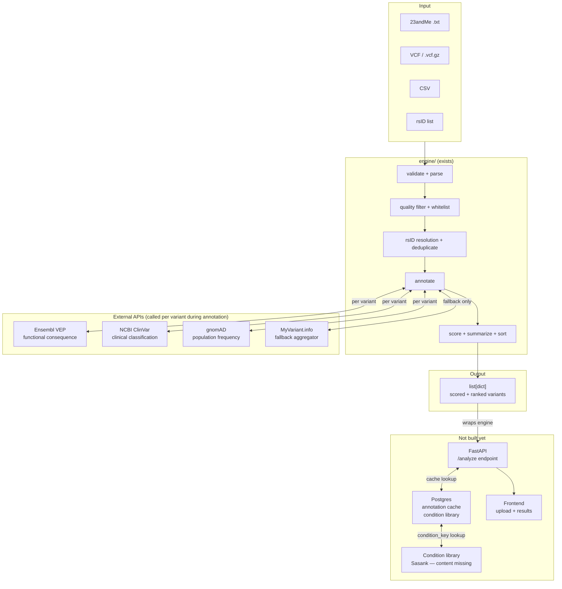

# Architecture

U4U takes a raw genome file, annotates each variant against clinical and population databases, scores and ranks findings, and returns a list of plain-English interpretations.

The core pipeline (`engine/`) is complete. The web layer does not exist yet.

---

## System Diagram



---

## Stack

| Component | Technology | Status |
|-----------|-----------|--------|
| Annotation pipeline | Python 3.11+ | Working |
| API layer | FastAPI + thread pool | Not built |
| Database | Postgres | Not built |
| Auth | Authelia | Not built (V2) |
| Frontend | React | Not built |
| Container | Docker | Not built |
| Hosting | Hampton's K8s cluster | Not deployed |
| CI | GitHub Actions | Running |

---

## Data flow

1. File uploaded via POST /analyze (not yet built)
2. FastAPI reads bytes, calls `run_pipeline(file_bytes, filename, filters)`
3. Engine annotates each variant by calling VEP, ClinVar, gnomAD sequentially
4. Engine returns `list[dict]` sorted by score
5. FastAPI checks `condition_key` in each result against Postgres condition library
6. Merged result returned to frontend

The annotation cache (Postgres) intercepts step 3: if a variant's coordinates are already cached, the external API call is skipped.

---

## Entry point

```python
from engine import run_pipeline

results = run_pipeline(
    file_bytes,          # bytes — never written to disk
    filename,            # used for format detection only
    filters=["acmg81_rsids.txt"]  # empty = all variants
)
# returns list[dict], score descending
```

Full pipeline spec: `docs/pipeline.md`
External APIs: `docs/integrations.md`
Interpretation logic: `docs/interpretation.md`
Current build status: `docs/project-status.md`
