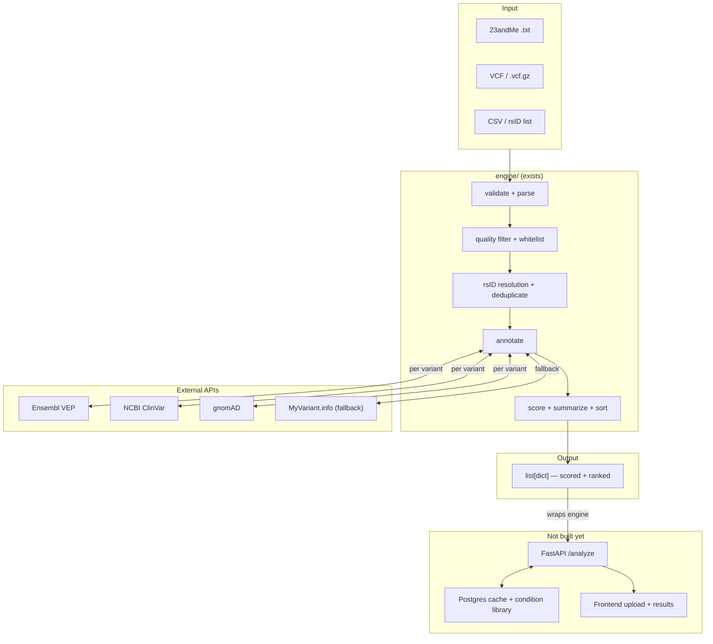

# Architecture

U4U takes a raw genome file, annotates each variant against clinical and population databases, scores findings, and returns plain-English interpretations.

**Engine (`engine/`) is complete. The web layer does not exist yet.**

---

## System Diagram



---

## Stack

| Component | Technology | Status |
|-----------|-----------|--------|
| Annotation pipeline | Python 3.11+ | **Working** |
| API layer | FastAPI | Not built |
| Database | Postgres | Not built |
| Frontend | React | Not built |
| Container | Docker | Not built |
| Hosting | Hampton's K8s cluster | Not deployed |
| CI | GitHub Actions | Running |

---

## Data flow

1. `POST /analyze` receives file bytes
2. FastAPI calls `run_pipeline(file_bytes, filename, filters)`
3. Engine annotates each variant via VEP → ClinVar → gnomAD (Postgres cache intercepts if warm)
4. Engine returns `list[dict]` sorted by score
5. API layer merges `condition_key` results from Postgres condition library
6. Response returned to frontend

---

## Entry point

```python
from engine import run_pipeline

results = run_pipeline(
    file_bytes,          # bytes — never written to disk
    filename,            # format detection only
    filters=["acmg81_rsids.txt"]
)
# returns list[dict], score descending
```

Full pipeline spec: `docs/pipeline.md`
External APIs: `docs/integrations.md`
Interpretation logic: `docs/interpretation.md`
Build status + UI spec: `docs/project-status.md`

---

## Next steps

1. **Hampton** — create `api/main.py`: `POST /analyze` reads uploaded file bytes, calls `run_pipeline(await file.read(), file.filename, filters=["acmg81_rsids.txt"])`, returns JSON
2. **Hampton** — write `Dockerfile`: `FROM python:3.11-slim`, copy `engine/`, `RUN pip install -e engine/`, `CMD ["uvicorn", "api.main:app", "--host", "0.0.0.0"]`, deploy to K8s
3. **Curtis** — register domain; point DNS A record at Hampton's cluster IP so there's a real URL before Phase 2 work starts
