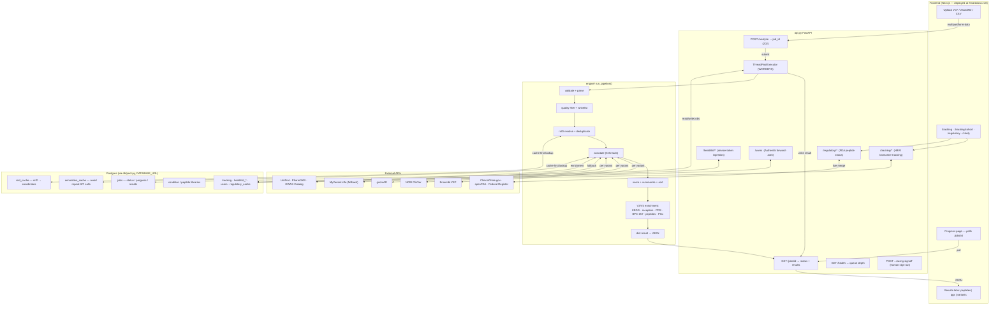

# Architecture

U4U takes a raw genome file, annotates each variant against clinical and population databases, scores findings, and returns plain-English interpretations plus downstream peptide, pharmacogenomic, and polygenic-risk profiles. Around that engine the platform now ships a deployed Next.js frontend, a Postgres-backed job store and cache layer, and a set of mounted API subsystems (tracking/HBRI, HealthKit ingestion, PGx, ACMG sign-off, regulatory, users).

---

## System Diagram[^mermaid]


```mermaid
flowchart TD
    subgraph CLIENT["Frontend (Next.js — deployed at flmanbiosci.net)"]
        U1["Upload VCF / 23andMe / CSV"]
        U2["Progress page — polls /jobs/id"]
        U3["Results tabs: peptides | pgx | variants"]
        U4["/tracking · /tracking/cohort · /regulatory · /study"]
    end

    subgraph API["api.py  FastAPI"]
        P1["POST /analyze → job_id (202)"]
        P2["ThreadPoolExecutor (WORKERS)"]
        P3["GET /jobs/id → status + results"]
        P4["GET /health → queue depth"]
        R1["/tracking/*  (HBRI biomarker tracking)"]
        R2["/healthkit/*  (device-token ingestion)"]
        R3["/users  (Authentik forward-auth)"]
        R4["/regulatory/*  (FDA peptide status)"]
        R5["POST .../acmg-signoff  (human sign-out)"]
        P1 -->|"submit"| P2
        P2 -->|"write result"| P3
    end

    subgraph ENGINE["engine/  run_pipeline()"]
        E1["validate + parse"]
        E2["quality filter + whitelist"]
        E3["rsID resolve + deduplicate"]
        E4["annotate (8 threads)"]
        E5["score + summarize + sort"]
        E6["V3/V4 enrichment:\nKEGG · receptors · PRS · BPC-157 · peptides · PGx"]
        E7["dict result → JSON"]
        E1 --> E2 --> E3 --> E4 --> E5 --> E6 --> E7
    end

    subgraph EXT["External APIs"]
        X1["Ensembl VEP"]
        X2["NCBI ClinVar"]
        X3["gnomAD"]
        X4["MyVariant.info (fallback)"]
        X5["UniProt · PharmGKB · GWAS Catalog"]
        X6["ClinicalTrials.gov · openFDA · Federal Register"]
    end

    subgraph DB["Postgres  (via db/pool.py, DATABASE_URL)"]
        D1["jobs — status / progress / results"]
        D2["annotation_cache — avoid repeat API calls"]
        D3["rsid_cache — rsID → coordinates"]
        D4["condition / peptide libraries"]
        D5["tracking · healthkit_* · users · regulatory_cache"]
    end

    U1 -->|"multipart/form-data"| P1
    U2 -->|"poll"| P3
    P3 -->|"JSON"| U3
    U4 --> R1
    U4 --> R4
    P2 --> E1
    E4 <-->|"per variant"| X1
    E4 <-->|"per variant"| X2
    E4 <-->|"per variant"| X3
    E4 <-->|"fallback"| X4
    E4 <-->|"enrichment"| X5
    R4 <-->|"live merge"| X6
    E7 --> P3
    P2 <-->|"read/write jobs"| D1
    E4 <-->|"cache-first lookup"| D2
    E3 <-->|"cache-first lookup"| D3
    R1 <--> D5
    R2 <--> D5
    R3 <--> D5
```

Storage is Postgres when `DATABASE_URL` is set (production); SQLite is the automatic fallback for local dev and tests. Both paths share the same code via `db/pool.py`.

---

## Stack

| Component | Technology | Status |
|-----------|-----------|--------|
| Annotation pipeline | Python 3.12 (`engine/`) | **Shipped** |
| API layer | FastAPI[^fastapi] + `ThreadPoolExecutor`[^threadpool] | **Shipped** |
| Job store | Postgres when `DATABASE_URL` set; in-memory fallback otherwise | **Shipped** |
| Database | Postgres via `db/pool.py`; migrations `001`–`011` applied by `db/migrate.py` | **Shipped** (11 migrations) |
| Cache layer | annotation cache + rsID cache — Postgres or SQLite | **Shipped** |
| Container | Docker + docker-compose (with `postgres:16-alpine`) | **Shipped** |
| Frontend | Next.js 15 (app router) | **Shipped** (`frontend/`) |
| Hosting | RKE2 Kubernetes[^k8s], GitOps via Flux | **Deployed** — `flmanbiosci.net` |
| Auth | Authentik[^authentik] forward-auth proxy → `/users` | **Shipped** |
| CI | GitHub Actions (Python 3.11 + 3.12) | Running |

---

## Mounted API subsystems

`api.py` is a FastAPI app that wraps `run_pipeline()` and mounts several routers:

| Mount | Module | Purpose |
|-------|--------|---------|
| `/analyze`, `/jobs/*`, `/health` | `api.py` | Async genome-analysis job queue |
| `/tracking/*` | `engine/tracking/api.py` | HBRI longitudinal biomarker tracking (see below) |
| `/healthkit/*` | `engine/healthkit/api.py` | Device-token HealthKit sample ingestion |
| `/users`, `/users/me` | `engine/users/api.py` | User identity from Authentik forward-auth headers |
| `/regulatory/peptides`, `/regulatory/events` | `engine/regulatory/` | Curated + live FDA peptide regulatory status |
| `POST /jobs/{job_id}/variants/{variant_id}/acmg-signoff` | `engine/acmg/` | Qualified human ACMG/AMP sign-out |
| `/jobs/{job_id}/pgx`, `/jobs/{job_id}/drug/{drug}` | `engine/pgx/` | Pharmacogenomics profile + per-drug detail |

### Tracking / HBRI (`engine/tracking/`)

SQLite/Postgres-backed longitudinal biomarker tracking with Bayesian posterior updates. The predictor is the **Human Biomarker Response Index (HBRI)** — a responder index `η = 1 + Δ·tanh(βᵀx)` (`Δ = 0.72`) built from an auto-discovering **feature-adapter registry** (`engine/tracking/feature_adapters/`: genetics, prs, bpc157, covariates, healthkit_behavior). Priors are fused across a leave-one-out cohort by a correlation-aware **BLUE** estimator in `pooling.combine_priors`; per-patient enrichment is wired through migration `011` (`patient_enrichment`). The prediction output includes a `responder_features` field. `dose_response.py` and `cross_biomarker.py` are present as gated stubs. Authoritative spec: `docs/models/peptide-response-model.md`.

### HealthKit ingestion (`engine/healthkit/`)

`POST`/`GET /healthkit/samples` accept de-identified HealthKit data into the `healthkit_*` tables (migration `008`). Requests carry a **device token** (`healthkit_device_tokens`, migration `009`); auth is **fail-closed** when `DATABASE_URL` is set and soft-open only in dev. A subject↔patient bridge (`healthkit_subject_map`, migration `010`, `engine/tracking/healthkit_identity.py`) links opaque subject IDs to tracking patients, feeding the `healthkit_behavior` HBRI adapter.

### PGx, ACMG, regulatory

- **PGx** (`engine/pgx/`, orchestrated by `pgx/orchestrator.py`) runs star-allele calls → HLA tag-SNP calls → CPIC phenoconversion → drug recommendations + PRS + conformal prediction sets. Shipped and surfaced as the default `pgx` results tab.
- **ACMG/AMP** (`engine/acmg/`) is an evidence-assembly aid embedded per variant (`acmg` field) and summarized at result level (`acmg_summary`); a final determination requires human sign-out.
- **Regulatory** (`engine/regulatory/`) merges a curated peptide FDA-status table with live sources (ClinicalTrials.gov, openFDA, Federal Register); live-source failures degrade gracefully.

---

## Job lifecycle

```
POST /analyze         →  202  { job_id, poll_url }
                                ↓
                      status = "pending"
                                ↓
                      status = "running"   progress_pct: 0→100
                                ↓
                      status = "done"      results: { ... }   (dict)
                                ↓  (or)
                      status = "failed"    error: "..."
```

The frontend polls `GET /jobs/{job_id}`, reads `progress.pct` to drive the progress bar, then renders the results view (tabs `peptides | pgx | variants`, default `pgx`) when `status == "done"`. Jobs persist to Postgres when `DATABASE_URL` is set and survive restarts; without it they live only in the in-memory `_jobs` dict and are lost on restart. `JOB_STORE_KEY` (the old Fernet-encrypted on-disk snapshot) is **deprecated and no longer used** — `api.py` emits a warning if it is set.

---

## Data flow

1. `POST /analyze` reads file bytes (uploaded as `multipart/form-data`[^multipart]), creates a job record, returns `job_id` immediately
2. A worker thread calls `run_pipeline(file_bytes, filename, filters, progress_callback, ...)`
3. `progress_callback` writes step/pct to the job record on every pipeline step
4. Engine annotates each variant (VEP → ClinVar → gnomAD, MyVariant.info fallback; UniProt/PharmGKB/GWAS enrichment) — the annotation cache intercepts warm lookups
5. V3/V4 enrichment runs (KEGG pathways, receptor genetics, PRS, BPC-157, peptide coverage, PGx)
6. Pipeline returns a **`dict`**, written to the job record as `results`
7. Frontend receives the full result when it polls and sees `status = "done"`

---

## Entry point

```python
from engine import run_pipeline

result = run_pipeline(
    file_bytes,                          # bytes — never written to disk
    filename,                            # format detection only
    filters=["acmg81_rsids.txt"],        # ACMG SF v3.2 — 81 genes
    progress_callback=lambda s, p: ...,  # optional — drives progress bar
    # optional V3/V4: bam_path, sex, ancestry, current_medications, pgx_confidence
)
# returns dict — keys: variants, pathway_summary, receptor_genetics, prs_profile,
# ar_cag_repeat, peptide_recommendations, pgx_profile, dossiers, acmg_summary,
# analysis_status, genome_build. All fields JSON-safe.
```

The top-level `dict` keys are:

| Key | Description |
|-----|-------------|
| `variants` | scored, tiered per-variant list (schema below), sorted by score descending |
| `pathway_summary` | KEGG pathways hit + summary text |
| `receptor_genetics` | receptor expression / isoform profiles + summary |
| `prs_profile` | polygenic risk scores |
| `ar_cag_repeat` | AR CAG repeat call (when a BAM is provided; else `null`) |
| `peptide_recommendations` | peptide therapy candidate coverage + BPC-157 prediction |
| `pgx_profile` | pharmacogenomics: star alleles, CPIC, drug predictions, conformal sets |
| `dossiers` | per-peptide dossier reports |
| `acmg_summary` | result-level ACMG counts + ClinVar discordances |
| `analysis_status` | expected / annotated / failed variant counts + `complete` flag |
| `genome_build` | detected reference build |

---

## Filter strategy — rsID vs gene-based

The default whitelist filter (`acmg81_rsids.txt`) keeps only variants whose rsID is in the list. This catches **all known pathogenic ClinVar variants** in ACMG SF genes.

Limitation: novel variants (no rsID) are filtered out. For VCF analysis of rare-disease cases, set `FILTERS=""` to run all variants through annotation — the scoring engine will still tier them correctly.

Run `scripts/generate_filters.py` to refresh `data/acmg81_rsids.txt` from ClinVar. The seed file (~200 rsIDs) covers founder mutations[^founder] and is usable out of the box.

---

## Result schema (per variant — all fields JSON-safe)

| Field | Type | Description |
|-------|------|-------------|
| `variant_id` | str | rsid or "chrom:pos" |
| `rsid` | str\|None | dbSNP[^dbsnp] rsID |
| `location` | str | "chrom:pos" |
| `chrom` | str | chromosome (no chr prefix) |
| `pos` | int | 1-based position |
| `ref` / `alt` | str | alleles |
| `zygosity` | str | heterozygous \| homozygous_alt \| unknown |
| `consequence` | str | VEP SO term[^soterm] (e.g. missense_variant) |
| `genes` | list[str] | affected gene symbols |
| `clinvar` | str\|None | clinical significance (lowercased) |
| `clinvar_raw` | str\|None | original ClinVar value |
| `disease_name` | str\|None | condition name |
| `condition_key` | str\|None | "OMIM:id" \| "MedGen:id" \| "ClinVar:id" |
| `gnomad_af` | float\|None | allele frequency |
| `gnomad_popmax` | float\|None | highest AF across ancestry groups |
| `gnomad_homozygote_count` | int\|None | |
| `score` | int | clinical priority score |
| `tier` | str | critical \| high \| medium \| low |
| `tier_basis` | str | plain-English explanation of why the tier was assigned |
| `reasons` | list[str] | human-readable scoring factors |
| `frequency_derived_label` | str\|None | additive frequency context |
| `carrier_note` | str\|None | set for het recessive variants |
| `emoji` | str | 🔴🟠🟡🟢🔵 |
| `headline` | str | one-sentence summary |
| `consequence_plain` | str | molecular impact in plain English |
| `rarity_plain` | str | population frequency in plain English |
| `clinvar_plain` | str | ClinVar context in plain English |
| `action_hint` | str | recommended next step |
| `zygosity_plain` | str\|None | plain-English zygosity statement |
| `acmg` | dict | ACMG/AMP evidence assembly (criteria met, tentative classification, ClinVar concordance); requires human sign-out |

---

## Compute model

All computation is server-side. A `ThreadPoolExecutor`[^threadpool] handles concurrent jobs; annotation within a single pipeline run also fans out across 8 threads. Raw genome bytes are never written to disk by the pipeline.

---

## Database initialization

Postgres schema is managed by migrations, not a single schema file. On startup, `db/migrate.py` applies any pending `db/migrations/00N_*.sql` files and records each in the `schema_migrations` table (re-running is safe). Migrations `001`–`011` are current.

```bash
# Apply migrations against a database (idempotent)
DATABASE_URL=postgres://… nix develop --command python -m db.migrate
```

The API also runs pending migrations at startup when `DATABASE_URL` is set (a no-op otherwise). Without `DATABASE_URL`, the engine and API fall back to SQLite automatically — no manual DB setup is needed for local dev or tests.

---

## Deployment checklist

- `docker compose up --build` — brings up the API, frontend, and a `postgres:16-alpine` service; confirm `/health` returns `{"status":"ok"}`
- Migrations apply automatically at API startup when `DATABASE_URL` is set (see above)
- Production deploys to the `theswamp` namespace on the RKE2 cluster via Flux GitOps — full runbook in [`docs/server-management.md`](server-management.md)

---

## Footnotes

[^mermaid]: **Mermaid** — a text-based diagramming syntax that renders flowcharts/diagrams from a fenced code block; GitHub and many viewers render it inline.
[^fastapi]: **FastAPI** — a modern Python web framework for building APIs, based on type hints and ASGI; used for the `/analyze`, `/jobs`, `/health`, and mounted subsystem routers.
[^k8s]: **K8s (Kubernetes)** — a container-orchestration platform for deploying and scaling containerized services across a cluster; U4U runs on a self-hosted RKE2 cluster.
[^authentik]: **Authentik** — an open-source identity provider; here it runs as a forward-auth proxy that injects `X-Authentik-*` headers identifying the caller, which `engine/users/` resolves to a user row.
[^multipart]: **multipart/form-data** — the HTTP content type used to upload files in a form POST; each part carries one field or file with its own headers.
[^founder]: **Founder mutations** — disease variants that are common within a population because they descend from a single ancestor (founder); a small seed list of them covers a disproportionate share of real cases.
[^dbsnp]: **dbSNP** — NCBI's public database of short genetic variations; it assigns the `rs` identifiers (rsIDs) used throughout the pipeline.
[^soterm]: **SO term (Sequence Ontology term)** — a controlled-vocabulary label for a variant's molecular consequence (e.g. `missense_variant`, `stop_gained`), used by VEP for consistency across tools.
[^threadpool]: **Thread pool** — a set of worker threads that process jobs concurrently without spawning unbounded threads; suited to the pipeline's blocking I/O. Annotation within a run fans out across 8 threads.
