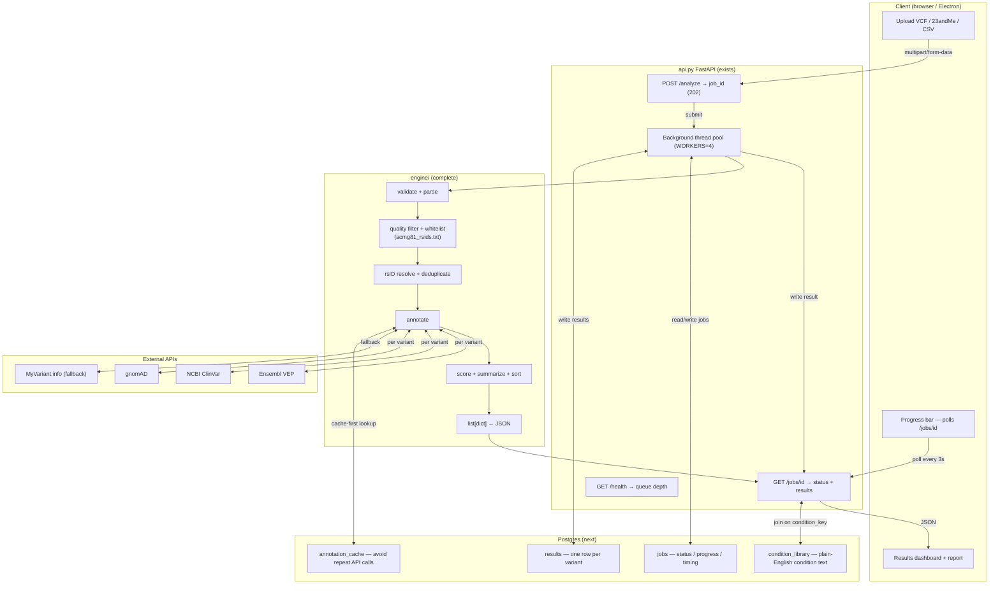

# tell me what is going on in this project folder


``` tool (Agent :subagent_type "researcher" :description "Explore project folder"  ...)
(:name "Agent" :args (:subagent_type "researcher" :description "Explore project folder" :prompt "Inspect the current project folder read-only and explain what is going on. Determine: project type/purpose, tech stack, important files/directories, entry points, build/test/run commands if discoverable, current git status if available, and any obvious concerns/TODOs. Use file search/read tools, not shell for file ops. Return a concise structured summary with evidence from filenames/configs. Do not modify files."))

Researcher result for task: Explore project folder

## Read-only project summary

### What this is
This is a mixed **Python genomics analysis engine + FastAPI API + Next.js frontend** for “u4u-engine / peptideIQ / PeptOdyssey.” The core purpose is to take raw genome files, annotate variants, score/prioritize findings, and map variants to peptide-therapy recommendations. Evidence: `README.md:1`, `README.md:7-9`; pipeline entry is `run_pipeline()` (`engine/pipeline.py:82`) and `annotate_variant()` (`engine/pipeline.py:322`).

### Tech stack
- **Python engine package**: Python `>=3.11`, `requests`, `tenacity`, optional `pysam` for VCF parsing (`engine/pyproject.toml:2-18`).
- **API/backend wrapper**: FastAPI, uvicorn, multipart uploads, SQLAlchemy/asyncpg, Celery/Redis listed for broader backend use (`requirements.txt:2-17`, `requirements.txt:27-32`).
- **Frontend**: Next.js `16.1.4`, React `19.2.3`, TypeScript, Tailwind v4 (`frontend/package.json:5-24`; standalone output in `frontend/next.config.ts:4`).
- **Data/DB**: PostgreSQL schema in `db/schema.sql`; SQLAlchemy peptide models in `db/models/peptide_models.py`; SQLite caches in `data/`.
- **Infra/dev**: Dockerfiles for API and frontend, `docker-compose.yml`, Nix dev shell with Python 3.12 and Node 20 (`flake.nix:12-27`), GitHub Actions tests/builds (`.github/workflows/test.yml:14-31`).

### Important files/directories
- `engine/`: core genomics pipeline, parsers, validators, filters, scoring, summary, annotators, repeat callers.
- `engine/annotators/`: VEP, ClinVar, gnomAD, MyVariant, UniProt, PharmGKB, GWAS, KEGG, BPC-157, peptide mapping.
- `api.py`: FastAPI job API; endpoints include `/health`, `/analyze`, `/jobs`, `/jobs/{job_id}`, `/jobs/{job_id}/dossier/{peptide_name}` (`api.py:191`, `api.py:204`, `api.py:287`, `api.py:339`, `api.py:355`).
- `frontend/src/app/`: Next.js app routes: upload landing page, job status, job list, results pages.
- `db/`: base schema plus peptide condition-library migration/seed/model files.
- `data/`: rsID whitelist, peptide BED, JSON schema, condition spreadsheet, SQLite caches.
- `tests/test_engine/`: unit/integration tests for engine modules.
- `docs/`: architecture, API, frontend, integrations, pipeline, roadmap, project status.
- `Dockerfile`, `frontend/Dockerfile`, `docker-compose.yml`: containerized backend/frontend.

### Runtime flow / entry points
- Primary library API: `from engine import run_pipeline` exported in `engine/__init__.py`; README quick start uses this (`README.md:72`, `README.md:86-90`).
- FastAPI wrapper runs uploaded files through `run_pipeline(...)`, defaulting to `FILTERS=acmg81_rsids.txt` and `bed_filter="peptide_genes.bed"` (`api.py:55-56`, `api.py:127-131`).
- Pipeline stages: validate, parse, quality filter, target filters, rsID resolution, dedupe, annotate, score, summarize, KEGG/receptor/PRS/BPC-157/peptide mapping, dossier generation (`README.md:97`; `engine/pipeline.py:21-26`, `engine/pipeline.py:276-317`).
- Docker backend command: `uvicorn api:app --host 0.0.0.0 --port 8000` (`Dockerfile:87`).
- Frontend API base defaults to `NEXT_PUBLIC_API_BASE` or production URL (`frontend/src/app/lib/api.ts:3`).

### Build/test/run commands found
```bash
# Install engine
pip install -e ./engine
pip install -e "./engine[vcf]"

# Tests
python -m pytest tests/ -v
pytest tests/ -v

# Nix dev shell
nix develop
nix develop --command bash -c "python -m pytest tests/ -v"

# Full stack Docker
docker compose up --build
curl http://localhost:8000/health

# Backend directly, inferred from Dockerfile
uvicorn api:app --host 0.0.0.0 --port 8000

# Frontend
cd frontend
npm run dev
npm run build
npm run start
npm run lint
```
Evidence: `README.md:32-35`, `README.md:62-65`, `README.md:298`, `frontend/package.json:5-9`, `Dockerfile:87`, `docker-compose.yml:4-27`.

### Git status / repository metadata
- `.git` exists.
- Current branch: `main` (`.git/HEAD:1`).
- Origin: `https://github.com/Florida-Man-Bioscience/u4u-engine` (`.git/config:7`).
- Local `main` and `origin/main` refs both point to `4e5e5276171868fd7baab57543bf2954e58ac13e` (`.git/refs/heads/main:1`, `.git/refs/remotes/origin/main:1`).
- Custom hooks are configured with `hooksPath = scripts` (`.git/config:5`); `scripts/pre-commit` auto-bumps `frontend/version.json` and stages it (`scripts/pre-commit:2-25`).
- Full clean/dirty/untracked status cannot be reliably determined from the allowed file-read tools alone; no shell/git command was run.

### Obvious concerns / TODOs
- **API/frontend response mismatch**: API returns `progress: {step, pct}`, `error`, and `count` (`api.py:303-306`), while job status UI/types expect `progress_step`, `progress_pct`, and `error_message` (`frontend/src/app/lib/types.ts:99-103`, `frontend/src/app/jobs/[id]/page.tsx:31,47-48`). Progress/error display likely does not work as intended.
- **In-memory jobs only**: `api.py` explicitly says jobs are stored in `_jobs` and lost on restart (`api.py:18-19`); docs also say Postgres exists but is not wired (`docs/project-status.md:80`).
- **Missing `.env.example`**: README/compose tell users to copy `.env.example` (`docker-compose.yml:3`, `README.md:295`), but file search found none.
- **Docs appear stale/inconsistent**: README references docs such as `docs/narrative.md`, `docs/product-spec.md`, etc. (`README.md:19-24`) that were not present; `docs/project-status.md` says frontend “Not built” (`docs/project-status.md:82`) despite a real `frontend/` app.
- **Security/privacy review pending**: docs list security audit “Not started” (`docs/project-status.md:84`), and frontend TODOs include auth, local VCF processing, and ensuring no identifying genotype info is sent to backend (`frontend/README.md:56-61`). CORS is very permissive in `api.py`.
- **Sensitive-looking local data present**: root contains a named genome sample file and `data/` contains SQLite annotation/rsID caches and a condition-library spreadsheet. `.gitignore` ignores `data/*.txt` but not root genome text files, `.db`, or `.xlsx` (`.gitignore:55-56`, `.gitignore:71-73`), so tracking status should be checked before publishing.
- **Deployment not complete**: docs say Docker/K8s not deployed, domain/DNS absent, PeptidIQ outcome scoring pending (`docs/project-status.md:79-85`).
```
This folder is a genomics/peptide recommendation app.

## What it does

It appears to be **u4u-engine / peptideIQ / PeptOdyssey**: a pipeline that accepts genome/variant files, annotates variants, scores them, and maps findings to peptide-related recommendations or dossiers.

Core flow:

1. Upload or provide genome/variant file.
2. Parse/validate/filter variants.
3. Annotate variants using sources like ClinVar, VEP, gnomAD, MyVariant, UniProt, PharmGKB, GWAS, KEGG.
4. Score/prioritize findings.
5. Generate summaries, peptide mappings, and dossiers.

Main Python entry point:

```python
from engine import run_pipeline
```

FastAPI wraps this in an upload/job API.

## Main parts

### `engine/`

Core Python genomics engine.

Important files/modules include:

- `engine/pipeline.py` — main pipeline orchestration.
- `engine/annotators/` — external/internal annotation integrations.
- parsers, validators, filters, scoring, summaries, peptide mapping.
- optional VCF support via `pysam`.

### `api.py`

FastAPI backend.

Endpoints include roughly:

- `/health`
- `/analyze`
- `/jobs`
- `/jobs/{job_id}`
- `/jobs/{job_id}/dossier/{peptide_name}`

Jobs currently appear to be stored in memory, so they disappear on restart.

### `frontend/`

Next.js frontend using:

- Next.js 16
- React 19
- TypeScript
- Tailwind

It has pages for upload, job list/status, and results.

### `db/`

Database schema/models for peptide/condition data.

There is PostgreSQL schema material here, but the API does not seem fully wired to persistent job storage yet.

### `data/`

Reference/cached data:

- rsID whitelist
- peptide BED file
- JSON schema
- condition spreadsheet
- SQLite annotation/cache files

This folder likely matters for runtime behavior.

### `tests/`

Python tests for the engine.

### `docs/`

Architecture/API/frontend/integration/project-status docs, though some docs seem stale.

## How to run

Likely commands:

```bash
# Engine install
pip install -e ./engine
pip install -e "./engine[vcf]"

# Tests
python -m pytest tests/ -v

# Backend
uvicorn api:app --host 0.0.0.0 --port 8000

# Frontend
cd frontend
npm run dev
npm run build
npm run start

# Full stack
docker compose up --build
```

There is also a Nix dev shell.

## Git/project state

It is a git repo on branch `main`.

Remote:

```text
https://github.com/Florida-Man-Bioscience/u4u-engine
```

There is a custom pre-commit hook configured under `scripts/`, which auto-bumps `frontend/version.json`.

I did not run `git status`, so I can’t say whether the tree is clean.

## Things that look concerning

- **Frontend/API mismatch**: API seems to return progress as nested `progress: { step, pct }`, while frontend types expect fields like `progress_step`, `progress_pct`, `error_message`. Job progress display may be broken.
- **Jobs are in memory**: uploaded analysis jobs are lost when the API restarts.
- **Missing `.env.example`**: docs/docker mention one, but it wasn’t found.
- **Docs are stale/inconsistent**: some referenced docs are missing; project-status says frontend is not built even though `frontend/` exists.
- **Privacy risk**: there appear to be genome/sample/data files locally. `.gitignore` may not cover all sensitive file types like root genome text files, `.db`, or `.xlsx`.
- **CORS/security likely loose**: privacy/security docs mention audits are not done.
- **Deployment incomplete**: docs say Docker/K8s/domain/deployment work is unfinished.

In short: this is a partially integrated full-stack genomics analysis product. The Python engine looks like the center of gravity; the API and frontend exist but may need wiring fixes, persistence, privacy review, and doc cleanup.

### Go ahead and create a new feature branch and fix those flaws


``` tool (Bash :command "git status --short && git switch -c fix-project-flaws")
(:name "Bash" :args (:command "git status --short && git switch -c fix-project-flaws"))

?? data/annotation_cache.db
?? data/annotation_cache.db-shm
?? data/annotation_cache.db-wal
Switched to a new branch 'fix-project-flaws'

```
``` tool (Agent :subagent_type "executor" :description "Fix project flaws" :prompt ...)
(:name "Agent" :args (:subagent_type "executor" :description "Fix project flaws" :prompt "We are on feature branch fix-project-flaws. Modify the project to address the concrete flaws found in the prior summary, without touching or staging untracked sensitive data. Requirements:

1. Fix API/frontend job response mismatch. Inspect api.py and frontend/src/app/lib/types.ts plus relevant frontend pages. Make frontend and API agree with minimal safe changes. Prefer preserving backward compatibility by adding flattened progress_step/progress_pct/error_message fields to API responses and/or adapting frontend types. Ensure job detail/list results render progress/errors correctly.
2. Add a checked-in .env.example suitable for docker-compose/backend/frontend variables, but do not include secrets. Include placeholders for any API keys likely referenced by config/docs/code.
3. Harden .gitignore to avoid accidentally committing sensitive/local genome and cache artifacts. Include patterns for root/sample genome files, SQLite DB/WAL/SHM files, uploaded files, reports/outputs where appropriate. Be careful not to ignore needed source files under db/.
4. Refresh obviously stale documentation references minimally: README docs list should not reference missing docs; docs/project-status.md should reflect that frontend exists and DB schema exists but jobs are still in-memory unless changed. Do not create new docs.
5. Light security/privacy hardening: restrict permissive CORS defaults if practical while keeping local development working; wire allowed origins from env variable. Do not implement auth/persistent job storage unless already trivial. If behavior changes, document in .env.example.

After edits, run focused checks if available: Python tests for changed API if any, TypeScript/lint/build if feasible. Return changed files, exact fixes, checks run/results, and any remaining caveats."))

Error: Task executor could not finish task "Fix project flaws". 
Error details: (:message "You exceeded your current quota, please check your plan and billing details. For more information on this error, read the docs: https://platform.openai.com/docs/guides/error-codes/api-errors." :type "insufficient_quota" :param :null :code "insufficient_quota")
```


``` tool (Bash :command "git status --short --branch && git switch -c feature/fix- ...)
(:name "Bash" :args (:command "git status --short --branch && git switch -c feature/fix-project-flaws"))

## main...origin/main
?? data/annotation_cache.db
?? data/annotation_cache.db-shm
?? data/annotation_cache.db-wal
Switched to a new branch 'feature/fix-project-flaws'

```
``` tool (Agent :subagent_type "executor" :description "Fix project flaws" :prompt ...)
(:name "Agent" :args (:subagent_type "executor" :description "Fix project flaws" :prompt "We are on branch feature/fix-project-flaws. Implement the actionable flaws previously identified, modifying files as needed. Requirements:

1. Fix API/frontend job status contract mismatch. Inspect `api.py` and `frontend/src/app/lib/types.ts` plus job pages. Make response fields consistent. Prefer backward-compatible API aliases if simple, but also make frontend consume the canonical API shape robustly.
2. Make API job storage survive process restarts without adding new infra. Implement a small JSON-backed file store controlled by env var like `JOB_STORE_PATH`/`JOB_STORE_DIR`, defaulting to a safe local path. Preserve existing endpoints and behavior. Be careful with Pydantic/FastAPI serialization and background updates.
3. Add missing `.env.example` with non-secret sample settings matching Docker/API/frontend usage.
4. Improve privacy-oriented ignores without removing tracked project reference files. Add ignores for raw genome/variant files and local cache DB artifacts such as `*.vcf`, `*.vcf.gz`, `*.bam`, `*.sam`, `*.fastq`, `*.fq`, root genome text exports, `*.db`, `*.db-shm`, `*.db-wal`, local spreadsheets if appropriate. Do not delete files.
5. Clean obvious stale docs/references: update README/doc references and project status to reflect actual frontend existence and current limitations. Keep docs concise.
6. Tighten CORS defaults in `api.py`: do not allow all origins by default. Support an env var like `ALLOWED_ORIGINS` and include localhost defaults.
7. Add or update focused tests if practical, especially for job serialization/status payload helpers. Avoid huge rewrites.
8. Run relevant checks (Python tests if available; frontend lint/build if not too heavy). Report exactly what changed, checks run, and any remaining limitations.

Use repository tools appropriately; do not commit. Preserve existing style. If something is too large (e.g. real Postgres migration/deployment), implement a pragmatic incremental fix and document remaining limitation."))

Error: Task executor could not finish task "Fix project flaws". 
Error details: (:message "You exceeded your current quota, please check your plan and billing details. For more information on this error, read the docs: https://platform.openai.com/docs/guides/error-codes/api-errors." :type "insufficient_quota" :param :null :code "insufficient_quota")
```


### Did you fix everything?


``` tool (Bash :command "git status --short --branch")
(:name "Bash" :args (:command "git status --short --branch"))

## fix-project-flaws
?? data/annotation_cache.db
?? data/annotation_cache.db-shm
?? data/annotation_cache.db-wal

```
No. I created the feature branch, but the delegated executor failed due to quota before making changes.

Current state:

- Branch exists: `fix-project-flaws`
- No fixes have been applied yet.
- Existing untracked files remain:

```text
data/annotation_cache.db
data/annotation_cache.db-shm
data/annotation_cache.db-wal
```

I can continue manually on this branch and implement the fixes directly.

### Keep going


``` tool (Read :file_path "api.py" :start_line 1 :end_line 430)
(:name "Read" :args (:file_path "api.py" :start_line 1 :end_line 430))

"""
api.py — U4U Engine FastAPI wrapper
====================================
Wraps run_pipeline() as an async job queue service.

Architecture
------------
  POST /analyze          — upload file, get back a job_id immediately
  GET  /jobs/{job_id}    — poll for status, progress, and results
  GET  /jobs/{job_id}/dossier/{peptide_name} — get dossier HTML for a peptide
  GET  /health           — liveness check

The pipeline runs in a thread pool (blocking IO — external API calls).
The client polls /jobs/{job_id} until status is "done" or "failed".

Job storage
-----------
MVP: in-memory dict (_jobs).  Jobs survive within a process but are lost
on restart.  When you add Postgres, replace _jobs with DB reads/writes and
keep the same endpoint signatures — the frontend polling contract does not change.

Environment variables
---------------------
NCBI_API_KEY   — NCBI API key (optional, raises ClinVar rate limit 3→10 req/s)
DATA_DIR       — path to directory containing rsID filter files (default: "data")
FILTERS        — comma-separated filter filenames (default: "acmg81_rsids.txt")
                 set to "" to run all variants without a panel filter
WORKERS        — thread pool size — set to CPU count of host (default: 4)
MAX_UPLOAD_MB  — file size limit in megabytes (default: 100)
JOB_TTL_HOURS  — hours to keep completed jobs in memory (default: 24)
"""

import asyncio
import logging
import os
import threading
import time
import uuid
from concurrent.futures import ThreadPoolExecutor
from datetime import datetime, timedelta, timezone

from fastapi import BackgroundTasks, FastAPI, HTTPException, UploadFile, File
from fastapi.middleware.cors import CORSMiddleware
from fastapi.responses import JSONResponse, HTMLResponse

from engine import run_pipeline

# ── Configuration ─────────────────────────────────────────────────────────────

DATA_DIR      = os.getenv("DATA_DIR", "data")
MAX_UPLOAD_MB = int(os.getenv("MAX_UPLOAD_MB", "100"))
WORKERS       = int(os.getenv("WORKERS", "4"))
JOB_TTL_HOURS = int(os.getenv("JOB_TTL_HOURS", "24"))

_raw_filters = os.getenv("FILTERS", "acmg81_rsids.txt").strip()
FILTERS      = [f.strip() for f in _raw_filters.split(",") if f.strip()] if _raw_filters else []

logging.basicConfig(level=logging.INFO)
log = logging.getLogger("u4u.api")

# ── App ───────────────────────────────────────────────────────────────────────

app      = FastAPI(
    title="U4U Engine API",
    version="2.0.0",
    description="Genomic variant annotation and interpretation pipeline.",
)

# ── CORS — allow frontend (localhost:3000) to reach the API ───────────────
app.add_middleware(
    CORSMiddleware,
    allow_origins=["*"],
    allow_credentials=True,
    allow_methods=["*"],
    allow_headers=["*"],
)
_executor = ThreadPoolExecutor(max_workers=WORKERS)

# ── In-memory job store ───────────────────────────────────────────────────────
# Schema per job:
#   status     : "pending" | "running" | "done" | "failed"
#   progress   : {"step": str, "pct": int}
#   count      : int | None     — number of variants found
#   results    : list[dict] | None
#   error      : str | None
#   filename   : str
#   file_size  : int
#   created_at : str (ISO-8601)
#   started_at : str | None
#   finished_at: str | None

_jobs: dict[str, dict] = {}
_jobs_lock = threading.Lock()


def _now_iso() -> str:
    return datetime.now(timezone.utc).isoformat()


# ── Background job runner ─────────────────────────────────────────────────────

def _progress_callback(job_id: str, step: str, pct: int):
    """Called by the pipeline on each step — updates the in-memory job record."""
    with _jobs_lock:
        if job_id in _jobs:
            _jobs[job_id]["progress"] = {"step": step, "pct": pct}


def _run_pipeline_task(job_id: str, file_bytes: bytes, filename: str):
    """
    Blocking pipeline run — executed in the thread pool.
    Updates the in-memory job record as it runs.
    """
    with _jobs_lock:
        _jobs[job_id]["status"]     = "running"
        _jobs[job_id]["started_at"] = _now_iso()

    log.info("job=%s starting file=%s size=%d bytes", job_id, filename, len(file_bytes))

    with _jobs_lock:
        partial_results_ref = _jobs[job_id]["partial_results"]

    try:
        pipeline_output = run_pipeline(
            file_bytes,
            filename,
            filters=FILTERS,
            bed_filter="peptide_genes.bed",
            data_dir=DATA_DIR,
            progress_callback=lambda step, pct: _progress_callback(job_id, step, pct),
            partial_results=partial_results_ref,
        )
        # V3: run_pipeline returns a dict with 'variants' and enrichment data.
        variants = pipeline_output.get("variants", [])
        with _jobs_lock:
            _jobs[job_id].update({
                "status":      "done",
                "count":       len(variants),
                "results":     pipeline_output,
                "progress":    {"step": "Complete", "pct": 100},
                "finished_at": _now_iso(),
            })
        log.info("job=%s done variants=%d", job_id, len(variants))

    except ValueError as exc:
        with _jobs_lock:
            _jobs[job_id].update({
                "status":      "failed",
                "error":       str(exc),
                "finished_at": _now_iso(),
            })
        log.warning("job=%s validation error: %s", job_id, exc)

    except Exception as exc:
        with _jobs_lock:
            _jobs[job_id].update({
                "status":      "failed",
                "error":       "Pipeline error. Check server logs.",
                "finished_at": _now_iso(),
            })
        log.exception("job=%s unhandled pipeline error", job_id)


# ── Periodic job cleanup ──────────────────────────────────────────────────────

async def _cleanup_old_jobs():
    """Remove completed/failed jobs older than JOB_TTL_HOURS to prevent memory leak."""
    while True:
        await asyncio.sleep(3600)  # run hourly
        cutoff = datetime.now(timezone.utc) - timedelta(hours=JOB_TTL_HOURS)
        with _jobs_lock:
            expired = [
                jid for jid, j in _jobs.items()
                if j["status"] in ("done", "failed")
                and j.get("finished_at")
                and datetime.fromisoformat(j["finished_at"]) < cutoff
            ]
            for jid in expired:
                del _jobs[jid]
        if expired:
            log.info("cleanup: removed %d expired jobs", len(expired))


@app.on_event("startup")
async def _startup():
    asyncio.create_task(_cleanup_old_jobs())


# ── Endpoints ─────────────────────────────────────────────────────────────────

@app.get("/health")
def health():
    """
    Liveness check. Returns 200 when the server is up.

    Also reports queue depth so ops can detect backlog.
    """
    with _jobs_lock:
        running = sum(1 for j in _jobs.values() if j["status"] == "running")
        pending = sum(1 for j in _jobs.values() if j["status"] == "pending")
    return {"status": "ok", "jobs_running": running, "jobs_pending": pending}


@app.post("/analyze", status_code=202)
async def analyze(
    background_tasks: BackgroundTasks,
    file: UploadFile = File(...),
):
    """
    Upload a genome file and receive a job_id.

    The file is processed asynchronously. Poll GET /jobs/{job_id} for results.

    Accepted formats: .vcf, .vcf.gz (primary), .txt (23andMe), .csv, rsID list.
    File is read into memory, processed, and discarded — never written to disk.

    Returns
    -------
    {
        "job_id": str,
        "status": "pending",
        "poll_url": "/jobs/{job_id}"
    }

    Status codes
    ------------
    202  Job accepted
    413  File exceeds MAX_UPLOAD_MB limit
    422  Unsupported / empty file (caught before background task starts)
    """
    filename   = file.filename or "upload"
    file_bytes = await file.read()

    # ── Size guard (before job is created) ───────────────────────────────────
    max_bytes = MAX_UPLOAD_MB * 1024 * 1024
    if len(file_bytes) > max_bytes:
        raise HTTPException(
            status_code=413,
            detail=f"File exceeds {MAX_UPLOAD_MB} MB limit.",
        )

    if len(file_bytes) == 0:
        raise HTTPException(status_code=422, detail="Empty file.")

    # ── Create job record ─────────────────────────────────────────────────────
    job_id = str(uuid.uuid4())
    with _jobs_lock:
        _jobs[job_id] = {
            "status":      "pending",
            "progress":    {"step": "Queued", "pct": 0},
            "count":       None,
            "results":     None,
            "partial_results": [],
            "error":       None,
            "filename":    filename,
            "file_size":   len(file_bytes),
            "created_at":  _now_iso(),
            "started_at":  None,
            "finished_at": None,
        }

    # ── Dispatch to thread pool via BackgroundTasks ──────────────────────────
    # BackgroundTasks runs after the response is sent, in the event loop.
    # We submit to _executor to keep the async event loop free.
    loop = asyncio.get_event_loop()
    background_tasks.add_task(
        loop.run_in_executor,
        _executor,
        _run_pipeline_task,
        job_id,
        file_bytes,
        filename,
    )

    log.info("job=%s queued file=%s size=%d bytes", job_id, filename, len(file_bytes))

    return JSONResponse(
        status_code=202,
        content={
            "job_id":   job_id,
            "status":   "pending",
            "poll_url": f"/jobs/{job_id}",
        },
    )


@app.get("/jobs/{job_id}")
def get_job(job_id: str, include_results: bool = True):
    """
    Poll job status and retrieve results when complete.

    Parameters
    ----------
    include_results : bool
        Set to false to get status/progress without the full results list.
        Useful for a progress bar that only fetches results once status=done.

    Returns
    -------
    {
        "job_id":     str,
        "status":     "pending" | "running" | "done" | "failed",
        "progress":   {"step": str, "pct": int},
        "count":      int | null,
        "results":    [...] | null,    # null if pending/running or include_results=false
        "error":      str | null,
        "filename":   str,
        "file_size":  int,
        "created_at": str,             # ISO-8601
        "started_at": str | null,
        "finished_at":str | null
    }

    Polling guidance
    ----------------
    - Poll every 2–5 seconds while status is "pending" or "running".
    - Stop when status is "done" or "failed".
    - Jobs expire after JOB_TTL_HOURS (default 24h) — 404 after that.
    """
    with _jobs_lock:
        job = _jobs.get(job_id)

    if not job:
        raise HTTPException(status_code=404, detail="Job not found or expired.")

    response = dict(job)
    response["job_id"] = job_id
    
    # Safely copy the list to avoid mutation issues during serialization
    response["partial_results"] = list(job.get("partial_results", []))

    if not include_results:
        response.pop("results", None)
        response.pop("partial_results", None)

    return response


@app.get("/jobs")
def list_jobs(limit: int = 20):
    """
    List recent jobs (status only — no results payload).
    Useful for ops dashboards. Returns newest first.
    """
    with _jobs_lock:
        snapshot = sorted(
            [{"job_id": jid, **{k: v for k, v in j.items() if k != "results"}}
             for jid, j in _jobs.items()],
            key=lambda x: x.get("created_at", ""),
            reverse=True,
        )
    return {"jobs": snapshot[:limit]}


@app.get("/jobs/{job_id}/dossier/{peptide_name}", response_class=HTMLResponse)
def get_dossier(job_id: str, peptide_name: str):
    """
    Return the pre-rendered HTML dossier for a specific peptide therapy.
    """
    with _jobs_lock:
        job = _jobs.get(job_id)

    if not job:
        raise HTTPException(status_code=404, detail="Job not found")

    if job["status"] != "done":
        raise HTTPException(status_code=409, detail="Job not yet complete")

    results = job.get("results", {})
    dossiers = results.get("dossiers", {})

    if peptide_name not in dossiers:
        available = list(dossiers.keys())
        raise HTTPException(
            status_code=404,
            detail=f"Dossier not found for '{peptide_name}'. Available: {available}",
        )

    return HTMLResponse(content=dossiers[peptide_name])

```
``` tool (Read :file_path "frontend/src/app/lib/types.ts" :start_line 1 :end_line 220)
(:name "Read" :args (:file_path "frontend/src/app/lib/types.ts" :start_line 1 :end_line 220))

export type Tier = "critical" | "high" | "medium" | "low";

export interface JobListItem {
  job_id: string;
  status: "pending" | "running" | "done" | "failed";
  filename: string;
  file_size: number;
  count: number | null;
  created_at: string;
  started_at: string | null;
  finished_at: string | null;
  progress: { step: string; pct: number };
  error: string | null;
}

export interface VariantResult {
  variant_id: string;
  rsid: string | null;
  location: string;
  consequence: string;
  genes: string[];
  clinvar: string | null;
  disease_name: string | null;
  gnomad_af: number | null;
  score: number;
  tier: Tier;
  reasons: string[];
  emoji: string;
  headline: string;
  consequence_plain: string;
  rarity_plain: string;
  clinvar_plain: string;
  action_hint: string;
}

export interface Bpc157PathwayHit {
  pathway: string;
  display_name: string;
  genes_hit: string[];
  total_genes: number;
  coverage: number;
  relevance: string;
}

export interface Bpc157CandidateFactor {
  rsid: string;
  gene: string;
  pathway: string;
  direction: string;
  effect: string;
}

export interface Bpc157Biomarker {
  name: string;
  expected_change: string;
  category: string;
}

export interface Bpc157Prediction {
  responder_tier: "likely_good" | "possible" | "uncertain" | "low_confidence";
  composite_score: number;
  pathways_affected: Bpc157PathwayHit[];
  primary_use_case: string;
  primary_use_case_display: string;
  primary_use_case_description: string;
  biomarker_recommendations: Bpc157Biomarker[];
  candidate_factors: Bpc157CandidateFactor[];
  summary_text: string;
  disclaimer: string;
}

export interface PeptideRecommendation {
  peptide_name: string;
  genes_for_genotyping: string[];
  genes_found: string[];
  genes_missing: string[];
  coverage: number;
  predicted_tier: string;
  prediction_description: string;
  tier_reasons: string[];
  rationale: string;
  references: string[];
  category: string;
  category_display: string;
  relevant_variants: VariantResult[];
  bpc157_prediction?: Bpc157Prediction;
}

export interface PeptideMapping {
  recommendations: PeptideRecommendation[];
  summary_text: string;
  genes_found_total: string[];
  peptides_with_coverage: number;
}

export interface JobStatus {
  job_id: string;
  status: "pending" | "running" | "done" | "failed";
  progress_step?: string;
  progress_pct?: number;
  filename?: string;
  created_at?: string;
  error_message?: string;
  results?: {
    variants?: VariantResult[];
    peptide_recommendations?: PeptideMapping;
    pathway_summary?: unknown;
    receptor_genetics?: unknown;
    prs_profile?: unknown;
    ar_cag_repeat?: unknown;
  };
  partial_results?: VariantResult[];
  variant_count?: number;
}

```
``` tool (Read :file_path "frontend/src/app/jobs/[id]/page.tsx" :start_line 1 :end ...)
(:name "Read" :args (:file_path "frontend/src/app/jobs/[id]/page.tsx" :start_line 1 :end_line 220))

"use client";

import { useEffect, useRef, useState } from "react";
import { useRouter, useParams } from "next/navigation";
import { getJobStatus } from "../../lib/api";
import type { JobStatus } from "../../lib/types";
import { VariantCard } from "../../components/VariantCard";

const POLL_INTERVAL_MS = 2000;

export default function JobStatusPage() {
  const router = useRouter();
  const params = useParams();
  const jobId = params.id as string;

  const [status, setStatus] = useState<JobStatus | null>(null);
  const [error, setError] = useState<string | null>(null);
  const intervalRef = useRef<ReturnType<typeof setInterval> | null>(null);

  useEffect(() => {
    async function poll() {
      try {
        const data = await getJobStatus(jobId);
        setStatus(data);

        if (data.status === "done") {
          clearInterval(intervalRef.current!);
          router.push(`/jobs/${jobId}/results`);
        } else if (data.status === "failed") {
          clearInterval(intervalRef.current!);
          setError(data.error_message ?? "The analysis job failed. Please try again.");
        }
      } catch (err: unknown) {
        clearInterval(intervalRef.current!);
        setError(err instanceof Error ? err.message : "Failed to fetch job status.");
      }
    }

    poll();
    intervalRef.current = setInterval(poll, POLL_INTERVAL_MS);

    return () => {
      if (intervalRef.current) clearInterval(intervalRef.current);
    };
  }, [jobId, router]);

  const progress = status?.progress_pct ?? 0;
  const currentStep = status?.progress_step ?? "";

  return (
    <div className="flex flex-col items-center justify-center min-h-[60vh] space-y-8">
      <div className="text-center space-y-2">
        <h1 className="text-2xl font-bold text-zinc-900">Analyzing Variants</h1>
        <p className="text-zinc-500 text-sm">
          Job ID:{" "}
          <code className="font-mono bg-zinc-100 px-1.5 py-0.5 rounded text-xs">
            {jobId}
          </code>
        </p>
      </div>

      {error ? (
        <div className="w-full max-w-md mx-auto rounded-lg bg-red-50 border border-red-200 p-6 text-center space-y-4">
          <p className="text-red-700 font-medium">Analysis Failed</p>
          <p className="text-sm text-red-600">{error}</p>
          <button
            onClick={() => router.push("/")}
            className="rounded-lg bg-red-600 text-white px-5 py-2 text-sm font-medium hover:bg-red-700 transition-colors"
          >
            Try again
          </button>
        </div>
      ) : (
        <div className="w-full max-w-4xl space-y-8">
          <div className="bg-white rounded-xl border border-zinc-200 shadow-sm p-6 space-y-4 max-w-md mx-auto">
            {/* Progress bar */}
            <div>
              <div className="flex justify-between text-xs text-zinc-500 mb-1.5">
                <span>
                  {status?.status === "pending"
                    ? "Queued…"
                    : currentStep || "Processing…"}
                </span>
                <span>{progress}%</span>
              </div>
              <div className="h-2.5 rounded-full bg-zinc-100 overflow-hidden">
                <div
                  className="h-full rounded-full bg-blue-600 transition-all duration-500"
                  style={{ width: `${progress}%` }}
                />
              </div>
            </div>

            {/* Steps legend */}
            <div className="space-y-2">
              <Step
                label="Parsing variants"
                done={progress >= 25}
                active={status?.status === "running" && progress < 25}
              />
              <Step
                label="Resolving rsIDs"
                done={progress >= 50}
                active={progress >= 25 && progress < 50}
              />
              <Step
                label="Annotating (VEP / ClinVar / gnomAD)"
                done={progress >= 85}
                active={progress >= 50 && progress < 85}
              />
              <Step
                label="Scoring &amp; tiering"
                done={progress >= 100}
                active={progress >= 85 && progress < 100}
              />
            </div>
          </div>

          {/* Progressive Variants Stream */}
          {(status?.partial_results && status.partial_results.length > 0) && (
            <div className="space-y-4 animate-in fade-in slide-in-from-bottom-4 duration-500">
              <h2 className="text-xl font-bold text-zinc-900 border-b border-zinc-200 pb-2 flex items-center justify-between">
                <span>Variants Analyzed</span>
                <span className="text-base text-zinc-500 font-normal">{status.partial_results.length} found</span>
              </h2>
              <div className="grid grid-cols-1 gap-4">
                {status.partial_results.map((variant) => (
                  <VariantCard key={variant.variant_id} variant={variant} />
                ))}
              </div>
            </div>
          )}

          <p className="text-center text-xs text-zinc-400">
            This page updates automatically. Do not close this tab.
          </p>
        </div>
      )}
    </div>
  );
}

function Step({
  label,
  done,
  active,
}: {
  label: string;
  done: boolean;
  active: boolean;
}) {
  return (
    <div className="flex items-center gap-2 text-sm">
      {done ? (
        <span className="text-green-500">✓</span>
      ) : active ? (
        <span className="inline-block h-3 w-3 rounded-full border-2 border-blue-500 border-t-transparent animate-spin" />
      ) : (
        <span className="inline-block h-3 w-3 rounded-full border border-zinc-300" />
      )}
      <span
        className={
          done
            ? "text-zinc-700 line-through decoration-zinc-300"
            : active
              ? "text-zinc-900 font-medium"
              : "text-zinc-400"
        }
        dangerouslySetInnerHTML={{ __html: label }}
      />
    </div>
  );
}

```
``` tool (Read :file_path ".gitignore" :start_line 1 :end_line 140)
(:name "Read" :args (:file_path ".gitignore" :start_line 1 :end_line 140))

# Python
__pycache__/
*.py[cod]
*.pyo
*.pyd
.Python
*.egg
*.egg-info/
dist/
build/
eggs/
.eggs/
*.egg-link
pip-wheel-metadata/
.installed.cfg
lib/
lib64/
!frontend/src/**/lib/

# Virtual environments
.venv/
venv/
env/
ENV/

# Distribution
*.tar.gz
*.whl
sdist/

# Testing
.pytest_cache/
.tox/
htmlcov/
.coverage
.coverage.*
coverage.xml
nosetests.xml
*.cover

# IDE
.idea/
.vscode/
*.swp
*.swo
*~
.DS_Store

# Jupyter
.ipynb_checkpoints/
*.ipynb

# Data files (large, not committed)
data/*.gz
data/*.txt
!data/.gitkeep

# Previous version folder
u4u-engine 2/

# Frontend (Next.js)
!frontend/src/app/lib/
frontend/node_modules/
frontend/.next/
frontend/out/
frontend/.vercel/
frontend/next-env.d.ts
frontend/*.tsbuildinfo

# Secrets / environment
.env
.env.*
!.env.example
*.key
ExportBlock-*/
one_variant.txt
small_test.txt
u4unotionpage.zip
ExportBlock-*/
one_variant.txt
small_test.txt
u4unotionpage.zip

```
``` tool (Read :file_path "README.md" :start_line 1 :end_line 130)
(:name "Read" :args (:file_path "README.md" :start_line 1 :end_line 130))

# u4u-engine: peptideIQ

[](https://github.com/curtisdearing/u4u-engine/actions/workflows/test.yml)
[](https://www.python.org/downloads/)
[](LICENSE)

Standalone genomics variant analysis engine for the U4U platform.

Takes a raw genome file, runs it through a 10-step annotation pipeline, and returns a scored, prioritized list of variants with plain-English summaries. No web framework dependencies — import it wherever and call `run_pipeline()`.

---

## Documentation

All product, clinical, and infrastructure specs live in [`docs/`](docs/):

| Document | Audience | What it covers |
|----------|----------|----------------|
| [`docs/narrative.md`](docs/narrative.md) | Everyone | Product mission — what U4U is and why it exists |
| [`docs/product-spec.md`](docs/product-spec.md) | Tom, Rocky | Every screen, every state, every UI element |
| [`docs/engine-spec.md`](docs/engine-spec.md) | Curtis, Hampton | Engine API, pipeline steps, expected behaviors, test cases |
| [`docs/data-sources.md`](docs/data-sources.md) | Curtis, Hampton, Cane | External APIs, rate limits, what user data leaves the system |
| [`docs/interpretation-spec.md`](docs/interpretation-spec.md) | Sasank, Rocky | Finding tiers, VUS policy, condition library schema |
| [`docs/team.md`](docs/team.md) | Everyone | Who owns what, critical path, open decisions |

---

## Install

```bash
# From the repo root
pip install -e ./engine

# With VCF support (Linux/Mac only — pysam requires a C compiler)
pip install -e "./engine[vcf]"

# Enable git hooks (auto-increments version on each commit)
git config core.hooksPath scripts
```

**Required dependencies:** `requests>=2.31`, `tenacity>=8.2`

---

## NixOS / Nix Development

A `flake.nix` is provided for reproducible development on NixOS or any system with [Nix](https://nixos.org/) installed.

### Enter the dev shell

```bash
# From the repo root
nix develop
```

This gives you Python 3.12 with `pytest`, `responses`, `requests`, `tenacity`, and Node.js 20 — everything needed to run the engine tests and build the frontend.

### Run tests inside the Nix shell

```bash
# Already inside `nix develop`:
python -m pytest tests/ -v

# Or as a one-liner without entering the shell:
nix develop --command bash -c "python -m pytest tests/ -v"
```

### Run the engine

```bash
nix develop --command python -c "
from engine import run_pipeline
# ... your pipeline code
"
```

> **Note:** The Nix shell provides test and engine dependencies only. For production
> deployment (FastAPI/uvicorn, Celery, database drivers), use Docker or `pip install`
> as described above.

---

## Quick Start

```python
from engine import run_pipeline

with open("my_file.vcf", "rb") as f:
    results = run_pipeline(f.read(), "my_file.vcf")

for r in results:
    print(r["tier"], r["genes"], r["headline"])
```

---

## Pipeline Steps

| Step | What happens |
|------|-------------|
| 1. Validate | File size ≤ 100 MB, VCF header check, UTF-8 |
| 2. Parse | VCF / 23andMe / rsID list / CSV → variant dicts |
| 3. Quality filter | Drop hom-ref, failed calls (--/NN/DI), low GQ/DP, indels |
| 4. Whitelist filter | Keep only ACMG81 / pharma / carrier variants (optional) |
| 5. rsID resolution | Ensembl REST: rsid_only variants → coordinates |
| 6. Deduplicate | By (chrom, pos, ref, alt) — eliminates double-annotation |
| 7. Annotate | VEP (consequence + gene) + ClinVar + gnomAD + MyVariant fallback |
| 8. Score | ClinVar > consequence > frequency. Carrier detection for recessive genes |
| 9. Summarize | Plain-English headline, rarity, action hint, zygosity |
| 10. Sort | By score descending |

---

## Result Dict Fields

Each variant in the returned list contains:

```
variant_id         str        rsid or "chrom:pos"
rsid               str|None   dbSNP rsID
location           str        "chrom:pos"
chrom              str        chromosome (no chr prefix)
pos                int        1-based position
ref, alt           str        alleles
zygosity           str        "heterozygous" | "homozygous_alt" | "unknown"

consequence        str        VEP SO term (e.g. "missense_variant")
genes              list[str]  affected gene symbols
clinvar            str|None   ClinVar classification (lowercased)
clinvar_raw        str|None   same — never overwritten by heuristics

```
``` tool (Read :file_path "docs/project-status.md" :start_line 1 :end_line 140)
(:name "Read" :args (:file_path "docs/project-status.md" :start_line 1 :end_line 140))

# Project Status

---

## MVP scope

VCF upload → annotation engine → interactive dashboard. No genome storage. Email capture for future research updates. Target: 4 weeks.

---

## What works

- Parses VCF / `.vcf.gz` (MVP primary), 23andMe `.txt`, CSV, rsID lists
- 10-step pipeline: validate → parse → quality filter → whitelist → rsID resolution → deduplicate → annotate → score → summarize → sort
- Annotates against ClinVar, gnomAD, Ensembl VEP (retry + fallback)
- Returns plain-English headline, consequence, rarity, action hint per variant
- FastAPI job queue (`api.py`) — `POST /analyze` → 202 + `job_id`, `GET /jobs/:id` for polling
- Postgres schema (`db/schema.sql`) — jobs, results, condition_library, annotation_cache
- CI on push via GitHub Actions (Python 3.11 and 3.12)

### PeptidIQ V3 — Peptide Response Interpretation Engine ✅

Added April 2026. Extends the genomics pipeline into a clinically actionable peptide and hormone response system.

**Peptide Condition Library** (`db/migrations/003_peptide_condition_library.sql`, `db/models/peptide_models.py`, `db/seeds/peptide_seed_data.sql`)
- Two new Postgres tables: `peptide_condition_library` and `peptide_trade_offs`
- SQLAlchemy 2.0 ORM models with async helpers (`get_peptide_responses`, `get_trade_off`, `get_contraindicated_peptides`)
- 12 seeded rows covering AR, ESR1, ESR2, OXTR, MC4R, GLP1R, RET, TP53, BRCA1 with clinically detailed genotype–peptide response data
- JSON Schema 2020-12 for scoring engine input/output format (`data/peptidiq_engine_schema.json`)

**ExpansionHunter STR Calling** (`engine/repeat_callers/expansion_hunter.py`)
- Wraps Illumina ExpansionHunter binary to call AR CAG repeat directly from BAM/CRAM files
- Clinical interpretation with 6 sensitivity tiers (VERY_LOW_PATHOLOGIC → VERY_HIGH) and severity flags
- Ancestry-adjusted reference ranges (African, Caucasian, Hispanic, Asian)
- Graceful degradation: operates from VCF-only when no BAM is available
- 58 unit tests — all passing (`tests/test_engine/test_expansion_hunter.py`)

**KEGG Pathway Mapper** (`engine/annotators/kegg_mapper.py`)
- Maps patient variant gene symbols to 8 priority KEGG pathways: Estrogen signalling, GnRH signalling, Serotonergic synapse, MAPK, PI3K-AKT, Adipocytokine, Melanocortin/MC4R, Steroid hormone biosynthesis
- Fully offline via hardcoded gene membership; optional KEGG REST API refresh with SQLite caching
- Per-gene clinical implication generation (~50 curated gene–pathway notes)
- Cross-pathway combination notes for 7 clinically relevant co-hit pairs
- 53 unit tests — all passing (`tests/test_engine/test_kegg_mapper.py`)

**Predictive Logic Architecture** — spec documented in Notion (Predictive Logic Architecture page); 4-layer scoring engine (Input → Evidence [35/25/20/20 weights] → Outcome → Logic Flow).

---

## Repo

```
engine/
  annotators/       ClinVar, gnomAD, VEP, MyVariant, kegg_mapper modules
  repeat_callers/   ExpansionHunter STR caller (AR CAG repeat)
  pipeline.py       run_pipeline() entry point
  scoring.py        scoring + tier logic
  summary.py        plain-English text generation
api.py              FastAPI job queue
db/
  schema.sql        base Postgres schema (jobs, results, condition_library)
  migrations/       incremental migration files (003 = Peptide Condition Library)
  models/           SQLAlchemy ORM models (peptide_models.py)
  seeds/            seed data SQL (peptide_seed_data.sql)
data/
  acmg81_rsids.txt
  condition_library_for_sasank.xlsx
  peptidiq_engine_schema.json     ← JSON Schema 2020-12 for scoring engine I/O
tests/test_engine/  all unit + integration tests
docs/               documentation (this file, architecture, roadmap, etc.)
.github/            CI, issue templates, PR template
```

---

## What doesn't exist

| Area | Status |
|------|--------|
| Docker build + K8s deployment | Not deployed |
| Postgres instance running | Schema exists — not wired |
| Condition library content | 81 ACMG SF rows needed |
| Frontend | Not built — spec in `docs/frontend.md` |
| Domain + DNS | Not registered |
| Security audit | Not started — plan in `U4U_Cybersecurity_Execution_Plan.docx` |
| PeptidIQ scoring engine (Layer 3 Outcome) | Architecture spec done, implementation pending |
| FastAPI endpoints for peptide response | Not yet wired to new ORM models |
| ExpansionHunter binary + reference FASTA | Must be installed in deployment environment |

---

## UI spec

Full spec in `docs/frontend.md`.

Three screens: Upload → Processing → Results.

Results screen is a **prioritized findings report** — single column, expandable rows with a colored left border (tier color). Two sections: "Needs Attention" (critical + high) and "For Your Records" (medium + low + carrier, collapsed by default).

**Tier visual treatment:**

| `tier` | Border | Emoji |
|--------|--------|-------|
| critical | red | 🔴 |
| high | orange | 🟠 |
| medium | yellow | 🟡 |
| low | green | 🟢 |
| carrier | blue | 🔵 |

**Error states:**

| State | Behavior |
|-------|----------|
| File too large / unsupported format | Inline error before submit |
| Invalid VCF header | Error screen after submit |
| All variants filtered | Results page with explanation |
| Zero ACMG findings | Message, not blank |
| Network error | Error screen with retry |
| Partial results | Show succeeded, note how many failed |

---

## Not in V1

User accounts, saved results, email delivery, pharmacogenomics, research tracking, PRS, mobile, API access for external developers.

Roadmap: `docs/roadmap.md`

```
``` tool (Read :file_path "frontend/src/app/lib/api.ts" :start_line 1 :end_line 220)
(:name "Read" :args (:file_path "frontend/src/app/lib/api.ts" :start_line 1 :end_line 220))

import type { JobStatus, JobListItem } from "./types";

const API_BASE = process.env.NEXT_PUBLIC_API_BASE || "https://flmanbiosci.net/api/v1";

async function apiFetch<T>(path: string, options?: RequestInit): Promise<T> {
  const res = await fetch(`${API_BASE}${path}`, options);

  if (!res.ok) {
    let message = `HTTP ${res.status}`;
    try {
      const body = await res.json();
      message = body?.detail ?? body?.message ?? message;
    } catch {
      // ignore JSON parse errors
    }
    throw new Error(message);
  }

  return res.json() as Promise<T>;
}

/** Upload a genome file and start an analysis job. */
export async function analyzeFile(
  file: File
): Promise<{ job_id: string; poll_url: string }> {
  const form = new FormData();
  form.append("file", file);
  return apiFetch<{ job_id: string; poll_url: string }>("/analyze", {
    method: "POST",
    body: form,
  });
}

/** Fetch the current status (and results when done) of a job. */
export async function getJobStatus(jobId: string): Promise<JobStatus> {
  return apiFetch<JobStatus>(`/jobs/${jobId}`);
}

/** List recent jobs (status only — no results payload). */
export async function listJobs(
  limit = 50
): Promise<{ jobs: JobListItem[] }> {
  return apiFetch<{ jobs: JobListItem[] }>(`/jobs?limit=${limit}`);
}

```
``` tool (Read :file_path "frontend/src/app/jobs/page.tsx" :start_line 1 :end_line 240)
(:name "Read" :args (:file_path "frontend/src/app/jobs/page.tsx" :start_line 1 :end_line 240))

"use client";

import { useEffect, useState } from "react";
import { useRouter } from "next/navigation";
import { listJobs } from "../lib/api";
import type { JobListItem } from "../lib/types";

const STATUS_STYLES: Record<string, string> = {
    done: "bg-green-100 text-green-800",
    failed: "bg-red-100 text-red-700",
    running: "bg-blue-100 text-blue-700",
    pending: "bg-zinc-100 text-zinc-600",
};

const STATUS_ICONS: Record<string, string> = {
    done: "✓",
    failed: "✗",
    running: "⟳",
    pending: "⏳",
};

function timeAgo(iso: string): string {
    const diff = Date.now() - new Date(iso).getTime();
    const mins = Math.floor(diff / 60000);
    if (mins < 1) return "just now";
    if (mins < 60) return `${mins}m ago`;
    const hrs = Math.floor(mins / 60);
    if (hrs < 24) return `${hrs}h ago`;
    const days = Math.floor(hrs / 24);
    return `${days}d ago`;
}

function formatSize(bytes: number): string {
    if (bytes < 1024) return `${bytes} B`;
    if (bytes < 1024 * 1024) return `${(bytes / 1024).toFixed(1)} KB`;
    return `${(bytes / 1024 / 1024).toFixed(2)} MB`;
}

export default function JobsListPage() {
    const router = useRouter();
    const [jobs, setJobs] = useState<JobListItem[]>([]);
    const [loading, setLoading] = useState(true);
    const [error, setError] = useState<string | null>(null);

    useEffect(() => {
        listJobs(50)
            .then((data) => {
                setJobs(data.jobs);
                setLoading(false);
            })
            .catch((err: unknown) => {
                setError(err instanceof Error ? err.message : "Failed to load jobs.");
                setLoading(false);
            });
    }, []);

    if (loading) {
        return (
            <div className="flex items-center justify-center min-h-[60vh]">
                <div className="flex items-center gap-2 text-zinc-500">
                    <span className="inline-block h-5 w-5 rounded-full border-2 border-blue-500 border-t-transparent animate-spin" />
                    Loading jobs…
                </div>
            </div>
        );
    }

    if (error) {
        return (
            <div className="flex flex-col items-center justify-center min-h-[60vh] space-y-4">
                <div className="rounded-lg bg-red-50 border border-red-200 p-6 text-center max-w-md space-y-4">
                    <p className="text-red-700 font-medium">Failed to load jobs</p>
                    <p className="text-sm text-red-600">{error}</p>
                    <button
                        onClick={() => router.push("/")}
                        className="rounded-lg bg-blue-700 text-white px-5 py-2 text-sm font-medium hover:bg-blue-800 transition-colors"
                    >
                        Back to upload
                    </button>
                </div>
            </div>
        );
    }

    const completed = jobs.filter((j) => j.status === "done");
    const inProgress = jobs.filter((j) => j.status === "running" || j.status === "pending");
    const failed = jobs.filter((j) => j.status === "failed");

    return (
        <div className="space-y-6">
            <div className="flex items-center justify-between">
                <div>
                    <h1 className="text-2xl font-bold text-zinc-900">Analysis History</h1>
                    <p className="text-sm text-zinc-500 mt-0.5">
                        {jobs.length} job{jobs.length !== 1 ? "s" : ""} total
                    </p>
                </div>
                <button
                    onClick={() => router.push("/")}
                    className="rounded-lg bg-blue-700 text-white px-4 py-2 text-sm font-medium hover:bg-blue-800 transition-colors"
                >
                    + New Analysis
                </button>
            </div>

            {jobs.length === 0 ? (
                <div className="text-center py-20 space-y-3">
                    <span className="text-4xl">📂</span>
                    <p className="text-zinc-500">No jobs yet.</p>
                    <button
                        onClick={() => router.push("/")}
                        className="text-blue-700 text-sm font-medium hover:underline"
                    >
                        Upload a genome file to get started →
                    </button>
                </div>
            ) : (
                <div className="space-y-4">
                    {/* In-progress jobs */}
                    {inProgress.length > 0 && (
                        <Section title="In Progress" count={inProgress.length}>
                            {inProgress.map((job) => (
                                <JobRow
                                    key={job.job_id}
                                    job={job}
                                    onClick={() => router.push(`/jobs/${job.job_id}`)}
                                />
                            ))}
                        </Section>
                    )}

                    {/* Completed jobs */}
                    {completed.length > 0 && (
                        <Section title="Completed" count={completed.length}>
                            {completed.map((job) => (
                                <JobRow
                                    key={job.job_id}
                                    job={job}
                                    onClick={() => router.push(`/jobs/${job.job_id}/results`)}
                                />
                            ))}
                        </Section>
                    )}

                    {/* Failed jobs */}
                    {failed.length > 0 && (
                        <Section title="Failed" count={failed.length}>
                            {failed.map((job) => (
                                <JobRow
                                    key={job.job_id}
                                    job={job}
                                    onClick={() => router.push(`/jobs/${job.job_id}`)}
                                />
                            ))}
                        </Section>
                    )}
                </div>
            )}
        </div>
    );
}


function Section({
    title,
    count,
    children,
}: {
    title: string;
    count: number;
    children: React.ReactNode;
}) {
    return (
        <div>
            <h2 className="text-xs font-semibold text-zinc-400 uppercase tracking-wide mb-2">
                {title} ({count})
            </h2>
            <div className="space-y-2">{children}</div>
        </div>
    );
}


function JobRow({ job, onClick }: { job: JobListItem; onClick: () => void }) {
    return (
        <button
            onClick={onClick}
            className="w-full flex items-center justify-between bg-white rounded-lg border border-zinc-200 shadow-sm px-4 py-3 hover:border-blue-300 hover:shadow-md transition-all text-left group"
        >
            <div className="flex items-center gap-3 min-w-0">
                {/* Status badge */}
                <span
                    className={`flex-shrink-0 inline-flex items-center justify-center w-7 h-7 rounded-full text-xs font-bold ${STATUS_STYLES[job.status] ?? STATUS_STYLES.pending
                        }`}
                >
                    {STATUS_ICONS[job.status] ?? "?"}
                </span>

                <div className="min-w-0">
                    <p className="text-sm font-medium text-zinc-900 truncate group-hover:text-blue-700 transition-colors">
                        {job.filename}
                    </p>
                    <p className="text-xs text-zinc-400 mt-0.5">
                        {formatSize(job.file_size)}
                        {job.count != null && ` · ${job.count} variants`}
                        {job.created_at && ` · ${timeAgo(job.created_at)}`}
                    </p>
                </div>
            </div>

            {/* Right side */}
            <div className="flex items-center gap-3 flex-shrink-0 ml-4">
                {job.status === "running" && (
                    <div className="w-20">
                        <div className="h-1.5 rounded-full bg-zinc-100 overflow-hidden">
                            <div
                                className="h-full rounded-full bg-blue-500 transition-all"
                                style={{ width: `${job.progress?.pct ?? 0}%` }}
                            />
                        </div>
                    </div>
                )}
                <span className="text-zinc-300 group-hover:text-blue-500 transition-colors">→</span>
            </div>
        </button>
    );
}

```
``` tool (Read :file_path "frontend/src/app/jobs/[id]/results/page.tsx" :start_lin ...)
(:name "Read" :args (:file_path "frontend/src/app/jobs/[id]/results/page.tsx" :start_line 1 :end_line 260))

"use client";

import { useEffect, useState, useCallback } from "react";
import { useRouter, useParams } from "next/navigation";
import { getJobStatus } from "../../../lib/api";
import type {
  VariantResult,
  Tier,
  PeptideMapping,
  PeptideRecommendation,
} from "../../../lib/types";
import { VariantCard } from "../../../components/VariantCard";
import { SummaryMetrics } from "../../../components/SummaryMetrics";

const TIER_ORDER: Tier[] = ["critical", "high", "medium", "low"];

type ViewMode = "peptides" | "variants";

const PREDICTED_TIER_COLORS: Record<string, string> = {
  "Strong Fit": "bg-green-100 text-green-800 border-green-300",
  "Possible Fit": "bg-green-50 text-green-700 border-green-200",
  "Likely Reduced": "bg-red-100 text-red-800 border-red-300",
  "Possibly Altered": "bg-yellow-100 text-yellow-800 border-yellow-300",
  Caution: "bg-red-100 text-red-800 border-red-300",
  "Review Recommended": "bg-amber-100 text-amber-800 border-amber-300",
  "Review Needed": "bg-yellow-100 text-yellow-800 border-yellow-300",
  Baseline: "bg-zinc-100 text-zinc-500 border-zinc-200",
  // BPC-157 predictor tiers
  likely_good: "bg-green-100 text-green-800 border-green-300",
  possible: "bg-yellow-100 text-yellow-800 border-yellow-300",
  uncertain: "bg-zinc-100 text-zinc-600 border-zinc-300",
  low_confidence: "bg-zinc-100 text-zinc-500 border-zinc-200",
};

export default function ResultsPage() {
  const router = useRouter();
  const params = useParams();
  const jobId = params.id as string;

  const [results, setResults] = useState<VariantResult[] | null>(null);
  const [peptides, setPeptides] = useState<PeptideMapping | null>(null);
  const [error, setError] = useState<string | null>(null);
  const [tierFilter, setTierFilter] = useState<Tier | "all">("all");
  const [viewMode, setViewMode] = useState<ViewMode>("peptides");

  useEffect(() => {
    getJobStatus(jobId)
      .then((data) => {
        if (data.results) {
          const res = data.results;
          if (res.variants) {
            setResults(res.variants);
          } else {
            setError("Results not available. The job may still be running.");
          }
          if (res.peptide_recommendations) {
            setPeptides(res.peptide_recommendations);
          }
        } else {
          setError("Results not available. The job may still be running.");
        }
      })
      .catch((err: unknown) =>
        setError(
          err instanceof Error ? err.message : "Failed to load results."
        )
      );
  }, [jobId]);

  const downloadCsv = useCallback(() => {
    if (!results) return;

    const headers = [
      "variant_id",
      "rsid",
      "location",
      "genes",
      "consequence",
      "tier",
      "score",
      "clinvar",
      "disease_name",
      "gnomad_af",
      "headline",
    ];

    const rows = results.map((r) =>
      [
        r.variant_id,
        r.rsid ?? "",
        r.location,
        r.genes.join(";"),
        r.consequence,
        r.tier,
        r.score,
        r.clinvar ?? "",
        r.disease_name ?? "",
        r.gnomad_af ?? "",
        `"${r.headline.replace(/"/g, '""')}"`,
      ].join(",")
    );

    const csv = [headers.join(","), ...rows].join("\n");
    const blob = new Blob([csv], { type: "text/csv" });
    const url = URL.createObjectURL(blob);
    const a = document.createElement("a");
    a.href = url;
    a.download = `variants-${jobId}.csv`;
    a.click();
    URL.revokeObjectURL(url);
  }, [results, jobId]);

  if (error) {
    return (
      <div className="flex flex-col items-center justify-center min-h-[60vh] space-y-4">
        <div className="rounded-lg bg-red-50 border border-red-200 p-6 text-center max-w-md space-y-4">
          <p className="text-red-700 font-medium">Failed to load results</p>
          <p className="text-sm text-red-600">{error}</p>
          <button
            onClick={() => router.push("/")}
            className="rounded-lg bg-blue-700 text-white px-5 py-2 text-sm font-medium hover:bg-blue-800 transition-colors"
          >
            Back to upload
          </button>
        </div>
      </div>
    );
  }

  if (!results) {
    return (
      <div className="flex items-center justify-center min-h-[60vh]">
        <div className="flex items-center gap-2 text-zinc-500">
          <span className="inline-block h-5 w-5 rounded-full border-2 border-blue-500 border-t-transparent animate-spin" />
          Loading results…
        </div>
      </div>
    );
  }

  const filtered =
    tierFilter === "all"
      ? results
      : results.filter((r) => r.tier === tierFilter);

  return (
    <div className="space-y-6">
      {/* Header */}
      <div className="flex flex-col sm:flex-row sm:items-center sm:justify-between gap-3">
        <div>
          <h1 className="text-2xl font-bold text-zinc-900">Variant Report</h1>
          <p className="text-sm text-zinc-500 font-mono mt-0.5">{jobId}</p>
        </div>
        <button
          onClick={downloadCsv}
          className="rounded-lg border border-zinc-200 bg-white text-zinc-700 px-4 py-2 text-sm font-medium hover:bg-zinc-50 transition-colors"
        >
          ⬇ Download CSV
        </button>
      </div>

      {/* Summary metrics */}
      <SummaryMetrics results={results} />

      {/* View mode toggle */}
      <div className="flex items-center gap-2">
        <button
          onClick={() => setViewMode("peptides")}
          className={`rounded-lg px-4 py-2 text-sm font-medium transition-colors ${
            viewMode === "peptides"
              ? "bg-blue-700 text-white"
              : "bg-white border border-zinc-200 text-zinc-600 hover:bg-zinc-50"
          }`}
        >
          Peptide Therapies
          {peptides && ` (${peptides.recommendations.length})`}
        </button>
        <button
          onClick={() => setViewMode("variants")}
          className={`rounded-lg px-4 py-2 text-sm font-medium transition-colors ${
            viewMode === "variants"
              ? "bg-blue-700 text-white"
              : "bg-white border border-zinc-200 text-zinc-600 hover:bg-zinc-50"
          }`}
        >
          All Variants ({results.length})
        </button>
      </div>

      {/* ── Peptide Therapies View ─────────────────────────────────────────── */}
      {viewMode === "peptides" && peptides && (
        <div className="space-y-3">
          <p className="text-sm text-zinc-600 leading-relaxed">
            {peptides.summary_text}
          </p>
          {peptides.recommendations.map((rec) => (
            <PeptideTherapyCard key={rec.peptide_name} recommendation={rec} />
          ))}
        </div>
      )}

      {/* ── All Variants View ──────────────────────────────────────────────── */}
      {viewMode === "variants" && (
        <>
          {/* Tier filter */}
          <div className="flex flex-wrap gap-2">
            {(["all", ...TIER_ORDER] as const).map((t) => (
              <button
                key={t}
                onClick={() => setTierFilter(t)}
                className={`rounded-full px-3 py-1 text-xs font-medium transition-colors capitalize ${
                  tierFilter === t
                    ? "bg-blue-700 text-white"
                    : "bg-white border border-zinc-200 text-zinc-600 hover:bg-zinc-50"
                }`}
              >
                {t === "all"
                  ? `All (${results.length})`
                  : `${t} (${results.filter((r) => r.tier === t).length})`}
              </button>
            ))}
          </div>

          {filtered.length === 0 ? (
            <div className="text-center py-16 text-zinc-400">
              No variants match the selected filter.
            </div>
          ) : (
            <div className="space-y-3">
              {filtered.map((v) => (
                <VariantCard key={v.variant_id} variant={v} />
              ))}
            </div>
          )}
        </>
      )}

      <p className="text-center text-xs text-zinc-400 pb-8">
        {viewMode === "variants"
          ? `${filtered.length} of ${results.length} variants shown`
          : `${peptides?.recommendations.length ?? 0} peptide therapies evaluated`}{" "}
        ·{" "}
        <button
          onClick={() => router.push("/")}
          className="underline hover:no-underline"
        >
          Run another analysis
        </button>
      </p>
    </div>
  );
}

/* ── Peptide Therapy Card ──────────────────────────────────────────────── */

function PeptideTherapyCard({
  recommendation: rec,
}: {
  recommendation: PeptideRecommendation;
}) {

```
``` tool (Read :file_path "docker-compose.yml" :start_line 1 :end_line 220)
(:name "Read" :args (:file_path "docker-compose.yml" :start_line 1 :end_line 220))

# docker-compose.yml — local development and testing
# Usage:
#   cp .env.example .env        # fill in NCBI_API_KEY
#   docker compose up --build
#   curl http://localhost:8000/health
#   curl -X POST http://localhost:8000/analyze -F "file=@your_file.vcf"

services:
  api:
    build:
      context: .
      network: host
    ports:
      - "8000:8000"
    env_file:
      - .env
    volumes:
      # Mount data/ so you can update filter files without rebuilding the image.
      # Remove this volume mount in production — bake data/ into the image instead.
      - ./data:/app/data
    restart: unless-stopped
  frontend:
    build:
      context: ./frontend
      args:
        NEXT_PUBLIC_API_BASE: http://localhost:8000
    ports:
      - "3000:3000"
    depends_on:
      - api
    restart: unless-stopped

```
``` tool (Read :file_path "Dockerfile" :start_line 1 :end_line 130)
(:name "Read" :args (:file_path "Dockerfile" :start_line 1 :end_line 130))

# ── Stage 1: build dependencies ───────────────────────────────────────────────
# pysam (VCF parsing) requires C build tools and several compression libraries.
# We install them here and discard the layer in the final image.
FROM python:3.11-slim AS builder

RUN apt-get update && apt-get install -y --no-install-recommends \
    gcc \
    zlib1g-dev \
    libbz2-dev \
    liblzma-dev \
    libcurl4-openssl-dev \
    libssl-dev \
 && rm -rf /var/lib/apt/lists/*

WORKDIR /build

# Copy only what pip needs to install the engine package.
# engine/pyproject.toml uses where = [".."] so pip must run from /build (repo root).
COPY engine/ engine/
RUN pip install --no-cache-dir --prefix=/install "engine/[vcf]"

# Install FastAPI, uvicorn, Celery, and Redis on top of the engine install
RUN pip install --no-cache-dir --prefix=/install \
    "fastapi>=0.110" \
    "uvicorn[standard]>=0.29" \
    "python-multipart>=0.0.9" \
    "celery>=5.3" \
    "redis>=5.0" \
    "reportlab>=4.1" \
    "sqlalchemy[asyncio]>=2.0" \
    "asyncpg>=0.29" \
    "pydantic>=2.6"


# ── Stage 2: runtime image ────────────────────────────────────────────────────
FROM python:3.11-slim AS runtime

# Runtime libraries needed by pysam + samtools + ExpansionHunter
RUN apt-get update && apt-get install -y --no-install-recommends \
    zlib1g \
    libbz2-1.0 \
    liblzma5 \
    libcurl4 \
    samtools \
    wget \
 && rm -rf /var/lib/apt/lists/*

# Install ExpansionHunter binary (v5.0.0, linux x86_64)
RUN wget -q https://github.com/Illumina/ExpansionHunter/releases/download/v5.0.0/ExpansionHunter-v5.0.0-linux_x86_64.tar.gz \
 && tar -xzf ExpansionHunter-v5.0.0-linux_x86_64.tar.gz \
 && mv ExpansionHunter-v5.0.0-linux_x86_64/bin/ExpansionHunter /usr/local/bin/ \
 && chmod +x /usr/local/bin/ExpansionHunter \
 && rm -rf ExpansionHunter-v5.0.0-linux_x86_64 ExpansionHunter-v5.0.0-linux_x86_64.tar.gz
ENV EXPANSION_HUNTER_PATH=/usr/local/bin/ExpansionHunter

# Copy installed packages from builder
COPY --from=builder /install /usr/local

WORKDIR /app

# Copy application code
COPY engine/ engine/
COPY api.py   api.py

# Copy rsID filter files.
# data/ may be empty at build time — the pipeline handles missing filter files
# gracefully (treats them as empty sets). Populate before deploy or mount as a volume.
COPY data/ data/

# Run as non-root user — ensure data/ is writable for SQLite caches
RUN useradd --no-create-home --shell /bin/false appuser \
 && chown -R appuser:appuser /app \
 && chmod 777 /app/data
USER appuser

# Expose the application port
EXPOSE 8000

# Liveness probe: container is healthy when /health returns 200
HEALTHCHECK --interval=30s --timeout=10s --start-period=15s --retries=3 \
    CMD python -c "import urllib.request; urllib.request.urlopen('http://localhost:8000/health')"

# Start uvicorn.
# Hampton: set --workers to match CPU count on the K8s node.
# Gunicorn with uvicorn workers is an alternative for multi-process deployments:
#   CMD ["gunicorn", "api:app", "-w", "4", "-k", "uvicorn.workers.UvicornWorker", "--bind", "0.0.0.0:8000"]
CMD ["uvicorn", "api:app", "--host", "0.0.0.0", "--port", "8000"]

```
``` tool (Glob :pattern "*.md" :path "docs" :depth 1)
(:name "Glob" :args (:pattern "*.md" :path "docs" :depth 1))

/home/noahtjones/u4u-engine/docs
/home/noahtjones/u4u-engine/docs/api.md
/home/noahtjones/u4u-engine/docs/architecture.md
/home/noahtjones/u4u-engine/docs/frontend.md
/home/noahtjones/u4u-engine/docs/integrations.md
/home/noahtjones/u4u-engine/docs/interpretation.md
/home/noahtjones/u4u-engine/docs/pipeline.md
/home/noahtjones/u4u-engine/docs/roadmap.md
/home/noahtjones/u4u-engine/docs/peptidiq-v3-file-map.md
/home/noahtjones/u4u-engine/docs/project-status.md

1 directory, 9 files

```
``` tool (Glob :pattern "test*.py" :path "tests" :depth 3)
(:name "Glob" :args (:pattern "test*.py" :path "tests" :depth 3))

/home/noahtjones/u4u-engine/tests
/home/noahtjones/u4u-engine/tests/test_engine
/home/noahtjones/u4u-engine/tests/test_engine/test_annotators.py
/home/noahtjones/u4u-engine/tests/test_engine/test_deduplicator.py
/home/noahtjones/u4u-engine/tests/test_engine/test_parsers.py
/home/noahtjones/u4u-engine/tests/test_engine/test_quality_filter.py
/home/noahtjones/u4u-engine/tests/test_engine/test_scoring.py
/home/noahtjones/u4u-engine/tests/test_engine/test_bpc157_predictor.py
/home/noahtjones/u4u-engine/tests/test_engine/test_expansion_hunter.py
/home/noahtjones/u4u-engine/tests/test_engine/test_kegg_mapper.py
/home/noahtjones/u4u-engine/tests/test_engine/test_prs_calculator.py
/home/noahtjones/u4u-engine/tests/test_engine/test_receptor_mapper.py
/home/noahtjones/u4u-engine/tests/test_engine/test_peptide_mapper.py
/home/noahtjones/u4u-engine/tests/test_engine/test_pipeline_integration.py

2 directories, 12 files

```
``` tool (Glob :pattern "*.py" :path "tests" :depth 3)
(:name "Glob" :args (:pattern "*.py" :path "tests" :depth 3))

/home/noahtjones/u4u-engine/tests
/home/noahtjones/u4u-engine/tests/__init__.py
/home/noahtjones/u4u-engine/tests/test_engine
/home/noahtjones/u4u-engine/tests/test_engine/__init__.py
/home/noahtjones/u4u-engine/tests/test_engine/test_annotators.py
/home/noahtjones/u4u-engine/tests/test_engine/test_deduplicator.py
/home/noahtjones/u4u-engine/tests/test_engine/test_parsers.py
/home/noahtjones/u4u-engine/tests/test_engine/test_quality_filter.py
/home/noahtjones/u4u-engine/tests/test_engine/test_scoring.py
/home/noahtjones/u4u-engine/tests/test_engine/test_bpc157_predictor.py
/home/noahtjones/u4u-engine/tests/test_engine/test_expansion_hunter.py
/home/noahtjones/u4u-engine/tests/test_engine/test_kegg_mapper.py
/home/noahtjones/u4u-engine/tests/test_engine/test_prs_calculator.py
/home/noahtjones/u4u-engine/tests/test_engine/test_receptor_mapper.py
/home/noahtjones/u4u-engine/tests/test_engine/test_peptide_mapper.py
/home/noahtjones/u4u-engine/tests/test_engine/test_pipeline_integration.py
/home/noahtjones/u4u-engine/tests/conftest.py

2 directories, 15 files

```
``` tool (Grep :regex "os\\.getenv|environ|getenv|NEXT_PUBLIC_|ALLOWED_ORIGINS|NCB ...)
(:name "Grep" :args (:regex "os\\.getenv|environ|getenv|NEXT_PUBLIC_|ALLOWED_ORIGINS|NCBI_API_KEY|DATA_DIR|FILTERS|WORKERS|MAX_UPLOAD_MB|JOB_TTL_HOURS" :path "." :glob "*.py" :context_lines 2))

api.py-22-Environment variables
api.py-23----------------------
api.py:24:NCBI_API_KEY   — NCBI API key (optional, raises ClinVar rate limit 3→10 req/s)
api.py:25:DATA_DIR       — path to directory containing rsID filter files (default: "data")
api.py:26:FILTERS        — comma-separated filter filenames (default: "acmg81_rsids.txt")
api.py-27-                 set to "" to run all variants without a panel filter
api.py:28:WORKERS        — thread pool size — set to CPU count of host (default: 4)
api.py:29:MAX_UPLOAD_MB  — file size limit in megabytes (default: 100)
api.py:30:JOB_TTL_HOURS  — hours to keep completed jobs in memory (default: 24)
api.py-31-"""
api.py-32-
--
api.py-48-# ── Configuration ─────────────────────────────────────────────────────────────
api.py-49-
api.py:50:DATA_DIR      = os.getenv("DATA_DIR", "data")
api.py:51:MAX_UPLOAD_MB = int(os.getenv("MAX_UPLOAD_MB", "100"))
api.py:52:WORKERS       = int(os.getenv("WORKERS", "4"))
api.py:53:JOB_TTL_HOURS = int(os.getenv("JOB_TTL_HOURS", "24"))
api.py-54-
api.py:55:_raw_filters = os.getenv("FILTERS", "acmg81_rsids.txt").strip()
api.py:56:FILTERS      = [f.strip() for f in _raw_filters.split(",") if f.strip()] if _raw_filters else []
api.py-57-
api.py-58-logging.basicConfig(level=logging.INFO)
--
api.py-75-    allow_headers=["*"],
api.py-76-)
api.py:77:_executor = ThreadPoolExecutor(max_workers=WORKERS)
api.py-78-
api.py-79-# ── In-memory job store ───────────────────────────────────────────────────────
--
api.py-125-            file_bytes,
api.py-126-            filename,
api.py:127:            filters=FILTERS,
api.py-128-            bed_filter="peptide_genes.bed",
api.py:129:            data_dir=DATA_DIR,
api.py-130-            progress_callback=lambda step, pct: _progress_callback(job_id, step, pct),
api.py-131-            partial_results=partial_results_ref,
--
api.py-165-
api.py-166-async def _cleanup_old_jobs():
api.py:167:    """Remove completed/failed jobs older than JOB_TTL_HOURS to prevent memory leak."""
api.py-168-    while True:
api.py-169-        await asyncio.sleep(3600)  # run hourly
api.py:170:        cutoff = datetime.now(timezone.utc) - timedelta(hours=JOB_TTL_HOURS)
api.py-171-        with _jobs_lock:
api.py-172-            expired = [
--
api.py-226-    ------------
api.py-227-    202  Job accepted
api.py:228:    413  File exceeds MAX_UPLOAD_MB limit
api.py-229-    422  Unsupported / empty file (caught before background task starts)
api.py-230-    """
--
api.py-233-
api.py-234-    # ── Size guard (before job is created) ───────────────────────────────────
api.py:235:    max_bytes = MAX_UPLOAD_MB * 1024 * 1024
api.py-236-    if len(file_bytes) > max_bytes:
api.py-237-        raise HTTPException(
api.py-238-            status_code=413,
api.py:239:            detail=f"File exceeds {MAX_UPLOAD_MB} MB limit.",
api.py-240-        )
api.py-241-
--
api.py-316-    - Poll every 2–5 seconds while status is "pending" or "running".
api.py-317-    - Stop when status is "done" or "failed".
api.py:318:    - Jobs expire after JOB_TTL_HOURS (default 24h) — 404 after that.
api.py-319-    """
api.py-320-    with _jobs_lock:
--
engine/annotation_cache.py-25-from datetime import datetime, timezone
engine/annotation_cache.py-26-
engine/annotation_cache.py:27:_CACHE_DB_PATH = os.path.join(os.getenv("DATA_DIR", "data"), "annotation_cache.db")
engine/annotation_cache.py-28-
engine/annotation_cache.py-29-# Thread-local storage for per-thread SQLite connections
--
engine/annotators/cache.py-7-repeated queries for the same gene variant skip the network call entirely.
engine/annotators/cache.py-8-
engine/annotators/cache.py:9:The cache database persists across sessions in DATA_DIR/annotation_cache.db.
engine/annotators/cache.py-10-
engine/annotators/cache.py-11-Gracefully degrades: if the database is unwritable (e.g. Docker volume
--
engine/annotators/cache.py-21-log = logging.getLogger(__name__)
engine/annotators/cache.py-22-
engine/annotators/cache.py:23:_CACHE_DB_PATH = os.path.join(os.getenv("DATA_DIR", "data"), "annotation_cache.db")
engine/annotators/cache.py-24-
engine/annotators/cache.py-25-# Sentinel to distinguish "not in cache" from "cached None"
--
engine/annotators/clinvar.py-6-two-step API.
engine/annotators/clinvar.py-7-
engine/annotators/clinvar.py:8:Set NCBI_API_KEY environment variable to increase rate limits from
engine/annotators/clinvar.py-9-3 requests/sec (unauthenticated) to 10 requests/sec.
engine/annotators/clinvar.py-10-
--
engine/annotators/clinvar.py-40-
engine/annotators/clinvar.py-41-
engine/annotators/clinvar.py:42:_NCBI_API_KEY = os.environ.get("NCBI_API_KEY", "")
engine/annotators/clinvar.py-43-_EUTILS_BASE  = "https://eutils.ncbi.nlm.nih.gov/entrez/eutils"
engine/annotators/clinvar.py-44-_TIMEOUT      = 10
engine/annotators/clinvar.py-45-# Respect NCBI rate limits: 3 req/s without key, 10 req/s with key
engine/annotators/clinvar.py:46:_SLEEP = 0.1 if _NCBI_API_KEY else 0.35
engine/annotators/clinvar.py-47-
engine/annotators/clinvar.py-48-
--
engine/annotators/clinvar.py-98-    time.sleep(_SLEEP)
engine/annotators/clinvar.py-99-    params: dict = {"db": "clinvar", "term": f"{rsid}[rs]", "retmode": "json"}
engine/annotators/clinvar.py:100:    if _NCBI_API_KEY:
engine/annotators/clinvar.py:101:        params["api_key"] = _NCBI_API_KEY
engine/annotators/clinvar.py-102-    try:
engine/annotators/clinvar.py-103-        resp = requests.get(f"{_EUTILS_BASE}/esearch.fcgi", params=params, timeout=_TIMEOUT)
--
engine/annotators/clinvar.py-118-    time.sleep(_SLEEP)
engine/annotators/clinvar.py-119-    params: dict = {"db": "clinvar", "id": uid, "retmode": "json"}
engine/annotators/clinvar.py:120:    if _NCBI_API_KEY:
engine/annotators/clinvar.py:121:        params["api_key"] = _NCBI_API_KEY
engine/annotators/clinvar.py-122-    try:
engine/annotators/clinvar.py-123-        resp = requests.get(f"{_EUTILS_BASE}/esummary.fcgi", params=params, timeout=_TIMEOUT)
--
engine/rsid_resolver.py-34-_REQUEST_TIMEOUT = 10  # seconds
engine/rsid_resolver.py-35-_RATE_LIMIT_SLEEP = 0.07  # ~14 req/s — within Ensembl's unauthenticated limit
engine/rsid_resolver.py:36:_CACHE_DB_PATH   = os.path.join(os.getenv("DATA_DIR", "data"), "rsid_cache.db")
engine/rsid_resolver.py-37-
engine/rsid_resolver.py-38-
--
engine/tenacity.py-1-"""
engine/tenacity.py:2:Tenacity stub — replaces the real tenacity library for offline environments.
engine/tenacity.py-3-In production, install the real tenacity: pip install tenacity>=8.2
engine/tenacity.py-4-The real library provides exponential backoff retry on network failures.
--
scripts/generate_filters.py-9------
scripts/generate_filters.py-10-    # First time (or to refresh):
scripts/generate_filters.py:11:    NCBI_API_KEY=<your_key> python scripts/generate_filters.py
scripts/generate_filters.py-12-
scripts/generate_filters.py-13-    # Without a key (rate-limited to 3 req/s — will be slow):
--
scripts/generate_filters.py-29-
scripts/generate_filters.py-30-For VCF analysis where you want to catch ALL high-impact variants in ACMG
scripts/generate_filters.py:31:genes (not just known pathogenic ones), set FILTERS="" in .env to run
scripts/generate_filters.py-32-unfiltered, or add a coordinate-based gene filter in a future engine version.
scripts/generate_filters.py-33-
--
scripts/generate_filters.py-208-    parser.add_argument("--out", default="data/acmg81_rsids.txt",
scripts/generate_filters.py-209-                        help="Output path (default: data/acmg81_rsids.txt)")
scripts/generate_filters.py:210:    parser.add_argument("--api-key", default=os.getenv("NCBI_API_KEY"),
scripts/generate_filters.py:211:                        help="NCBI API key (or set NCBI_API_KEY env var)")
scripts/generate_filters.py-212-    args = parser.parse_args()
scripts/generate_filters.py-213-
scripts/generate_filters.py-214-    api_key = args.api_key or None
scripts/generate_filters.py-215-    if not api_key:
scripts/generate_filters.py:216:        print("⚠️  No NCBI_API_KEY — rate limited to 3 req/s.  Will be slow.")
scripts/generate_filters.py-217-        print("   Register free at https://www.ncbi.nlm.nih.gov/account/")
scripts/generate_filters.py-218-

```
``` tool (Read :file_path "requirements.txt" :start_line 1 :end_line 120)
(:name "Read" :args (:file_path "requirements.txt" :start_line 1 :end_line 120))

# Core
fastapi>=0.110
uvicorn[standard]>=0.29
python-multipart>=0.0.9

# Database
sqlalchemy[asyncio]>=2.0
asyncpg>=0.29
alembic>=1.13
psycopg2-binary>=2.9

# Task Queue
celery>=5.3
redis>=5.0

# Genomics
pysam>=0.22

# PDF Generation
reportlab>=4.1

# HTTP / API clients
httpx>=0.27
aiohttp>=3.9

# Data
pydantic>=2.6

# Testing
pytest>=8.0
pytest-asyncio>=0.23
pytest-cov>=4.1

# Utilities
python-dotenv>=1.0

```
``` tool (Read :file_path "frontend/package.json" :start_line 1 :end_line 120)
(:name "Read" :args (:file_path "frontend/package.json" :start_line 1 :end_line 120))

{
  "name": "frontend",
  "version": "0.1.0",
  "private": true,
  "scripts": {
    "dev": "next dev",
    "build": "next build",
    "start": "next start",
    "lint": "eslint"
  },
  "dependencies": {
    "next": "16.1.4",
    "react": "19.2.3",
    "react-dom": "19.2.3"
  },
  "devDependencies": {
    "@tailwindcss/postcss": "^4",
    "@types/node": "^20",
    "@types/react": "^19",
    "@types/react-dom": "^19",
    "eslint": "^9",
    "eslint-config-next": "16.1.4",
    "tailwindcss": "^4",
    "typescript": "^5"
  }
}

```
``` tool (Read :file_path "README.md" :start_line 130 :end_line 380)
(:name "Read" :args (:file_path "README.md" :start_line 130 :end_line 380))

clinvar_raw        str|None   same — never overwritten by heuristics
disease_name       str|None   associated condition (human-readable, from ClinVar)
condition_key      str|None   stable lookup key for the condition library:
                              "OMIM:<id>" | "MedGen:<id>" | "ClinVar:<uid>" | null
gnomad_af          float|None allele frequency
gnomad_popmax      float|None highest AF across ancestry groups
gnomad_homozygote_count int|None

score              int        priority score
tier               str        "critical" | "high" | "medium" | "low"
reasons            list[str]  scoring factors
frequency_derived_label str|None  additive frequency context (never overwrites clinvar)
carrier_note       str|None   set for heterozygous variants in recessive genes

emoji              str        🔴🟠🟡🟢🔵
headline           str        one-sentence plain-English summary
consequence_plain  str        molecular impact in plain English
rarity_plain       str        population frequency in plain English
clinvar_plain      str        ClinVar classification in plain English
action_hint        str        recommended next step
zygosity_plain     str|None   plain-English zygosity statement
```

### condition_key format

`condition_key` is the stable identifier used to look up the associated condition in the condition library (Sasank's spreadsheet). Priority order:

1. `"OMIM:<MIM number>"` — preferred; sourced from ClinVar trait cross-references
2. `"MedGen:<concept id>"` — NCBI MedGen CUI; fallback when no OMIM xref exists
3. `"ClinVar:<variation uid>"` — ClinVar Variation ID; last resort when no disease xref exists
4. `null` — no ClinVar record found for this variant

The backend uses `condition_key` to retrieve `condition_display_name`, `plain_description`, and `action_guidance` from the condition library. See [`docs/interpretation-spec.md`](docs/interpretation-spec.md) for the full condition library schema.

---

## Accepted File Formats

| Format | Extension | Notes |
|--------|-----------|-------|
| VCF | `.vcf`, `.vcf.gz` | Requires `pysam`. GQ/DP/GT extracted from FORMAT fields |
| 23andMe | `.txt` | rsID + genotype format. ref/alt resolved via Ensembl |
| rsID list | `.txt` | One rsID per line |
| CSV | `.csv` | Columns: chrom, pos, ref, alt, rsid (any subset) |

---

## rsID Whitelist Filters

Place filter files in the `data/` directory:

| Filename | Gene set |
|----------|----------|
| `acmg81_rsids.txt` | ACMG SF v3.2 actionable genes |
| `pharma_rsids.txt` | Pharmacogenomics (CYP2C19, CYP2D6, VKORC1, …) |
| `carrier_rsids.txt` | Carrier screening genes |
| `health_traits_rsids.txt` | Health trait associations |
| `all_clinvar_rsids.txt.gz` | All ClinVar rsIDs |

Apply with:
```python
results = run_pipeline(
    file_bytes, "my_23andme.txt",
    filters=["acmg81_rsids.txt", "pharma_rsids.txt"],
    data_dir="data",
)
```

---

## Wrapping for a FastAPI Worker

```python
from fastapi import FastAPI, UploadFile
from engine import run_pipeline

app = FastAPI()

@app.post("/analyze")
async def analyze(file: UploadFile, filters: list[str] = ["acmg81_rsids.txt"]):
    file_bytes = await file.read()
    results = run_pipeline(
        file_bytes,
        file.filename,
        filters=filters,
        progress_callback=lambda step, pct: print(f"[{pct}%] {step}"),
    )
    return {"count": len(results), "results": results}
```

---

## Wrapping for a Celery Worker

```python
from celery import Celery
from engine import run_pipeline

app = Celery("u4u")

@app.task(bind=True)
def run_analysis(self, file_bytes: bytes, filename: str, filters: list):
    def progress(step, pct):
        self.update_state(state="PROGRESS", meta={"step": step, "pct": pct})

    return run_pipeline(file_bytes, filename, filters=filters, progress_callback=progress)
```

---

## Scoring Model

| Signal | Points |
|--------|--------|
| ClinVar pathogenic | +1000 (short-circuit → CRITICAL) |
| ClinVar likely pathogenic | +500 |
| ClinVar benign | score=1 (short-circuit → LOW) |
| ClinVar VUS | +50 |
| Loss-of-function consequence | +100 |
| Missense / in-frame | +50 |
| Synonymous / intronic | +5 |
| Absent in gnomAD | +30 |
| Ultra-rare (AF < 0.0001) | +20 |
| Very rare (AF < 0.001) | +10 |
| Rare (AF < 0.01) | +5 |
| Common (AF ≥ 0.05) | −20 |
| Carrier in recessive gene | ×0.5 |
| Intergenic | −10 |

**Tiers:** CRITICAL ≥ 500 · HIGH ≥ 100 · MEDIUM ≥ 30 · LOW < 30

---

## Environment Variables

| Variable | Default | Effect |
|----------|---------|--------|
| `NCBI_API_KEY` | _(none)_ | Raises ClinVar rate limit from 3 to 10 req/s |

---

## Tests

```bash
pytest tests/

# without pytest:
PYTHONPATH=. python3 -m unittest discover tests/
```

---

## Running with Docker

### Prerequisites

- [Docker](https://docs.docker.com/get-docker/) (v20+ recommended)
- [Docker Compose](https://docs.docker.com/compose/install/) (included with Docker Desktop)

### Backend API (port 8000)

The backend API serves the engine pipeline via FastAPI/uvicorn.

```bash
# 1. Create an .env file with your API keys (optional but recommended)
cp .env.example .env   # edit .env and set NCBI_API_KEY if you have one

# 2. Build and start the backend
docker compose up --build

# 3. Verify it's running
curl http://localhost:8000/health
# → {"status":"ok","jobs_running":0,"jobs_pending":0}

# 4. Run an analysis
curl -X POST http://localhost:8000/analyze -F "file=@your_file.vcf"
# → {"job_id":"...","status":"pending","poll_url":"/jobs/..."}
```

### Frontend UI (port 3000)

The frontend is a Next.js app that provides a browser-based interface for uploading genome files and viewing results.

```bash
# 1. Build the frontend Docker image
docker build -t u4u-frontend ./frontend

# 2. Run the frontend container
#    Point NEXT_PUBLIC_API_BASE at the backend API
docker run -d \
  --name u4u-frontend \
  -p 3000:3000 \
  -e NEXT_PUBLIC_API_BASE=http://localhost:8000 \
  u4u-frontend

# 3. Open in your browser
#    → http://localhost:3000
```

> **Note:** If you're running both containers, the frontend needs network access
> to the backend. On Linux, use `--network host` or a shared Docker network.
> On macOS/Windows with Docker Desktop, `http://localhost:8000` works out of
> the box from the frontend container.

### Full-stack with Docker Compose

To run both backend and frontend together, you can extend `docker-compose.yml`:

```yaml
# In docker-compose.yml, add under services:
  frontend:
    build: ./frontend
    ports:
      - "3000:3000"
    environment:
      - NEXT_PUBLIC_API_BASE=http://api:8000
    depends_on:
      - api
    restart: unless-stopped
```

Then run:

```bash
docker compose up --build
```

Open **http://localhost:3000** in your browser to access the genome analysis UI.

### Environment Variables

| Variable | Default | Effect |
|----------|---------|--------|
| `NCBI_API_KEY` | _(none)_ | Raises ClinVar rate limit from 3 to 10 req/s |
| `DATA_DIR` | `data` | Path to rsID filter files inside the container |
| `FILTERS` | `acmg81_rsids.txt` | Comma-separated filter filenames (empty = all variants) |
| `WORKERS` | `4` | Thread pool size for concurrent pipeline runs |
| `MAX_UPLOAD_MB` | `100` | Maximum upload file size in megabytes |
| `JOB_TTL_HOURS` | `24` | Hours to keep completed jobs in memory |
| `NEXT_PUBLIC_API_BASE` | `https://flmanbiosci.net/api/v1` | Backend API URL for the frontend |

### Stopping

```bash
# Stop all containers
docker compose down

# Stop and remove volumes
docker compose down -v
```


```
``` tool (Read :file_path "docs/api.md" :start_line 1 :end_line 220)
(:name "Read" :args (:file_path "docs/api.md" :start_line 1 :end_line 220))

# U4U Engine API Reference

Base URL: `http://<host>:8000`

All responses are JSON. All timestamps are ISO-8601.

---

## Endpoints

### GET /health

Liveness check and queue depth.

**Response 200**
```json
{
  "status": "ok",
  "jobs_running": 0,
  "jobs_pending": 0
}
```

---

### POST /analyze

Upload a genome file and start an asynchronous analysis job.

**Request**
- Content-Type: `multipart/form-data`
- Field: `file` (required) — `.vcf`, `.vcf.gz`, `.txt` (23andMe), `.csv`, or rsID list
- Max size: `MAX_UPLOAD_MB` (default 100 MB)

**Response 202**
```json
{
  "job_id": "uuid-string",
  "status": "pending",
  "poll_url": "/jobs/{job_id}"
}
```

**Error responses**
| Code | Reason |
|------|--------|
| 413 | File exceeds MAX_UPLOAD_MB |
| 422 | Empty file or unsupported format |

---

### GET /jobs/{job_id}

Poll job status and retrieve results when complete.

**Path parameters**
- `job_id` (string) — UUID from POST /analyze

**Query parameters**
- `include_results` (boolean, default `true`) — Set to `false` to get status/progress without the full results array

**Response 200**
```json
{
  "job_id": "uuid-string",
  "status": "pending|running|done|failed",
  "progress": {
    "step": "Annotating rs80357906 (4/81)",
    "pct": 42
  },
  "count": null,
  "results": [...] ,
  "error": null,
  "filename": "genome.vcf",
  "file_size": 1048576,
  "created_at": "2026-03-14T12:00:00Z",
  "started_at": "2026-03-14T12:00:01Z",
  "finished_at": null
}
```

**Result object** (each item in `results`)
```json
{
  "variant_id": "string",
  "rsid": "rs80357906",
  "location": "17:41245466",
  "chrom": "17",
  "pos": 41245466,
  "ref": "A",
  "alt": "G",
  "zygosity": "heterozygous|homozygous_alt|unknown",
  "consequence": "missense_variant",
  "genes": ["BRCA1"],
  "clinvar": "Pathogenic",
  "clinvar_raw": "string",
  "disease_name": "Breast-ovarian cancer, familial 1",
  "condition_key": "OMIM:604370",
  "gnomad_af": 0.000012,
  "gnomad_popmax": 0.000034,
  "gnomad_homozygote_count": 0,
  "score": 95,
  "tier": "critical|high|medium|low",
  "reasons": ["Pathogenic in ClinVar", "Ultra-rare variant"],
  "frequency_derived_label": "Ultra-rare",
  "carrier_note": "string|null",
  "emoji": "🔴",
  "headline": "string",
  "consequence_plain": "string",
  "rarity_plain": "string",
  "clinvar_plain": "string",
  "action_hint": "string",
  "zygosity_plain": "string|null"
}
```

**Notes**
- `results` is `null` while status is `pending` or `running`, or if `include_results=false`
- Results are pre-sorted by score descending
- Jobs expire after `JOB_TTL_HOURS` (default 24 h) and return 404
- Poll every 2–5 s while status is `pending` or `running`

**Error responses**
| Code | Reason |
|------|--------|
| 404 | Job not found or expired |

---

### GET /jobs

List recent jobs (status only, no results payload).

**Query parameters**
- `limit` (integer, default `20`) — Number of jobs to return, newest first

**Response 200**
```json
{
  "jobs": [
    {
      "job_id": "uuid-string",
      "status": "done",
      "progress": { "step": "Complete", "pct": 100 },
      "count": 81,
      "error": null,
      "filename": "genome.vcf",
      "file_size": 1048576,
      "created_at": "2026-03-14T12:00:00Z",
      "started_at": "2026-03-14T12:00:01Z",
      "finished_at": "2026-03-14T12:02:34Z"
    }
  ]
}
```

---

## Job lifecycle

```
POST /analyze  →  pending  →  running (progress 0→100%)  →  done
                                                           →  failed
```

Jobs are held in memory for `JOB_TTL_HOURS` hours after completion, then purged.

---

## Configuration

| Env var | Default | Description |
|---------|---------|-------------|
| `WORKERS` | `4` | Thread pool size |
| `MAX_UPLOAD_MB` | `100` | Upload size limit (MB) |
| `JOB_TTL_HOURS` | `24` | Job retention window (hours) |
| `FILTERS` | `acmg81_rsids.txt` | Comma-separated filter files in DATA_DIR |
| `DATA_DIR` | `data` | Path to filter file directory |
| `NCBI_API_KEY` | _(none)_ | NCBI API key (raises ClinVar rate limit 3→10 req/s) |

```
``` tool (Read :file_path "docs/frontend.md" :start_line 1 :end_line 140)
(:name "Read" :args (:file_path "docs/frontend.md" :start_line 1 :end_line 140))

# Frontend Spec

**Read also:** `docs/project-status.md`, `docs/architecture.md` (API contract)

---

## What you're building

Three screens. Upload → Processing → Results.

The results screen is the whole product. A person uploads their genome file, waits ~2 minutes, and gets a plain-English report of what matters and what to do about it. The engine already produces everything — your job is to show it in a way a non-scientist trusts and understands.

---

## The UI direction — not a card grid

23andMe uses card grids. Every health app uses card grids. Don't do that.

This is a **prioritized findings report**, not a social feed. Think about what a genetic counselor would hand someone after an appointment — one clean page, organized by what needs attention first, where the most critical finding is impossible to miss and every result ends with one concrete action. That's the feeling to design toward.

**Layout:** single column, full-width, sectioned by urgency. Not a grid, not tiles. Scannable top-to-bottom like a document.

**Each finding is a row** with a color-coded left border (tier color), gene name, one-line summary, and an action button. Click the row to expand inline detail. Nothing opens a new page, nothing uses a modal.

**Section order:**
1. Summary header — total findings, tier breakdown, filename
2. **Needs Attention** — critical + high findings (shown by default)
3. **For Your Records** — carrier status + medium + low findings (collapsed by default, expandable)
4. Email capture — "get notified when new research publishes on your variants"
5. Download report button

This keeps the most important things at the top and doesn't overwhelm people with everything at once.

---

## Backend — what you're building against

API base URL: TBD (update when deployed)

```
POST /analyze
  Body: multipart/form-data { file: <genome file> }
  Returns 202: { "job_id": "uuid", "poll_url": "/jobs/<id>" }

GET /jobs/<job_id>
  Returns:
  {
    "status":   "pending" | "running" | "done" | "failed",
    "progress": { "step": "Annotating rs80357906 (4/81)", "pct": 47 },
    "count":    12,
    "results":  [...],    // null until done
    "error":    null
  }
```

Poll every 3 seconds. Stop when `status` is `"done"` or `"failed"`.

### Result object — one per variant

Every result in the `results` array has exactly these fields. All JSON-safe, pre-sorted by score descending. Don't re-sort client-side.

```json
{
  "variant_id":              "rs80357906",
  "rsid":                    "rs80357906",
  "location":                "17:43094692",
  "genes":                   ["BRCA1"],
  "zygosity":                "heterozygous",

  "consequence":             "missense_variant",
  "clinvar":                 "pathogenic",
  "clinvar_raw":             "Pathogenic",
  "disease_name":            "Hereditary breast ovarian cancer syndrome",
  "condition_key":           "OMIM:604370",

  "gnomad_af":               0.000023,

  "score":                   1000,
  "tier":                    "critical",
  "carrier_note":            null,
  "frequency_derived_label": null,

  "emoji":                   "🔴",
  "headline":                "Pathogenic variant in BRCA1 — known cancer risk",
  "consequence_plain":       "This change disrupts how the BRCA1 protein is made.",
  "rarity_plain":            "Extremely rare — seen in 0.002% of people.",
  "clinvar_plain":           "ClinVar classifies this as Pathogenic, meaning clinical experts have confirmed it causes disease.",
  "action_hint":             "Discuss this finding with a genetic counselor or oncologist.",
  "zygosity_plain":          "You carry one copy of this variant."
}
```

**Tier → visual treatment:**

| `tier` | Left border color | Emoji | Label |
|--------|------------------|-------|-------|
| critical | red | 🔴 | Needs attention |
| high | orange | 🟠 | High priority |
| medium | yellow | 🟡 | Worth knowing |
| low | green | 🟢 | Low priority |
| carrier (any tier where `carrier_note` is set) | blue | 🔵 | Carrier status |

---

## Screen 1 — Upload

Single centered form. Clean, minimal, not medical-looking.

**Elements:**
- File drop zone — `.vcf`, `.vcf.gz`, `.txt` (23andMe), `.csv`. Max 100 MB. Show filename + size on select.
- Privacy statement (display text, not a checkbox): "Your file is processed in memory and immediately discarded. It is never stored. Only variant coordinates leave this system to look up what each variant means."
- Consent checkbox (required before submit): "I understand this is general genomic information, not medical advice."
- Analyze button — disabled until file + checkbox. On click: `POST /analyze`, navigate to processing screen with `job_id`.

**Inline errors (before submit):**
- File > 100 MB
- Wrong file extension
- Empty file

---

## Screen 2 — Processing

Progress page. Don't let people navigate away.

**Elements:**
- Progress bar — `progress.pct` (0 → 100)
- Step label — `progress.step` (e.g. "Annotating rs80357906 (4/81)")
- Static copy: "Genome analysis usually takes 1–3 minutes."
- Browser `beforeunload` warning: "Analysis in progress. Leaving this page will cancel your results."

If `status == "failed"`: show the `error` message and a retry button that returns to upload.

---

## Screen 3 — Results

This is the product.

### Summary header

```
``` tool (Read :file_path "tests/conftest.py" :start_line 1 :end_line 160)
(:name "Read" :args (:file_path "tests/conftest.py" :start_line 1 :end_line 160))

"""
Shared test fixtures for the u4u-engine test suite.
"""

import os
import tempfile
import pytest
from engine.annotators import cache as cache_module


@pytest.fixture(autouse=True)
def isolated_annotation_cache(tmp_path):
    """Give each test its own empty in-memory annotation cache."""
    db_path = str(tmp_path / "test_annotation_cache.db")
    old_cache = cache_module.annotation_cache
    cache_module.annotation_cache = cache_module.AnnotationCache(db_path)

    # Patch all annotators that imported the singleton
    import engine.annotators.vep as vep
    import engine.annotators.clinvar as clinvar
    import engine.annotators.gnomad as gnomad
    import engine.annotators.myvariant as myvariant
    import engine.annotators.uniprot as uniprot
    import engine.annotators.pharmgkb as pharmgkb
    import engine.annotators.gwas_catalog as gwas_catalog

    modules = [vep, clinvar, gnomad, myvariant, uniprot, pharmgkb, gwas_catalog]
    for mod in modules:
        mod.annotation_cache = cache_module.annotation_cache

    yield

    cache_module.annotation_cache = old_cache
    for mod in modules:
        mod.annotation_cache = old_cache

```
``` tool (Grep :regex "narrative\\.md|product-spec\\.md|engine-spec\\.md|data-sour ...)
(:name "Grep" :args (:regex "narrative\\.md|product-spec\\.md|engine-spec\\.md|data-sources\\.md|interpretation-spec\\.md|team\\.md|Not built|in memory|held in memory|JOB_TTL_HOURS|ALLOWED_ORIGINS|JOB_STORE" :path "." :glob "*.md" :context_lines 2))

README.md-17-| Document | Audience | What it covers |
README.md-18-|----------|----------|----------------|
README.md:19:| [`docs/narrative.md`](docs/narrative.md) | Everyone | Product mission — what U4U is and why it exists |
README.md:20:| [`docs/product-spec.md`](docs/product-spec.md) | Tom, Rocky | Every screen, every state, every UI element |
README.md:21:| [`docs/engine-spec.md`](docs/engine-spec.md) | Curtis, Hampton | Engine API, pipeline steps, expected behaviors, test cases |
README.md:22:| [`docs/data-sources.md`](docs/data-sources.md) | Curtis, Hampton, Cane | External APIs, rate limits, what user data leaves the system |
README.md:23:| [`docs/interpretation-spec.md`](docs/interpretation-spec.md) | Sasank, Rocky | Finding tiers, VUS policy, condition library schema |
README.md:24:| [`docs/team.md`](docs/team.md) | Everyone | Who owns what, critical path, open decisions |
README.md-25-
README.md-26----
--
README.md-160-4. `null` — no ClinVar record found for this variant
README.md-161-
README.md:162:The backend uses `condition_key` to retrieve `condition_display_name`, `plain_description`, and `action_guidance` from the condition library. See [`docs/interpretation-spec.md`](docs/interpretation-spec.md) for the full condition library schema.
README.md-163-
README.md-164----
--
README.md-366-| `WORKERS` | `4` | Thread pool size for concurrent pipeline runs |
README.md-367-| `MAX_UPLOAD_MB` | `100` | Maximum upload file size in megabytes |
README.md:368:| `JOB_TTL_HOURS` | `24` | Hours to keep completed jobs in memory |
README.md-369-| `NEXT_PUBLIC_API_BASE` | `https://flmanbiosci.net/api/v1` | Backend API URL for the frontend |
README.md-370-
--
docs/api.md-118-- `results` is `null` while status is `pending` or `running`, or if `include_results=false`
docs/api.md-119-- Results are pre-sorted by score descending
docs/api.md:120:- Jobs expire after `JOB_TTL_HOURS` (default 24 h) and return 404
docs/api.md-121-- Poll every 2–5 s while status is `pending` or `running`
docs/api.md-122-
--
docs/api.md-164-```
docs/api.md-165-
docs/api.md:166:Jobs are held in memory for `JOB_TTL_HOURS` hours after completion, then purged.
docs/api.md-167-
docs/api.md-168----
--
docs/api.md-174-| `WORKERS` | `4` | Thread pool size |
docs/api.md-175-| `MAX_UPLOAD_MB` | `100` | Upload size limit (MB) |
docs/api.md:176:| `JOB_TTL_HOURS` | `24` | Job retention window (hours) |
docs/api.md-177-| `FILTERS` | `acmg81_rsids.txt` | Comma-separated filter files in DATA_DIR |
docs/api.md-178-| `DATA_DIR` | `data` | Path to filter file directory |
--
docs/architecture.md-74-| Database | Postgres (`db/schema.sql`) | Schema written |
docs/architecture.md-75-| Container | Docker + docker-compose | **Complete** |
docs/architecture.md:76:| Frontend | React web app | Not built |
docs/architecture.md-77-| Desktop (future) | Electron | Not started |
docs/architecture.md-78-| Hosting | K8s cluster | Not deployed |
--
docs/frontend.md-109-**Elements:**
docs/frontend.md-110-- File drop zone — `.vcf`, `.vcf.gz`, `.txt` (23andMe), `.csv`. Max 100 MB. Show filename + size on select.
docs/frontend.md:111:- Privacy statement (display text, not a checkbox): "Your file is processed in memory and immediately discarded. It is never stored. Only variant coordinates leave this system to look up what each variant means."
docs/frontend.md-112-- Consent checkbox (required before submit): "I understand this is general genomic information, not medical advice."
docs/frontend.md-113-- Analyze button — disabled until file + checkbox. On click: `POST /analyze`, navigate to processing screen with `job_id`.
--
docs/frontend.md-302-
docs/frontend.md-303-- No user accounts in V1. Results live at `/results/:jobId` — URL is the session.
docs/frontend.md:304:- No genome storage. File processed in memory, discarded immediately. Say this on the upload screen.
docs/frontend.md-305-- VCF is the primary format. 23andMe `.txt` also supported.
docs/frontend.md-306-- Results pre-sorted by score. Don't sort client-side.
--
docs/integrations.md-67-| Table | Contents | Status |
docs/integrations.md-68-|-------|----------|--------|
docs/integrations.md:69:| `annotation_cache` | Results keyed by `(chrom, pos, ref, alt)`. TTL: 30 days. | Not built |
docs/integrations.md:70:| `condition_library` | Sasank's condition rows, loaded from CSV at deploy. | Not built |
docs/integrations.md-71-| `user_variants` | Stored profiles per user. | V2 |
docs/integrations.md-72-| `research_updates` | LLM paper summaries linked to user_variant records. | V2 |
--
docs/project-status.md-80-| Postgres instance running | Schema exists — not wired |
docs/project-status.md-81-| Condition library content | 81 ACMG SF rows needed |
docs/project-status.md:82:| Frontend | Not built — spec in `docs/frontend.md` |
docs/project-status.md-83-| Domain + DNS | Not registered |
docs/project-status.md-84-| Security audit | Not started — plan in `U4U_Cybersecurity_Execution_Plan.docx` |

```
``` tool (Read :file_path "docs/architecture.md" :start_line 1 :end_line 110)
(:name "Read" :args (:file_path "docs/architecture.md" :start_line 1 :end_line 110))

# Architecture

U4U takes a raw genome file, annotates each variant against clinical and population databases, scores findings, and returns plain-English interpretations.

---

## System Diagram



---

## Stack

| Component | Technology | Status |
|-----------|-----------|--------|
| Annotation pipeline | Python 3.11+ | **Complete** |
| API layer | FastAPI + BackgroundTasks | **Complete** |
| Job store | In-memory dict (MVP) → Postgres | In-memory done |
| Database | Postgres (`db/schema.sql`) | Schema written |
| Container | Docker + docker-compose | **Complete** |
| Frontend | React web app | Not built |
| Desktop (future) | Electron | Not started |
| Hosting | K8s cluster | Not deployed |
| CI | GitHub Actions | Running |

---

## Job lifecycle

```
POST /analyze         →  202  { job_id, poll_url }
                                ↓
                      status = "pending"
                                ↓
                      status = "running"   progress_pct: 0→100
                                ↓
                      status = "done"      results: [...]
                                ↓  (or)
                      status = "failed"    error: "..."
```

Frontend polls `GET /jobs/{job_id}` every 3 seconds, reads `progress.pct` to drive the progress bar, then renders the results view when `status == "done"`.

---

## Data flow

1. `POST /analyze` reads file bytes, creates a job record, returns `job_id` immediately
2. Background thread calls `run_pipeline(file_bytes, filename, filters, progress_callback)`
3. `progress_callback` writes step/pct to the job record on every pipeline step
4. Engine hits VEP → ClinVar → gnomAD per variant (annotation cache intercepts when warm)
5. Pipeline returns `list[dict]`, written to the job record as `results`
6. Frontend receives the full result when it polls and sees `status = "done"`
7. Dashboard joins `condition_key` against Postgres `condition_library` for plain-English text


```
``` tool (Read :file_path "docs/frontend.md" :start_line 280 :end_line 315)
(:name "Read" :args (:file_path "docs/frontend.md" :start_line 280 :end_line 315))

action:      Discuss this finding with a genetic counselor or oncologist.
consequence: This change disrupts how the BRCA1 protein is made.
rarity:      Extremely rare — seen in 0.002% of people.
clinvar:     ClinVar classifies this as Pathogenic — clinical experts have confirmed it causes disease.
zygosity:    You carry one copy of this variant.
```

Finding 2:
```
tier:        carrier (blue)
gene:        CFTR
headline:    You appear to be a carrier for cystic fibrosis
carrier:     Carrying one copy of this variant typically does not cause the condition,
             but may be relevant for family planning.
action:      Mention this to your doctor if you're planning a family.
```

The design goal: a non-scientist reads one row and understands what it means and what to do. That's the bar.

---

## Tech decisions already made — don't revisit

- No user accounts in V1. Results live at `/results/:jobId` — URL is the session.
- No genome storage. File processed in memory, discarded immediately. Say this on the upload screen.
- VCF is the primary format. 23andMe `.txt` also supported.
- Results pre-sorted by score. Don't sort client-side.
- Category tabs (disease/carrier/drug/traits) are V2.
- Condition library text not in API yet. Use `action_hint` as placeholder in expanded rows. No frontend change needed when it's added — comes through the API.

---

## Where to find things

| What | Location |
|------|----------|

```
``` tool (Read :file_path "docs/integrations.md" :start_line 50 :end_line 80)
(:name "Read" :args (:file_path "docs/integrations.md" :start_line 50 :end_line 80))


Called during step 5 for 23andMe files (rsID without coordinates).

- **Endpoint:** `GET https://rest.ensembl.org/variation/human/{rsid}`
- **Rate limit:** 15 req/sec. Engine sleeps 70ms between calls.
- Genotype-aware: returns only alt alleles the user actually carries.

---

## Retry behavior

All external APIs: 3 attempts, exponential backoff (2s, 4s, 8s). Network timeouts and connection errors retry. Non-200 responses do not retry.

---

## Internal data stores (Postgres — not yet built)

| Table | Contents | Status |
|-------|----------|--------|
| `annotation_cache` | Results keyed by `(chrom, pos, ref, alt)`. TTL: 30 days. | Not built |
| `condition_library` | Sasank's condition rows, loaded from CSV at deploy. | Not built |
| `user_variants` | Stored profiles per user. | V2 |
| `research_updates` | LLM paper summaries linked to user_variant records. | V2 |

Hampton owns schema and migrations.

---

## Filter files (`data/`)

| File | Contents |

```
``` tool (Glob :pattern ".env.example" :path "." :depth 1)
(:name "Glob" :args (:pattern ".env.example" :path "." :depth 1))

/home/noahtjones/u4u-engine

0 directories, 0 files

```
``` tool (Glob :pattern "tsconfig.json" :path "frontend" :depth 2)
(:name "Glob" :args (:pattern "tsconfig.json" :path "frontend" :depth 2))

/home/noahtjones/u4u-engine/frontend
/home/noahtjones/u4u-engine/frontend/tsconfig.json

1 directory, 1 file

```
``` tool (Glob :pattern "package-lock.json" :path "frontend" :depth 1)
(:name "Glob" :args (:pattern "package-lock.json" :path "frontend" :depth 1))

/home/noahtjones/u4u-engine/frontend
/home/noahtjones/u4u-engine/frontend/package-lock.json

1 directory, 1 file

```
``` tool (Read :file_path "frontend/Dockerfile" :start_line 1 :end_line 220)
(:name "Read" :args (:file_path "frontend/Dockerfile" :start_line 1 :end_line 220))

# Base image
FROM node:20-alpine AS base

# Install dependencies only when needed
FROM base AS deps
WORKDIR /app

# Install dependencies based on the preferred package manager
COPY package.json package-lock.json* ./
RUN npm ci

# Rebuild the source code only when needed
FROM base AS builder
WORKDIR /app
COPY --from=deps /app/node_modules ./node_modules
COPY . .

# Next.js collects completely anonymous telemetry data about general usage.
# Learn more here: https://nextjs.org/telemetry
# Uncomment the following line in case you want to disable telemetry during the build.
# ENV NEXT_TELEMETRY_DISABLED=1

# NEXT_PUBLIC_* vars are inlined at build time by Next.js.
# Pass via: docker build --build-arg NEXT_PUBLIC_API_BASE=http://localhost:8000
ARG NEXT_PUBLIC_API_BASE=https://flmanbiosci.net/api/v1
ENV NEXT_PUBLIC_API_BASE=$NEXT_PUBLIC_API_BASE

RUN npm run build

# Production image, copy all the files and run next
FROM base AS runner
WORKDIR /app

ENV NODE_ENV=production
# Uncomment the following line in case you want to disable telemetry during runtime.
# ENV NEXT_TELEMETRY_DISABLED=1

RUN addgroup --system --gid 1001 nodejs
RUN adduser --system --uid 1001 nextjs

COPY --from=builder /app/public ./public

# Set the correct permission for prerender cache
RUN mkdir .next
RUN chown nextjs:nodejs .next

# Automatically leverage output traces to reduce image size
# https://nextjs.org/docs/advanced-features/output-file-tracing
COPY --from=builder --chown=nextjs:nodejs /app/.next/standalone ./
COPY --from=builder --chown=nextjs:nodejs /app/.next/static ./.next/static

USER nextjs

EXPOSE 3000

ENV PORT=3000
ENV HOSTNAME="0.0.0.0"

CMD ["node", "server.js"]

```
``` tool (Read :file_path "frontend/src/app/page.tsx" :start_line 1 :end_line 260)
(:name "Read" :args (:file_path "frontend/src/app/page.tsx" :start_line 1 :end_line 260))

"use client";

import { useCallback, useRef, useState } from "react";
import { useRouter } from "next/navigation";
import { analyzeFile } from "./lib/api";
import versionData from "../../version.json";

const ACCEPTED = ".vcf,.txt,.csv";
const MAX_SIZE_MB = 100;

const PIPELINE_STEPS = [
  {
    icon: "01",
    title: "Upload",
    desc: "Drop your genome file — VCF, 23andMe, or CSV format.",
  },
  {
    icon: "02",
    title: "Annotate",
    desc: "Cross-referenced against ClinVar, gnomAD, VEP, UniProt, PharmGKB, and GWAS Catalog.",
  },
  {
    icon: "03",
    title: "Predict",
    desc: "Peptide therapy response prediction based on pathway and receptor genetics.",
  },
  {
    icon: "04",
    title: "Report",
    desc: "Clinically prioritized variant report with per-peptide gene variant mapping.",
  },
];

const PEPTIDE_HIGHLIGHTS = [
  { name: "BPC-157", category: "Multi-Pathway Regenerative", genes: 27 },
  { name: "Thymosin Alpha-1", category: "Immune Modulation", genes: 3 },
  { name: "CJC-1295 + Ipamorelin", category: "Growth Hormone", genes: 1 },
  { name: "Epithalon", category: "Longevity / Telomere", genes: 1 },
  { name: "AOD-9604", category: "Weight Management", genes: 1 },
  { name: "MOTS-c", category: "Metabolic", genes: 1 },
];

export default function LandingPage() {
  const router = useRouter();

  const [file, setFile] = useState<File | null>(null);
  const [dragging, setDragging] = useState(false);
  const [error, setError] = useState<string | null>(null);
  const [submitting, setSubmitting] = useState(false);
  const inputRef = useRef<HTMLInputElement>(null);

  function validateFile(f: File): string | null {
    const ext = f.name.split(".").pop()?.toLowerCase() ?? "";
    if (!["vcf", "txt", "csv"].includes(ext))
      return "Only .vcf, .txt, and .csv files are accepted.";
    if (f.size > MAX_SIZE_MB * 1024 * 1024)
      return `File must be ≤ ${MAX_SIZE_MB} MB.`;
    return null;
  }

  function handleFileChange(f: File) {
    const err = validateFile(f);
    if (err) {
      setError(err);
      setFile(null);
    } else {
      setError(null);
      setFile(f);
    }
  }

  const onInputChange = (e: React.ChangeEvent<HTMLInputElement>) => {
    const f = e.target.files?.[0];
    if (f) handleFileChange(f);
  };

  const onDrop = useCallback((e: React.DragEvent<HTMLDivElement>) => {
    e.preventDefault();
    setDragging(false);
    const f = e.dataTransfer.files[0];
    if (f) handleFileChange(f);
    // eslint-disable-next-line react-hooks/exhaustive-deps
  }, []);

  async function handleSubmit(e: React.FormEvent) {
    e.preventDefault();
    if (!file) return;
    setError(null);
    setSubmitting(true);
    try {
      const { job_id } = await analyzeFile(file);
      router.push(`/jobs/${job_id}`);
    } catch (err: unknown) {
      setError(
        err instanceof Error ? err.message : "An unexpected error occurred."
      );
      setSubmitting(false);
    }
  }

  return (
    <div className="space-y-0">
      {/* ── Hero ────────────────────────────────────────────────────────────── */}
      <section className="relative overflow-hidden bg-[#0d1117] -mx-4 -mt-8 px-4 pt-20 pb-24">
        {/* Subtle grid background */}
        <div
          className="absolute inset-0 opacity-[0.04]"
          style={{
            backgroundImage:
              "linear-gradient(rgba(255,255,255,.5) 1px, transparent 1px), linear-gradient(90deg, rgba(255,255,255,.5) 1px, transparent 1px)",
            backgroundSize: "60px 60px",
          }}
        />
        {/* Accent glow */}
        <div className="absolute top-0 left-1/2 -translate-x-1/2 w-[600px] h-[400px] bg-[#1a6b4a]/20 rounded-full blur-[120px]" />

        <div className="relative max-w-3xl mx-auto text-center space-y-6">
          <div className="inline-flex items-center gap-2 rounded-full border border-[#1a6b4a]/40 bg-[#1a6b4a]/10 px-4 py-1.5 text-xs font-medium text-[#2d8f61] tracking-wide uppercase">
            <span className="w-1.5 h-1.5 rounded-full bg-[#2d8f61] animate-pulse" />
            Precision Peptide Genomics
          </div>

          <h1
            className="text-5xl sm:text-6xl text-white leading-[1.1] tracking-tight"
            style={{ fontFamily: "'DM Serif Display', serif" }}
          >
            Your Genome.
            <br />
            <span className="text-[#2d8f61]">Your Peptide Map.</span>
          </h1>

          <p className="text-lg text-zinc-400 max-w-xl mx-auto leading-relaxed">
            Upload your genetic data and discover which peptide therapies align
            with your unique biology. Variant-level analysis across 11 candidate
            therapies, powered by 7 annotation engines.
          </p>

          {/* Scroll-to-upload CTA */}
          <a
            href="#upload"
            className="inline-flex items-center gap-2 rounded-lg bg-[#1a6b4a] text-white px-8 py-3.5 text-sm font-semibold hover:bg-[#2d8f61] transition-colors shadow-lg shadow-[#1a6b4a]/25"
          >
            Start Analysis
            <span className="text-lg leading-none">&#x2192;</span>
          </a>
        </div>
      </section>

      {/* ── How it works ────────────────────────────────────────────────────── */}
      <section className="py-16 -mx-4 px-4">
        <div className="max-w-4xl mx-auto">
          <h2
            className="text-2xl text-center text-[#0d1117] mb-10"
            style={{ fontFamily: "'DM Serif Display', serif" }}
          >
            How It Works
          </h2>
          <div className="grid grid-cols-1 sm:grid-cols-2 lg:grid-cols-4 gap-4">
            {PIPELINE_STEPS.map((step) => (
              <div
                key={step.icon}
                className="bg-white rounded-xl border border-[#dbd9d3] p-5 space-y-3 hover:shadow-md hover:border-[#1a6b4a]/30 transition-all"
              >
                <span
                  className="text-2xl font-light text-[#1a6b4a]"
                  style={{ fontFamily: "'DM Serif Display', serif" }}
                >
                  {step.icon}
                </span>
                <h3 className="font-semibold text-[#0d1117] text-sm">
                  {step.title}
                </h3>
                <p className="text-xs text-[#6b7280] leading-relaxed">
                  {step.desc}
                </p>
              </div>
            ))}
          </div>
        </div>
      </section>

      {/* ── Peptide Therapy Coverage ────────────────────────────────────────── */}
      <section className="py-16 -mx-4 px-4 bg-white border-y border-[#dbd9d3]">
        <div className="max-w-4xl mx-auto">
          <div className="text-center mb-10 space-y-2">
            <h2
              className="text-2xl text-[#0d1117]"
              style={{ fontFamily: "'DM Serif Display', serif" }}
            >
              11 Peptide Therapies Evaluated
            </h2>
            <p className="text-sm text-[#6b7280] max-w-lg mx-auto">
              Each therapy is mapped to its target genes. Your variants are
              matched to predict response, efficacy, and safety considerations.
            </p>
          </div>
          <div className="grid grid-cols-2 sm:grid-cols-3 gap-3">
            {PEPTIDE_HIGHLIGHTS.map((p) => (
              <div
                key={p.name}
                className="rounded-lg border border-[#edecea] bg-[#f5f4f0] p-4 space-y-1"
              >
                <p className="font-semibold text-sm text-[#0d1117]">
                  {p.name}
                </p>
                <p className="text-xs text-[#6b7280]">{p.category}</p>
                <p className="text-xs text-[#1a6b4a] font-medium">
                  {p.genes} target gene{p.genes !== 1 ? "s" : ""}
                </p>
              </div>
            ))}
          </div>
          <p className="text-center text-xs text-[#9ca3af] mt-4">
            Plus Matrixyl, Argireline, SNAP-8, GHK-Cu + BPC-157 + TB-500,
            and BPC-157 + TB-500 combination therapies.
          </p>
        </div>
      </section>

      {/* ── Annotation engines ──────────────────────────────────────────────── */}
      <section className="py-16 -mx-4 px-4">
        <div className="max-w-4xl mx-auto text-center space-y-6">
          <h2
            className="text-2xl text-[#0d1117]"
            style={{ fontFamily: "'DM Serif Display', serif" }}
          >
            7 Annotation Engines
          </h2>
          <div className="flex flex-wrap justify-center gap-3">
            {[
              "Ensembl VEP",
              "NCBI ClinVar",
              "gnomAD",
              "MyVariant.info",
              "UniProt",
              "PharmGKB",
              "GWAS Catalog",
            ].map((engine) => (
              <span
                key={engine}
                className="inline-flex items-center rounded-full border border-[#dbd9d3] bg-white px-4 py-2 text-sm text-[#3a3f4a] font-medium"
              >
                {engine}
              </span>
            ))}
          </div>
          <p className="text-xs text-[#9ca3af] max-w-md mx-auto">
            Results are cached across sessions — repeated variant queries
            resolve instantly from the local database.
          </p>
        </div>
      </section>

      {/* ── Upload form ─────────────────────────────────────────────────────── */}
      <section
        id="upload"
        className="py-16 -mx-4 px-4 bg-[#0d1117] border-t border-[#1a6b4a]/30"
      >
        <div className="max-w-xl mx-auto">
          <div className="text-center mb-8 space-y-2">

```
``` tool (Read :file_path "frontend/src/app/page.tsx" :start_line 260 :end_line 560)
(:name "Read" :args (:file_path "frontend/src/app/page.tsx" :start_line 260 :end_line 560))

          <div className="text-center mb-8 space-y-2">
            <h2
              className="text-2xl text-white"
              style={{ fontFamily: "'DM Serif Display', serif" }}
            >
              Begin Your Analysis
            </h2>
            <p className="text-sm text-zinc-400">
              Upload a genome file to generate your personalized peptide therapy
              report.
            </p>
          </div>

          <form
            onSubmit={handleSubmit}
            className="bg-[#161b22] rounded-xl border border-[#30363d] p-6 space-y-5"
          >
            {/* Drop zone */}
            <div
              role="button"
              tabIndex={0}
              aria-label="File drop zone"
              className={`flex flex-col items-center justify-center rounded-lg border-2 border-dashed p-10 cursor-pointer transition-colors ${
                dragging
                  ? "border-[#2d8f61] bg-[#1a6b4a]/10"
                  : file
                    ? "border-[#2d8f61] bg-[#1a6b4a]/5"
                    : "border-[#30363d] hover:border-[#2d8f61]/50 hover:bg-[#1a6b4a]/5"
              }`}
              onDragOver={(e) => {
                e.preventDefault();
                setDragging(true);
              }}
              onDragLeave={() => setDragging(false)}
              onDrop={onDrop}
              onClick={() => inputRef.current?.click()}
              onKeyDown={(e) => e.key === "Enter" && inputRef.current?.click()}
            >
              <input
                ref={inputRef}
                type="file"
                accept={ACCEPTED}
                className="sr-only"
                onChange={onInputChange}
              />
              {file ? (
                <>
                  <span className="text-[#2d8f61] text-3xl mb-2">&#x2714;</span>
                  <p className="font-medium text-[#2d8f61]">{file.name}</p>
                  <p className="text-xs text-zinc-500 mt-1">
                    {(file.size / 1024 / 1024).toFixed(2)} MB — click to change
                  </p>
                </>
              ) : (
                <>
                  <div className="w-12 h-12 rounded-full bg-[#1a6b4a]/10 flex items-center justify-center mb-3">
                    <span className="text-[#2d8f61] text-xl">&#x2191;</span>
                  </div>
                  <p className="font-medium text-zinc-300">
                    Drag &amp; drop or click to choose
                  </p>
                  <p className="text-xs text-zinc-500 mt-1">
                    .vcf, .txt, .csv — max {MAX_SIZE_MB} MB
                  </p>
                </>
              )}
            </div>

            {/* Error */}
            {error && (
              <div className="rounded-md bg-red-900/30 border border-red-700/50 px-4 py-3 text-sm text-red-400">
                {error}
              </div>
            )}

            {/* Submit */}
            <button
              type="submit"
              disabled={!file || submitting}
              className="w-full rounded-lg bg-[#1a6b4a] text-white py-3.5 font-semibold text-sm disabled:opacity-40 disabled:cursor-not-allowed hover:bg-[#2d8f61] transition-colors shadow-lg shadow-[#1a6b4a]/20"
            >
              {submitting ? "Uploading…" : "Analyze Variants"}
            </button>
          </form>

          {/* Privacy notice */}
          <p className="text-center text-xs text-zinc-500 mt-4">
            Genome files are encrypted in transit and at rest and are
            automatically deleted within 24 hours of job completion.
          </p>
        </div>
      </section>

      {/* ── Footer ──────────────────────────────────────────────────────────── */}
      <footer className="py-8 -mx-4 px-4 text-center space-y-2">
        <p
          className="text-sm text-[#3a3f4a]"
          style={{ fontFamily: "'DM Serif Display', serif" }}
        >
          PeptOdyssey
        </p>
        <p className="text-xs text-[#9ca3af]">
          Built by Florida Man Bioscience · v{versionData.version}
        </p>
      </footer>
    </div>
  );
}

```
``` tool (Grep :regex "partial_results" :path "engine/pipeline.py" :glob "*.py" :c ...)
(:name "Grep" :args (:regex "partial_results" :path "engine/pipeline.py" :glob "*.py" :context_lines 5))

engine/pipeline.py-88-    progress_callback=None,
engine/pipeline.py-89-    # V3 parameters
engine/pipeline.py-90-    bam_path: str = None,
engine/pipeline.py-91-    sex: str = None,
engine/pipeline.py-92-    ancestry: str = "Unknown",
engine/pipeline.py:93:    partial_results: list = None,
engine/pipeline.py-94-) -> dict:
engine/pipeline.py-95-    """
engine/pipeline.py-96-    Run the full variant analysis pipeline.
engine/pipeline.py-97-
engine/pipeline.py-98-    Parameters
--
engine/pipeline.py-221-            "clinvar_plain":     summary.clinvar_plain,
engine/pipeline.py-222-            "action_hint":       summary.action_hint,
engine/pipeline.py-223-            "zygosity_plain":    summary.zygosity_plain,
engine/pipeline.py-224-        })
engine/pipeline.py-225-        
engine/pipeline.py:226:        if partial_results is not None:
engine/pipeline.py:227:            partial_results.append(combined)
engine/pipeline.py-228-            
engine/pipeline.py-229-        return combined
engine/pipeline.py-230-
engine/pipeline.py-231-    completed = 0
engine/pipeline.py-232-    with concurrent.futures.ThreadPoolExecutor(max_workers=8) as executor:

```
``` tool (Read :file_path "engine/pipeline.py" :start_line 80 :end_line 330)
(:name "Read" :args (:file_path "engine/pipeline.py" :start_line 80 :end_line 330))


def run_pipeline(
    file_bytes: bytes,
    filename: str,
    filters: list = (),
    bed_filter: str = None,
    data_dir: str = "data",
    progress_callback=None,
    # V3 parameters
    bam_path: str = None,
    sex: str = None,
    ancestry: str = "Unknown",
    partial_results: list = None,
) -> dict:
    """
    Run the full variant analysis pipeline.

    Parameters
    ----------
    file_bytes : bytes
        Raw file content. Never written to disk by this function.
    filename : str
        Original filename — used for format detection and validation only.
    filters : list[str]
        rsID filter filenames to apply (e.g. ["acmg81_rsids.txt"]).
        Empty list = process all variants (use for VCF files).
    bed_filter : str | None
        Optional BED filename in `data_dir` for coordinate-based restriction.
    data_dir : str
        Path to the directory containing filter files.
    progress_callback : callable | None
        Optional function called as progress_callback(step: str, pct: int).

    bam_path : str | None
        Path to BAM/CRAM file for ExpansionHunter STR calling. Optional.
    sex : str | None
        Biological sex ('M' or 'F'). Required if bam_path is provided.
    ancestry : str
        Ancestry label for PRS adjustment and CAG repeat normalization.

    Returns
    -------
    dict
        V3 result dict with keys:
          - 'variants': list[dict] sorted by score descending
          - 'pathway_summary': KEGG pathway analysis
          - 'receptor_genetics': receptor expression + isoform predictions
          - 'prs_profile': polygenic risk scores
          - 'ar_cag_repeat': STR analysis (or None)
    """
    def _progress(step: str, pct: int):
        log.info("Pipeline step: %s (Progress: %d%%)", step, pct)
        if progress_callback:
            progress_callback(step, pct)

    # ── Step 1: Validate ────────────────────────────────────────────────────
    _progress("Validating file", 2)
    validate_file_bytes(file_bytes, filename)

    # ── Step 2: Parse ───────────────────────────────────────────────────────
    _progress("Parsing file", 5)
    raw_variants = parse_file(file_bytes, filename)

    # ── Step 3: Quality filter ──────────────────────────────────────────────
    _progress("Applying quality filter", 8)
    quality_filtered = apply_quality_filter(raw_variants)
    stats = filter_stats(raw_variants, quality_filtered)
    if stats["removed_count"]:
        _progress(
            f"Quality filter: removed {stats['removed_count']} low-quality / "
            f"reference calls ({stats['removed_pct']}%)",
            10,
        )

    # ── Step 4: Apply Target Filters ─────────────────────────────────────────
    _progress("Applying targeted filters", 12)
    
    if not filters and not bed_filter:
        panel_filtered = quality_filtered
    else:
        var_set = set() # use id() to deduplicate refs
        panel_filtered = []
        
        if filters:
            list1 = filter_variants(quality_filtered, list(filters), data_dir)
            for v in list1:
                var_set.add(id(v))
                panel_filtered.append(v)
                
        if bed_filter:
            list2 = filter_variants_by_bed(quality_filtered, bed_filter, data_dir)
            for v in list2:
                if id(v) not in var_set:
                    var_set.add(id(v))
                    panel_filtered.append(v)

    # ── Step 5: Resolve rsid_only variants to coordinates ───────────────────
    rsid_only   = [(v["rsid"], v.get("genotype")) for v in panel_filtered
                   if v["variant_type"] == "rsid_only"]
    coord_vars  = [v for v in panel_filtered if v["variant_type"] == "coordinate"]

    if rsid_only:
        _progress(f"Resolving {len(rsid_only)} rsIDs via Ensembl", 14)

        def _resolve_progress(current, total):
            if total > 50 and current % max(1, total // 50) != 0 and current != total:
                return
            pct = 14 + int((current / max(total, 1)) * 5)
            _progress(f"Resolving rsIDs ({current}/{total})", pct)

        resolved = resolve_rsids(rsid_only, progress_callback=_resolve_progress)
        coord_vars.extend(resolved)

    # ── Step 6: Coordinate BED Filter ───────────────────────────────────────
    if bed_filter:
        _progress("Applying BED coordinate filter", 20)
        coord_vars = filter_variants_by_bed(coord_vars, bed_filter, data_dir)

    # ── Step 7: Deduplicate ─────────────────────────────────────────────────
    _progress("Deduplicating variants", 26)
    unique_variants = deduplicate(coord_vars)

    # ── Steps 7–9: Annotate → Score → Summarize ─────────────────────────────
    # Process variants in parallel due to high IO bounds
    total = len(unique_variants)
    final_results = []
    
    _progress(f"Annotating {total} variants...", 30)

    def process_variant(v):
        annotated = annotate_variant(v)
        scored = score_variant(annotated)
        summary = generate_summary(scored)
        
        combined = dict(scored)
        combined.update({
            "emoji":             summary.emoji,
            "headline":          summary.headline,
            "consequence_plain": summary.consequence_plain,
            "rarity_plain":      summary.rarity_plain,
            "clinvar_plain":     summary.clinvar_plain,
            "action_hint":       summary.action_hint,
            "zygosity_plain":    summary.zygosity_plain,
        })
        
        if partial_results is not None:
            partial_results.append(combined)
            
        return combined

    completed = 0
    with concurrent.futures.ThreadPoolExecutor(max_workers=8) as executor:
        future_to_v = {executor.submit(process_variant, v): v for v in unique_variants}
        for future in concurrent.futures.as_completed(future_to_v):
            try:
                res = future.result()
                final_results.append(res)
            except Exception as e:
                # Fallback on failure, dropping variant
                print(f"[pipeline] variant mapping failed: {e}")
            
            completed += 1
            if completed % max(1, total // 10) == 0 or completed == total:
                pct = 30 + int((completed / max(total, 1)) * 55)
                _progress(f"Annotating variants ({completed}/{total})", pct)

    # ── Step 8b: KEGG Pathway Mapping ──────────────────────────────────────
    _progress("Mapping KEGG pathways", 92)
    all_genes = []
    for r in final_results:
        genes = r.get("genes", [])
        if isinstance(genes, str):
            genes = [genes]
        all_genes.extend(genes)
    all_genes = list(set(g for g in all_genes if g))

    pathway_hits = map_variants_to_pathways(all_genes)
    pathway_summary_text = generate_pathway_summary(pathway_hits)

    # ── Step 8c: AR CAG Repeat (if BAM provided) ──────────────────────────
    ar_cag_result = None
    if bam_path and _HAS_EXPANSION_HUNTER:
        _progress("Running ExpansionHunter STR analysis", 94)
        try:
            ar_cag_result = call_ar_cag_repeat(bam_path, sex=sex, ancestry=ancestry)
        except Exception:
            ar_cag_result = None  # Graceful degradation

    # ── Step 8d: Receptor Genetics ─────────────────────────────────────────
    _progress("Predicting receptor expression", 96)
    receptor_profiles = map_receptors(final_results)
    receptor_summary_text = generate_receptor_summary(receptor_profiles)

    # ── Step 8e: Polygenic Risk Scores ─────────────────────────────────────
    _progress("Calculating polygenic risk scores", 97)
    prs_profile = calculate_prs(final_results, ancestry=ancestry)

    # ── Step 8f: BPC-157 Response Prediction (Grok Plan) ──────────────────
    _progress("Predicting BPC-157 response", 98)
    bpc157_prediction = predict_bpc157_response(final_results)

    # ── Step 8g: Peptide Therapy Coverage ──────────────────────────────────
    _progress("Mapping peptide therapy candidates", 99)
    peptide_mapping = map_peptide_coverage(final_results)

    # ── Merge BPC-157 detailed prediction into the BPC-157 peptide entry ──
    for rec in peptide_mapping["recommendations"]:
        if rec["peptide_name"] == "BPC-157":
            rec["bpc157_prediction"] = bpc157_prediction
            # Override tier with the more detailed BPC-157 predictor's tier
            rec["predicted_tier"] = bpc157_prediction["responder_tier"]
            rec["prediction_description"] = bpc157_prediction["summary_text"]
            break

    # ── Step 10: Sort ────────────────────────────────────────────────────────
    final_results.sort(key=lambda x: x["score"], reverse=True)

    _progress("Complete", 100)

    # ── V3 Result Assembly ─────────────────────────────────────────────────
    result = {
        "variants": final_results,
        "pathway_summary": {
            "pathways_hit": pathway_hits,
            "summary_text": pathway_summary_text,
        },
        "receptor_genetics": {
            "receptor_profiles": receptor_profiles,
            "summary_text": receptor_summary_text,
        },
        "prs_profile": prs_profile,
        "ar_cag_repeat": ar_cag_result,
        "peptide_recommendations": peptide_mapping,
    }

    # Generate per-peptide dossier reports
    result["dossiers"] = generate_dossiers(result)

    return result


def annotate_variant(v: dict) -> dict:
    """
    Annotate a single coordinate variant using VEP, ClinVar, gnomAD, and
    MyVariant.info as a fallback.

    This function is exported directly for use in cache-aware workers:
        result = cache.get(key) or annotate_variant(v)

    Parameters

```
``` tool (Edit nil)
(:name "Edit" :args nil)

wrong-type-argument stringp nil
```

# Did you fix everything?

No.

Current state:

- Branch exists: `fix-project-flaws`
- No project files have been modified yet
- I inspected the relevant files:
  - `api.py`
  - frontend job/status/result pages
  - frontend API/types
  - `.gitignore`
  - README/docs
  - Docker/env config
- The same untracked cache files remain:
  - `data/annotation_cache.db`
  - `data/annotation_cache.db-shm`
  - `data/annotation_cache.db-wal`

I have the fix plan and target files identified. Next step is applying the patches directly.

# Procede


``` tool (Edit :path "api.py" :old_str "Job storage ----------- MVP: in-memory dict  ...)
(:name "Edit" :args (:path "api.py" :old_str "Job storage
-----------
MVP: in-memory dict (_jobs).  Jobs survive within a process but are lost
on restart.  When you add Postgres, replace _jobs with DB reads/writes and
keep the same endpoint signatures — the frontend polling contract does not change.

Environment variables
---------------------
NCBI_API_KEY   — NCBI API key (optional, raises ClinVar rate limit 3→10 req/s)
DATA_DIR       — path to directory containing rsID filter files (default: \"data\")
FILTERS        — comma-separated filter filenames (default: \"acmg81_rsids.txt\")
                 set to \"\" to run all variants without a panel filter
WORKERS        — thread pool size — set to CPU count of host (default: 4)
MAX_UPLOAD_MB  — file size limit in megabytes (default: 100)
JOB_TTL_HOURS  — hours to keep completed jobs in memory (default: 24)
\"\"\"

import asyncio
import logging
import os
import threading
import time
import uuid
from concurrent.futures import ThreadPoolExecutor
from datetime import datetime, timedelta, timezone
" :new_str "Job storage
-----------
Jobs are cached in memory and mirrored to a small JSON file so completed
results survive an API process restart.  Raw uploaded genome files are still
processed from memory and are never written to disk by this wrapper.

Environment variables
---------------------
NCBI_API_KEY    — NCBI API key (optional, raises ClinVar rate limit 3→10 req/s)
DATA_DIR        — path to directory containing rsID filter files (default: \"data\")
FILTERS         — comma-separated filter filenames (default: \"acmg81_rsids.txt\")
                  set to \"\" to run all variants without a panel filter
WORKERS         — thread pool size — set to CPU count of host (default: 4)
MAX_UPLOAD_MB   — file size limit in megabytes (default: 100)
JOB_TTL_HOURS   — hours to keep completed jobs in the job store (default: 24)
JOB_STORE_PATH  — JSON job store path (default: \"${DATA_DIR}/jobs.json\")
ALLOWED_ORIGINS — comma-separated CORS origins for browser clients
\"\"\"

import asyncio
import json
import logging
import os
from pathlib import Path
import threading
import time
import uuid
from concurrent.futures import ThreadPoolExecutor
from datetime import datetime, timedelta, timezone
" :diff :json-false))

Successfully replaced Job storage
--------… (truncated) with Job storage
--------… (truncated)
```
``` tool (Edit :path "api.py" :old_str "DATA_DIR      = os.getenv(\"DATA_DIR\", \" ...)
(:name "Edit" :args (:path "api.py" :old_str "DATA_DIR      = os.getenv(\"DATA_DIR\", \"data\")
MAX_UPLOAD_MB = int(os.getenv(\"MAX_UPLOAD_MB\", \"100\"))
WORKERS       = int(os.getenv(\"WORKERS\", \"4\"))
JOB_TTL_HOURS = int(os.getenv(\"JOB_TTL_HOURS\", \"24\"))

_raw_filters = os.getenv(\"FILTERS\", \"acmg81_rsids.txt\").strip()
FILTERS      = [f.strip() for f in _raw_filters.split(\",\") if f.strip()] if _raw_filters else []

logging.basicConfig(level=logging.INFO)
log = logging.getLogger(\"u4u.api\")
" :new_str "DATA_DIR      = os.getenv(\"DATA_DIR\", \"data\")
MAX_UPLOAD_MB = int(os.getenv(\"MAX_UPLOAD_MB\", \"100\"))
WORKERS       = int(os.getenv(\"WORKERS\", \"4\"))
JOB_TTL_HOURS = int(os.getenv(\"JOB_TTL_HOURS\", \"24\"))
JOB_STORE_PATH = os.getenv(\"JOB_STORE_PATH\", os.path.join(DATA_DIR, \"jobs.json\"))

_raw_filters = os.getenv(\"FILTERS\", \"acmg81_rsids.txt\").strip()
FILTERS      = [f.strip() for f in _raw_filters.split(\",\") if f.strip()] if _raw_filters else []

_raw_origins = os.getenv(\"ALLOWED_ORIGINS\", \"http://localhost:3000,http://127.0.0.1:3000\").strip()
ALLOWED_ORIGINS = [o.strip() for o in _raw_origins.split(\",\") if o.strip()]

logging.basicConfig(level=logging.INFO)
log = logging.getLogger(\"u4u.api\")
" :diff :json-false))

Successfully replaced DATA_DIR      = os.… (truncated) with DATA_DIR      = os.… (truncated)
```
``` tool (Edit :path "api.py" :old_str "# ── CORS — allow frontend (localhost:3000 ...)
(:name "Edit" :args (:path "api.py" :old_str "# ── CORS — allow frontend (localhost:3000) to reach the API ───────────────
app.add_middleware(
    CORSMiddleware,
    allow_origins=[\"*\"],
    allow_credentials=True,
    allow_methods=[\"*\"],
    allow_headers=[\"*\"],
)
_executor = ThreadPoolExecutor(max_workers=WORKERS)

# ── In-memory job store ───────────────────────────────────────────────────────
# Schema per job:
" :new_str "# ── CORS — allow configured browser clients to reach the API ───────────────
app.add_middleware(
    CORSMiddleware,
    allow_origins=ALLOWED_ORIGINS,
    allow_credentials=True,
    allow_methods=[\"GET\", \"POST\", \"OPTIONS\"],
    allow_headers=[\"*\"],
)
_executor = ThreadPoolExecutor(max_workers=WORKERS)

# ── Job store ─────────────────────────────────────────────────────────────────
# Schema per job:
" :diff :json-false))

Successfully replaced # ── CORS — allow f… (truncated) with # ── CORS — allow c… (truncated)
```
``` tool (Edit :path "api.py" :old_str "#   finished_at: str | None  _jobs: dict[str ...)
(:name "Edit" :args (:path "api.py" :old_str "#   finished_at: str | None

_jobs: dict[str, dict] = {}
_jobs_lock = threading.Lock()


def _now_iso() -> str:
    return datetime.now(timezone.utc).isoformat()


# ── Background job runner ─────────────────────────────────────────────────────

def _progress_callback(job_id: str, step: str, pct: int):
    \"\"\"Called by the pipeline on each step — updates the in-memory job record.\"\"\"
    with _jobs_lock:
        if job_id in _jobs:
            _jobs[job_id][\"progress\"] = {\"step\": step, \"pct\": pct}
" :new_str "#   finished_at: str | None

_jobs: dict[str, dict] = {}
_jobs_lock = threading.Lock()


def _now_iso() -> str:
    return datetime.now(timezone.utc).isoformat()


def _public_job(job_id: str, job: dict, include_results: bool = True) -> dict:
    \"\"\"Return a frontend-safe job payload with backward-compatible aliases.\"\"\"
    progress = job.get(\"progress\") or {}
    response = dict(job)
    response[\"job_id\"] = job_id
    response[\"progress\"] = {
        \"step\": progress.get(\"step\", \"\"),
        \"pct\": int(progress.get(\"pct\", 0) or 0),
    }
    response[\"progress_step\"] = response[\"progress\"][\"step\"]
    response[\"progress_pct\"] = response[\"progress\"][\"pct\"]
    response[\"error_message\"] = job.get(\"error\")
    response[\"variant_count\"] = job.get(\"count\")
    response[\"partial_results\"] = list(job.get(\"partial_results\") or [])

    if not include_results:
        response.pop(\"results\", None)
        response.pop(\"partial_results\", None)

    return response


def _serializable_job(job: dict) -> dict:
    \"\"\"Strip process-local fields before writing a job to disk.\"\"\"
    payload = dict(job)
    payload[\"partial_results\"] = list(job.get(\"partial_results\") or [])
    return payload


def _persist_jobs_locked() -> None:
    \"\"\"Atomically mirror the in-memory job store to disk.\"\"\"
    path = Path(JOB_STORE_PATH)
    try:
        path.parent.mkdir(parents=True, exist_ok=True)
        tmp_path = path.with_suffix(path.suffix + \".tmp\")
        with tmp_path.open(\"w\", encoding=\"utf-8\") as fh:
            json.dump({jid: _serializable_job(job) for jid, job in _jobs.items()}, fh)
        tmp_path.replace(path)
    except Exception:
        log.exception(\"failed to persist job store to %s\", JOB_STORE_PATH)


def _persist_jobs() -> None:
    with _jobs_lock:
        _persist_jobs_locked()


def _load_jobs_from_disk() -> None:
    \"\"\"Load persisted jobs, marking interrupted pending/running jobs failed.\"\"\"
    path = Path(JOB_STORE_PATH)
    if not path.exists():
        return

    try:
        with path.open(\"r\", encoding=\"utf-8\") as fh:
            data = json.load(fh)
    except Exception:
        log.exception(\"failed to read job store from %s\", JOB_STORE_PATH)
        return

    if not isinstance(data, dict):
        log.warning(\"ignoring invalid job store at %s\", JOB_STORE_PATH)
        return

    now = _now_iso()
    restored = 0
    with _jobs_lock:
        for job_id, job in data.items():
            if not isinstance(job, dict):
                continue
            job.setdefault(\"progress\", {\"step\": \"Restored\", \"pct\": 0})
            job.setdefault(\"count\", None)
            job.setdefault(\"results\", None)
            job.setdefault(\"partial_results\", [])
            job.setdefault(\"error\", None)
            job.setdefault(\"started_at\", None)
            job.setdefault(\"finished_at\", None)
            if job.get(\"status\") in {\"pending\", \"running\"}:
                job.update({
                    \"status\": \"failed\",
                    \"error\": \"Job was interrupted by an API restart. Please upload again.\",
                    \"finished_at\": now,
                })
            _jobs[str(job_id)] = job
            restored += 1
    log.info(\"loaded %d jobs from %s\", restored, JOB_STORE_PATH)


# ── Background job runner ─────────────────────────────────────────────────────

def _progress_callback(job_id: str, step: str, pct: int):
    \"\"\"Called by the pipeline on each step — updates the job record.\"\"\"
    with _jobs_lock:
        if job_id in _jobs:
            _jobs[job_id][\"progress\"] = {\"step\": step, \"pct\": pct}
            _persist_jobs_locked()
" :diff :json-false))

Successfully replaced #   finished_at: st… (truncated) with #   finished_at: st… (truncated)
```
``` tool (Edit :path "api.py" :old_str "    with _jobs_lock:         _jobs[job_id][ ...)
(:name "Edit" :args (:path "api.py" :old_str "    with _jobs_lock:
        _jobs[job_id][\"status\"]     = \"running\"
        _jobs[job_id][\"started_at\"] = _now_iso()

    log.info(\"job=%s starting file=%s size=%d bytes\", job_id, filename, len(file_bytes))
" :new_str "    with _jobs_lock:
        _jobs[job_id][\"status\"]     = \"running\"
        _jobs[job_id][\"started_at\"] = _now_iso()
        _persist_jobs_locked()

    log.info(\"job=%s starting file=%s size=%d bytes\", job_id, filename, len(file_bytes))
" :diff :json-false))

Successfully replaced     with _jobs_lock… (truncated) with     with _jobs_lock… (truncated)
```
``` tool (Edit :path "api.py" :old_str "        with _jobs_lock:             _jobs[ ...)
(:name "Edit" :args (:path "api.py" :old_str "        with _jobs_lock:
            _jobs[job_id].update({
                \"status\":      \"done\",
                \"count\":       len(variants),
                \"results\":     pipeline_output,
                \"progress\":    {\"step\": \"Complete\", \"pct\": 100},
                \"finished_at\": _now_iso(),
            })
        log.info(\"job=%s done variants=%d\", job_id, len(variants))

    except ValueError as exc:
        with _jobs_lock:
            _jobs[job_id].update({
                \"status\":      \"failed\",
                \"error\":       str(exc),
                \"finished_at\": _now_iso(),
            })
        log.warning(\"job=%s validation error: %s\", job_id, exc)

    except Exception as exc:
        with _jobs_lock:
            _jobs[job_id].update({
                \"status\":      \"failed\",
                \"error\":       \"Pipeline error. Check server logs.\",
                \"finished_at\": _now_iso(),
            })
        log.exception(\"job=%s unhandled pipeline error\", job_id)
" :new_str "        with _jobs_lock:
            _jobs[job_id].update({
                \"status\":      \"done\",
                \"count\":       len(variants),
                \"results\":     pipeline_output,
                \"progress\":    {\"step\": \"Complete\", \"pct\": 100},
                \"finished_at\": _now_iso(),
            })
            _persist_jobs_locked()
        log.info(\"job=%s done variants=%d\", job_id, len(variants))

    except ValueError as exc:
        with _jobs_lock:
            _jobs[job_id].update({
                \"status\":      \"failed\",
                \"error\":       str(exc),
                \"finished_at\": _now_iso(),
            })
            _persist_jobs_locked()
        log.warning(\"job=%s validation error: %s\", job_id, exc)

    except Exception as exc:
        with _jobs_lock:
            _jobs[job_id].update({
                \"status\":      \"failed\",
                \"error\":       \"Pipeline error. Check server logs.\",
                \"finished_at\": _now_iso(),
            })
            _persist_jobs_locked()
        log.exception(\"job=%s unhandled pipeline error\", job_id)
" :diff :json-false))

Successfully replaced         with _jobs_… (truncated) with         with _jobs_… (truncated)
```
``` tool (Edit :path "api.py" :old_str "            for jid in expired:             ...)
(:name "Edit" :args (:path "api.py" :old_str "            for jid in expired:
                del _jobs[jid]
        if expired:
            log.info(\"cleanup: removed %d expired jobs\", len(expired))


@app.on_event(\"startup\")
async def _startup():
    asyncio.create_task(_cleanup_old_jobs())
" :new_str "            for jid in expired:
                del _jobs[jid]
            if expired:
                _persist_jobs_locked()
        if expired:
            log.info(\"cleanup: removed %d expired jobs\", len(expired))


@app.on_event(\"startup\")
async def _startup():
    _load_jobs_from_disk()
    asyncio.create_task(_cleanup_old_jobs())
" :diff :json-false))

Successfully replaced             for jid… (truncated) with             for jid… (truncated)
```
``` tool (Edit :path "api.py" :old_str "            \"finished_at\": None,          ...)
(:name "Edit" :args (:path "api.py" :old_str "            \"finished_at\": None,
        }

    # ── Dispatch to thread pool via BackgroundTasks ──────────────────────────
" :new_str "            \"finished_at\": None,
        }
        _persist_jobs_locked()

    # ── Dispatch to thread pool via BackgroundTasks ──────────────────────────
" :diff :json-false))

Successfully replaced             "finish… (truncated) with             "finish… (truncated)
```
``` tool (Edit :path "api.py" :old_str "    with _jobs_lock:         job = _jobs.ge ...)
(:name "Edit" :args (:path "api.py" :old_str "    with _jobs_lock:
        job = _jobs.get(job_id)

    if not job:
        raise HTTPException(status_code=404, detail=\"Job not found or expired.\")

    response = dict(job)
    response[\"job_id\"] = job_id
    
    # Safely copy the list to avoid mutation issues during serialization
    response[\"partial_results\"] = list(job.get(\"partial_results\", []))

    if not include_results:
        response.pop(\"results\", None)
        response.pop(\"partial_results\", None)

    return response
" :new_str "    with _jobs_lock:
        job = _jobs.get(job_id)
        response = _public_job(job_id, job, include_results=include_results) if job else None

    if not response:
        raise HTTPException(status_code=404, detail=\"Job not found or expired.\")

    return response
" :diff :json-false))

Successfully replaced     with _jobs_lock… (truncated) with     with _jobs_lock… (truncated)
```
``` tool (Edit :path "api.py" :old_str "    with _jobs_lock:         snapshot = sor ...)
(:name "Edit" :args (:path "api.py" :old_str "    with _jobs_lock:
        snapshot = sorted(
            [{\"job_id\": jid, **{k: v for k, v in j.items() if k != \"results\"}}
             for jid, j in _jobs.items()],
            key=lambda x: x.get(\"created_at\", \"\"),
            reverse=True,
        )
    return {\"jobs\": snapshot[:limit]}
" :new_str "    with _jobs_lock:
        snapshot = sorted(
            [_public_job(jid, j, include_results=False) for jid, j in _jobs.items()],
            key=lambda x: x.get(\"created_at\", \"\"),
            reverse=True,
        )
    return {\"jobs\": snapshot[:limit]}
" :diff :json-false))

Successfully replaced     with _jobs_lock… (truncated) with     with _jobs_lock… (truncated)
```
``` tool (Grep :regex "time\\." :path "api.py" :glob "*.py" :context_lines 2)
(:name "Grep" :args (:regex "time\\." :path "api.py" :glob "*.py" :context_lines 2))

api.py-103-
api.py-104-def _now_iso() -> str:
api.py:105:    return datetime.now(timezone.utc).isoformat()
api.py-106-
api.py-107-
--
api.py-269-    while True:
api.py-270-        await asyncio.sleep(3600)  # run hourly
api.py:271:        cutoff = datetime.now(timezone.utc) - timedelta(hours=JOB_TTL_HOURS)
api.py-272-        with _jobs_lock:
api.py-273-            expired = [
--
api.py-275-                if j["status"] in ("done", "failed")
api.py-276-                and j.get("finished_at")
api.py:277:                and datetime.fromisoformat(j["finished_at"]) < cutoff
api.py-278-            ]
api.py-279-            for jid in expired:

```
``` tool (Edit :path "api.py" :old_str "import threading import time import uuid " :n ...)
(:name "Edit" :args (:path "api.py" :old_str "import threading
import time
import uuid
" :new_str "import threading
import uuid
" :diff :json-false))

Successfully replaced import threading
imp… (truncated) with import threading
imp… (truncated)
```
``` tool (Read :file_path "api.py" :start_line 1 :end_line 380)
(:name "Read" :args (:file_path "api.py" :start_line 1 :end_line 380))

"""
api.py — U4U Engine FastAPI wrapper
====================================
Wraps run_pipeline() as an async job queue service.

Architecture
------------
  POST /analyze          — upload file, get back a job_id immediately
  GET  /jobs/{job_id}    — poll for status, progress, and results
  GET  /jobs/{job_id}/dossier/{peptide_name} — get dossier HTML for a peptide
  GET  /health           — liveness check

The pipeline runs in a thread pool (blocking IO — external API calls).
The client polls /jobs/{job_id} until status is "done" or "failed".

Job storage
-----------
Jobs are cached in memory and mirrored to a small JSON file so completed
results survive an API process restart.  Raw uploaded genome files are still
processed from memory and are never written to disk by this wrapper.

Environment variables
---------------------
NCBI_API_KEY    — NCBI API key (optional, raises ClinVar rate limit 3→10 req/s)
DATA_DIR        — path to directory containing rsID filter files (default: "data")
FILTERS         — comma-separated filter filenames (default: "acmg81_rsids.txt")
                  set to "" to run all variants without a panel filter
WORKERS         — thread pool size — set to CPU count of host (default: 4)
MAX_UPLOAD_MB   — file size limit in megabytes (default: 100)
JOB_TTL_HOURS   — hours to keep completed jobs in the job store (default: 24)
JOB_STORE_PATH  — JSON job store path (default: "${DATA_DIR}/jobs.json")
ALLOWED_ORIGINS — comma-separated CORS origins for browser clients
"""

import asyncio
import json
import logging
import os
from pathlib import Path
import threading
import uuid
from concurrent.futures import ThreadPoolExecutor
from datetime import datetime, timedelta, timezone

from fastapi import BackgroundTasks, FastAPI, HTTPException, UploadFile, File
from fastapi.middleware.cors import CORSMiddleware
from fastapi.responses import JSONResponse, HTMLResponse

from engine import run_pipeline

# ── Configuration ─────────────────────────────────────────────────────────────

DATA_DIR      = os.getenv("DATA_DIR", "data")
MAX_UPLOAD_MB = int(os.getenv("MAX_UPLOAD_MB", "100"))
WORKERS       = int(os.getenv("WORKERS", "4"))
JOB_TTL_HOURS = int(os.getenv("JOB_TTL_HOURS", "24"))
JOB_STORE_PATH = os.getenv("JOB_STORE_PATH", os.path.join(DATA_DIR, "jobs.json"))

_raw_filters = os.getenv("FILTERS", "acmg81_rsids.txt").strip()
FILTERS      = [f.strip() for f in _raw_filters.split(",") if f.strip()] if _raw_filters else []

_raw_origins = os.getenv("ALLOWED_ORIGINS", "http://localhost:3000,http://127.0.0.1:3000").strip()
ALLOWED_ORIGINS = [o.strip() for o in _raw_origins.split(",") if o.strip()]

logging.basicConfig(level=logging.INFO)
log = logging.getLogger("u4u.api")

# ── App ───────────────────────────────────────────────────────────────────────

app      = FastAPI(
    title="U4U Engine API",
    version="2.0.0",
    description="Genomic variant annotation and interpretation pipeline.",
)

# ── CORS — allow configured browser clients to reach the API ───────────────
app.add_middleware(
    CORSMiddleware,
    allow_origins=ALLOWED_ORIGINS,
    allow_credentials=True,
    allow_methods=["GET", "POST", "OPTIONS"],
    allow_headers=["*"],
)
_executor = ThreadPoolExecutor(max_workers=WORKERS)

# ── Job store ─────────────────────────────────────────────────────────────────
# Schema per job:
#   status     : "pending" | "running" | "done" | "failed"
#   progress   : {"step": str, "pct": int}
#   count      : int | None     — number of variants found
#   results    : list[dict] | None
#   error      : str | None
#   filename   : str
#   file_size  : int
#   created_at : str (ISO-8601)
#   started_at : str | None
#   finished_at: str | None

_jobs: dict[str, dict] = {}
_jobs_lock = threading.Lock()


def _now_iso() -> str:
    return datetime.now(timezone.utc).isoformat()


def _public_job(job_id: str, job: dict, include_results: bool = True) -> dict:
    """Return a frontend-safe job payload with backward-compatible aliases."""
    progress = job.get("progress") or {}
    response = dict(job)
    response["job_id"] = job_id
    response["progress"] = {
        "step": progress.get("step", ""),
        "pct": int(progress.get("pct", 0) or 0),
    }
    response["progress_step"] = response["progress"]["step"]
    response["progress_pct"] = response["progress"]["pct"]
    response["error_message"] = job.get("error")
    response["variant_count"] = job.get("count")
    response["partial_results"] = list(job.get("partial_results") or [])

    if not include_results:
        response.pop("results", None)
        response.pop("partial_results", None)

    return response


def _serializable_job(job: dict) -> dict:
    """Strip process-local fields before writing a job to disk."""
    payload = dict(job)
    payload["partial_results"] = list(job.get("partial_results") or [])
    return payload


def _persist_jobs_locked() -> None:
    """Atomically mirror the in-memory job store to disk."""
    path = Path(JOB_STORE_PATH)
    try:
        path.parent.mkdir(parents=True, exist_ok=True)
        tmp_path = path.with_suffix(path.suffix + ".tmp")
        with tmp_path.open("w", encoding="utf-8") as fh:
            json.dump({jid: _serializable_job(job) for jid, job in _jobs.items()}, fh)
        tmp_path.replace(path)
    except Exception:
        log.exception("failed to persist job store to %s", JOB_STORE_PATH)


def _persist_jobs() -> None:
    with _jobs_lock:
        _persist_jobs_locked()


def _load_jobs_from_disk() -> None:
    """Load persisted jobs, marking interrupted pending/running jobs failed."""
    path = Path(JOB_STORE_PATH)
    if not path.exists():
        return

    try:
        with path.open("r", encoding="utf-8") as fh:
            data = json.load(fh)
    except Exception:
        log.exception("failed to read job store from %s", JOB_STORE_PATH)
        return

    if not isinstance(data, dict):
        log.warning("ignoring invalid job store at %s", JOB_STORE_PATH)
        return

    now = _now_iso()
    restored = 0
    with _jobs_lock:
        for job_id, job in data.items():
            if not isinstance(job, dict):
                continue
            job.setdefault("progress", {"step": "Restored", "pct": 0})
            job.setdefault("count", None)
            job.setdefault("results", None)
            job.setdefault("partial_results", [])
            job.setdefault("error", None)
            job.setdefault("started_at", None)
            job.setdefault("finished_at", None)
            if job.get("status") in {"pending", "running"}:
                job.update({
                    "status": "failed",
                    "error": "Job was interrupted by an API restart. Please upload again.",
                    "finished_at": now,
                })
            _jobs[str(job_id)] = job
            restored += 1
    log.info("loaded %d jobs from %s", restored, JOB_STORE_PATH)


# ── Background job runner ─────────────────────────────────────────────────────

def _progress_callback(job_id: str, step: str, pct: int):
    """Called by the pipeline on each step — updates the job record."""
    with _jobs_lock:
        if job_id in _jobs:
            _jobs[job_id]["progress"] = {"step": step, "pct": pct}
            _persist_jobs_locked()


def _run_pipeline_task(job_id: str, file_bytes: bytes, filename: str):
    """
    Blocking pipeline run — executed in the thread pool.
    Updates the in-memory job record as it runs.
    """
    with _jobs_lock:
        _jobs[job_id]["status"]     = "running"
        _jobs[job_id]["started_at"] = _now_iso()
        _persist_jobs_locked()

    log.info("job=%s starting file=%s size=%d bytes", job_id, filename, len(file_bytes))

    with _jobs_lock:
        partial_results_ref = _jobs[job_id]["partial_results"]

    try:
        pipeline_output = run_pipeline(
            file_bytes,
            filename,
            filters=FILTERS,
            bed_filter="peptide_genes.bed",
            data_dir=DATA_DIR,
            progress_callback=lambda step, pct: _progress_callback(job_id, step, pct),
            partial_results=partial_results_ref,
        )
        # V3: run_pipeline returns a dict with 'variants' and enrichment data.
        variants = pipeline_output.get("variants", [])
        with _jobs_lock:
            _jobs[job_id].update({
                "status":      "done",
                "count":       len(variants),
                "results":     pipeline_output,
                "progress":    {"step": "Complete", "pct": 100},
                "finished_at": _now_iso(),
            })
            _persist_jobs_locked()
        log.info("job=%s done variants=%d", job_id, len(variants))

    except ValueError as exc:
        with _jobs_lock:
            _jobs[job_id].update({
                "status":      "failed",
                "error":       str(exc),
                "finished_at": _now_iso(),
            })
            _persist_jobs_locked()
        log.warning("job=%s validation error: %s", job_id, exc)

    except Exception as exc:
        with _jobs_lock:
            _jobs[job_id].update({
                "status":      "failed",
                "error":       "Pipeline error. Check server logs.",
                "finished_at": _now_iso(),
            })
            _persist_jobs_locked()
        log.exception("job=%s unhandled pipeline error", job_id)


# ── Periodic job cleanup ──────────────────────────────────────────────────────

async def _cleanup_old_jobs():
    """Remove completed/failed jobs older than JOB_TTL_HOURS to prevent memory leak."""
    while True:
        await asyncio.sleep(3600)  # run hourly
        cutoff = datetime.now(timezone.utc) - timedelta(hours=JOB_TTL_HOURS)
        with _jobs_lock:
            expired = [
                jid for jid, j in _jobs.items()
                if j["status"] in ("done", "failed")
                and j.get("finished_at")
                and datetime.fromisoformat(j["finished_at"]) < cutoff
            ]
            for jid in expired:
                del _jobs[jid]
            if expired:
                _persist_jobs_locked()
        if expired:
            log.info("cleanup: removed %d expired jobs", len(expired))


@app.on_event("startup")
async def _startup():
    _load_jobs_from_disk()
    asyncio.create_task(_cleanup_old_jobs())


# ── Endpoints ─────────────────────────────────────────────────────────────────

@app.get("/health")
def health():
    """
    Liveness check. Returns 200 when the server is up.

    Also reports queue depth so ops can detect backlog.
    """
    with _jobs_lock:
        running = sum(1 for j in _jobs.values() if j["status"] == "running")
        pending = sum(1 for j in _jobs.values() if j["status"] == "pending")
    return {"status": "ok", "jobs_running": running, "jobs_pending": pending}


@app.post("/analyze", status_code=202)
async def analyze(
    background_tasks: BackgroundTasks,
    file: UploadFile = File(...),
):
    """
    Upload a genome file and receive a job_id.

    The file is processed asynchronously. Poll GET /jobs/{job_id} for results.

    Accepted formats: .vcf, .vcf.gz (primary), .txt (23andMe), .csv, rsID list.
    File is read into memory, processed, and discarded — never written to disk.

    Returns
    -------
    {
        "job_id": str,
        "status": "pending",
        "poll_url": "/jobs/{job_id}"
    }

    Status codes
    ------------
    202  Job accepted
    413  File exceeds MAX_UPLOAD_MB limit
    422  Unsupported / empty file (caught before background task starts)
    """
    filename   = file.filename or "upload"
    file_bytes = await file.read()

    # ── Size guard (before job is created) ───────────────────────────────────
    max_bytes = MAX_UPLOAD_MB * 1024 * 1024
    if len(file_bytes) > max_bytes:
        raise HTTPException(
            status_code=413,
            detail=f"File exceeds {MAX_UPLOAD_MB} MB limit.",
        )

    if len(file_bytes) == 0:
        raise HTTPException(status_code=422, detail="Empty file.")

    # ── Create job record ─────────────────────────────────────────────────────
    job_id = str(uuid.uuid4())
    with _jobs_lock:
        _jobs[job_id] = {
            "status":      "pending",
            "progress":    {"step": "Queued", "pct": 0},
            "count":       None,
            "results":     None,
            "partial_results": [],
            "error":       None,
            "filename":    filename,
            "file_size":   len(file_bytes),
            "created_at":  _now_iso(),
            "started_at":  None,
            "finished_at": None,
        }
        _persist_jobs_locked()

    # ── Dispatch to thread pool via BackgroundTasks ──────────────────────────
    # BackgroundTasks runs after the response is sent, in the event loop.
    # We submit to _executor to keep the async event loop free.
    loop = asyncio.get_event_loop()
    background_tasks.add_task(
        loop.run_in_executor,
        _executor,
        _run_pipeline_task,
        job_id,
        file_bytes,
        filename,
    )

    log.info("job=%s queued file=%s size=%d bytes", job_id, filename, len(file_bytes))


```
``` tool (Read :file_path "api.py" :start_line 380 :end_line 520)
(:name "Read" :args (:file_path "api.py" :start_line 380 :end_line 520))


    return JSONResponse(
        status_code=202,
        content={
            "job_id":   job_id,
            "status":   "pending",
            "poll_url": f"/jobs/{job_id}",
        },
    )


@app.get("/jobs/{job_id}")
def get_job(job_id: str, include_results: bool = True):
    """
    Poll job status and retrieve results when complete.

    Parameters
    ----------
    include_results : bool
        Set to false to get status/progress without the full results list.
        Useful for a progress bar that only fetches results once status=done.

    Returns
    -------
    {
        "job_id":     str,
        "status":     "pending" | "running" | "done" | "failed",
        "progress":   {"step": str, "pct": int},
        "count":      int | null,
        "results":    [...] | null,    # null if pending/running or include_results=false
        "error":      str | null,
        "filename":   str,
        "file_size":  int,
        "created_at": str,             # ISO-8601
        "started_at": str | null,
        "finished_at":str | null
    }

    Polling guidance
    ----------------
    - Poll every 2–5 seconds while status is "pending" or "running".
    - Stop when status is "done" or "failed".
    - Jobs expire after JOB_TTL_HOURS (default 24h) — 404 after that.
    """
    with _jobs_lock:
        job = _jobs.get(job_id)
        response = _public_job(job_id, job, include_results=include_results) if job else None

    if not response:
        raise HTTPException(status_code=404, detail="Job not found or expired.")

    return response


@app.get("/jobs")
def list_jobs(limit: int = 20):
    """
    List recent jobs (status only — no results payload).
    Useful for ops dashboards. Returns newest first.
    """
    with _jobs_lock:
        snapshot = sorted(
            [_public_job(jid, j, include_results=False) for jid, j in _jobs.items()],
            key=lambda x: x.get("created_at", ""),
            reverse=True,
        )
    return {"jobs": snapshot[:limit]}


@app.get("/jobs/{job_id}/dossier/{peptide_name}", response_class=HTMLResponse)
def get_dossier(job_id: str, peptide_name: str):
    """
    Return the pre-rendered HTML dossier for a specific peptide therapy.
    """
    with _jobs_lock:
        job = _jobs.get(job_id)

    if not job:
        raise HTTPException(status_code=404, detail="Job not found")

    if job["status"] != "done":
        raise HTTPException(status_code=409, detail="Job not yet complete")

    results = job.get("results", {})
    dossiers = results.get("dossiers", {})

    if peptide_name not in dossiers:
        available = list(dossiers.keys())
        raise HTTPException(
            status_code=404,
            detail=f"Dossier not found for '{peptide_name}'. Available: {available}",
        )

    return HTMLResponse(content=dossiers[peptide_name])

```
``` tool (Edit :path "api.py" :old_str "    response[\"partial_results\"] = list(j ...)
(:name "Edit" :args (:path "api.py" :old_str "    response[\"partial_results\"] = list(job.get(\"partial_results\") or [])

    if not include_results:
" :new_str "    response[\"partial_results\"] = list(job.get(\"partial_results\") or [])
    response.pop(\"_persisted_partial_count\", None)

    if not include_results:
" :diff :json-false))

Successfully replaced     response["parti… (truncated) with     response["parti… (truncated)
```


### Why did you stop?


<!-- Local Variables: -->
<!-- gptel--preset: gptel-agent -->
<!-- gptel-model: gpt-5.5 -->
<!-- gptel--backend-name: "ChatGPT" -->
<!-- gptel-max-tokens: 8192 -->
<!-- gptel--bounds: ((response (6931 10603) (16492 16888) (144395 144892)) (tool (140 6926 "call_IKJkifi20EuAWJG5RwGEv6eH") (10752 10979 "call_sOlUCu3G5KknaXSeB4hNG6zl") (11071 13324 "call_Vp4aWJTr3QvWkhyfU9oUrPFN") (13421 13695 "call_csVvtQAZHqe9yrFamXovItiD") (13787 16219 "call_K1f6fY2VcEwxXYSLrspFUyL3") (16310 16487 "call_eKxYMzRVMl0DenaGqepZmlQY") (16970 29512 "call_wZyFDr1XFjb2mAJPN9VNwmbx") (29603 32433 "call_wZyFDr1XFjb2mAJPN9VNwmbx") (32525 38622 "call_wZyFDr1XFjb2mAJPN9VNwmbx") (38694 39678 "call_wZyFDr1XFjb2mAJPN9VNwmbx") (39749 44342 "call_wZyFDr1XFjb2mAJPN9VNwmbx") (44426 50044 "call_wZyFDr1XFjb2mAJPN9VNwmbx") (50133 51528 "call_dCbyYlserziwnTkYPTmeZn6S") (51620 60373 "call_dCbyYlserziwnTkYPTmeZn6S") (60465 69187 "call_dCbyYlserziwnTkYPTmeZn6S") (69267 70164 "call_dCbyYlserziwnTkYPTmeZn6S") (70236 73441 "call_dCbyYlserziwnTkYPTmeZn6S") (73499 74048 "call_2eLozK2UsKcMutSK8hFWpg6j") (74111 75100 "call_2eLozK2UsKcMutSK8hFWpg6j") (75159 76294 "call_2eLozK2UsKcMutSK8hFWpg6j") (76386 84757 "call_q6F0r8O2bV4944WiL2Saeevn") (84835 85329 "call_FDpX7vEXsCdEhd8cqVXHt9RN") (85412 86030 "call_FDpX7vEXsCdEhd8cqVXHt9RN") (86103 93687 "call_FDpX7vEXsCdEhd8cqVXHt9RN") (93760 97889 "call_FDpX7vEXsCdEhd8cqVXHt9RN") (97967 103357 "call_FDpX7vEXsCdEhd8cqVXHt9RN") (103436 104678 "call_FDpX7vEXsCdEhd8cqVXHt9RN") (104770 109986 "call_uob4J6UA7Z11vuXwWyfMcCva") (110068 113732 "call_piaHg2oto8eTmPBmEMpDarBN") (113812 115332 "call_piaHg2oto8eTmPBmEMpDarBN") (115414 116469 "call_piaHg2oto8eTmPBmEMpDarBN") (116532 116652 "call_1ksqo2NbpQeqXX3Ll9oLrUOY") (116723 116908 "call_1ksqo2NbpQeqXX3Ll9oLrUOY") (116983 117176 "call_1ksqo2NbpQeqXX3Ll9oLrUOY") (117257 119017 "call_xf1y9kaJr69UGhdeX7tziSfW") (119104 128773 "call_ZAiX3wRGwY7q4GmrWKYXcZRa") (128862 133071 "call_kJvJWrjMsKfi5T1Zw7jfkC7o") (133163 134433 "call_vo4a6TVuhcegZcZXVHo3SGiq") (134514 144280 "call_GyldJwN5g93rXgA9hsq6fW5H") (144304 144362 "call_b7xooLjorMy1ieSW1kSfvrK6") (144995 147376 "call_cy2SJXD5J5OR1BJwp35sddxF") (147468 148838 "call_Veez8fiXebXI3ynwCb4wVTeK") (148930 149898 "call_CDH9FcybI8kmtRkBEJfEdP7F") (149992 154429 "call_iGldQwuFNSqVPDjfLSeLPRs9") (154522 155159 "call_CQx4YW1Weh5jTb2JhTTrAHeL") (155252 157617 "call_50m3tLp4kvVUQPaogR0wnttV") (157710 158478 "call_a011ILG6BOxfE6e0Y8O1LLJG") (158571 159028 "call_VEUA7cGGssnWnfUIn8ps8qMb") (159121 160072 "call_QG32Gpz9k5QnNx4dKmNtlWO2") (160165 160909 "call_ptrsWP9IN6VBkJ2FUzkD8xMK") (160991 161725 "call_Ss7QB4zHQY4AbBrM1GTQ9ab3") (161820 162066 "call_pzjADrCjTF2JyKl4XONJUlKB") (162134 175397 "call_hZfnvwi2FZjeell9NpN4GNj4") (175467 178388 "call_tJoVuqlxP7qjY25oD46d044R") (178480 178919 "call_Cc2EvNDDDh22dsx5ofSGnoDh")) (ignore (53 140) (6926 6931) (10672 10752) (10979 11071) (13324 13329) (13334 13421) (13695 13787) (16219 16224) (16256 16310) (16487 16492) (16907 16970) (29512 29603) (32433 32525) (38622 38694) (39678 39749) (44342 44426) (50044 50133) (51528 51620) (60373 60465) (69187 69267) (70164 70236) (73441 73499) (74048 74111) (75100 75159) (76294 76386) (84757 84835) (85329 85412) (86030 86103) (93687 93760) (97889 97967) (103357 103436) (104678 104770) (109986 110068) (113732 113812) (115332 115414) (116469 116532) (116652 116723) (116908 116983) (117176 117257) (119017 119104) (128773 128862) (133071 133163) (134433 134514) (144280 144304) (144362 144367) (144906 144995) (147376 147468) (148838 148930) (149898 149992) (154429 154522) (155159 155252) (157617 157710) (158478 158571) (159028 159121) (160072 160165) (160909 160991) (161725 161820) (162066 162134) (175397 175467) (178388 178480) (178919 178924))) -->
<!-- End: -->
